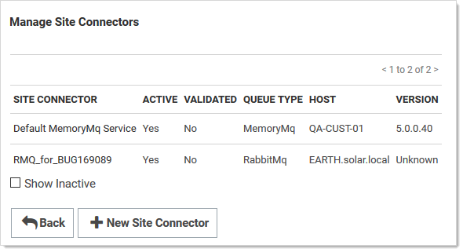
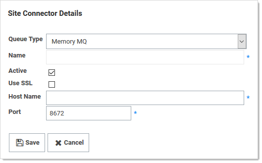
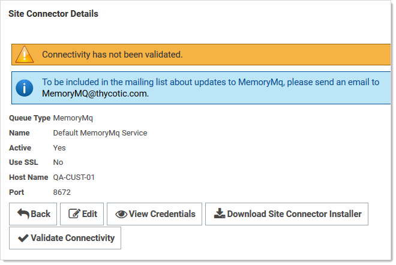
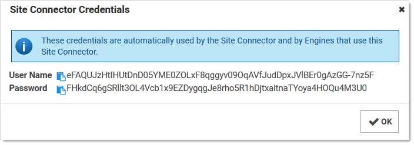

[title]: # (Installing RabbitMQ)
[tags]: # (RabbitMQ,Setup,Install)
[priority]: #

# Installing RabbitMQ

## Overview

### What is RabbitMQ?

RabbitMQ is a robust message queuing software package that Secret Server uses to communicate with its distributed engines. For detailed information about RabbitMQ go to https://www.rabbitmq.com/

### Why do you need to install it?

RabbitMQ is an enterprise-ready alternative to MemoryMQ. While MemoryMQ is sufficient for basic and prototyping installations, RabbitMQ is the preferred messaging framework when the need for greater reliability and clustering arises.

### RabbitMQ and Encryption

All data sent from or read by Secret Server from RabbitMQ is encrypted. If you would like to add SSL despite the data already being encrypted, please follow the "Advanced installation of RabbitMQ with TLS" use case. Please note that Thycotic Support can help with non-SSL installations. For SSL installation, configuration, troubleshooting, and RabbitMQ clustering, please contact [Thycotic Professional Services](https://thycotic.com/products/professional-services-training/) to learn more about our Professional Services rates.

## Prerequisites

> **Important:** Secret Server only supports RabbitMQ on Windows operating systems.

RabbitMQ requires:

### General

- Windows Server 2008 or higher with PowerShell v3 support
- Nodes hosting RabbitMQ need a minimum of 2 GB RAM
- Nodes hosting RabbitMQ should have at least 128 MB of memory available at all times
- Nodes hosting RabbitMQ need a minimum of 2 GB RAM
- Minimum 2 vCPUs
- Ports 5672 (non-SSL) or 5671 (SSL) opened on the machine and firewall

### SSL Certificate

- A server certificate PFX type and a root certificate authority certificate CER type.
- The PFX certificate should have:

  - A name that matches the RabbitMQ Fully qualified machine name
   - If you plan on making a RabbitMQ cluster, add DNS names (SANs) to your certificate

  - Your certificate must be an RSA certificate. CNG is not supported and will cause the installation to fail.

- If you do not have an internal PKI and prefer not to use a public certificate, you can use a self-signed certificate.

> **Note:** Thycotic will not assist with creating or troubleshooting self-signed certificates.

## Installation

### Task 1: Secret Server

In Secret Server UI

1. Navigate to **Admin** > **Distributed Engine**.

1. Click the **Manage Site Connectors** button. The Manage Site Connectors page appears:

   

1. Click the **+ New Site Connector** button. The Site Connector Details page appears:

   

1. Click to select **Rabbit MQ** in the **Queue Type** dropdown list.

1. Type a name for your new site connector in the **Name** text box.

1. Click to select the **Active** check box.

1. Type the host name of the machine where you plan to install RabbitMQ in the **Host Name** text box.

   > **Note:** The Engines need to be able to resolve this host name or the connection will fail. Also, inbound firewall rules must be created on the machine that is hosting the connector.

1. Type either port 5672 (non-SSL) or 5671 (SSL) in the **Port** text box.

1. Click the **Save** button.

1. After the site connector is created, click the site connector's link. The Site Connector Details page appears:

   

1. Click the **View Credentials** button to retrieve the automatically generated cred­­­­­entials. The Site Connector Credentials popup appears. You can ignore the informational message that the connectivity has not been validated for now as you will be doing so after you install RabbitMQ on the host you have selected.

   

1. Click the copy icons to copy both the **User Name** and **Password**, and store them for use in the next section.

1. Click the **OK** button.

###  Task 2: RabbitMQ Host

1. Download the [Thycotic RabbitMQ Helper.](https://updates.thycotic.net/links.ashx?RabbitMqInstaller)

1. Install the Thycotic RabbitMQ helper by running the downloaded MSI.

1. Review the supported [installation scenarios](https://thycotic.github.io/rabbitmq-helper/installation/).

1. Navigate to the installation folder in `%PROGRAMFILES%\Thycotic Software Ltd\RabbitMq Helper`

1. Launch the Thycotic.RabbitMq.Helper.exe, which opens the Windows PowerShell.

1. Then, issue a `cmdlet` command from the scenario that applies to your need.

1. After installation completes, the helper opens a Web browser to the RabbitMQ management console. There is no need to interact with the site at this time, so you can minimize or close the page for now.

1. Return to SS, and go to the site connector you created in the previous section.

1. Click the site connector's link. The Site Connector Details page appears.

1. Click the **Validate Connectivity** button.

1. If everything is set up correctly, you will see "Validation Succeeded."

1. If you see "Validation Failed," do the following:
   1. Ensure the RabbitMQ Windows service is running.
   1. Check the logs found under `C:\Program Files\Thycotic Software Ltd\RabbitMq Site Connector\log`.
   1. Check the SS system log for a full error report.

## Troubleshooting

Please refer to [RabbitMQ Helper](https://thycotic.github.io/rabbitmq-helper/#troubleshooting-and-maintenance).
