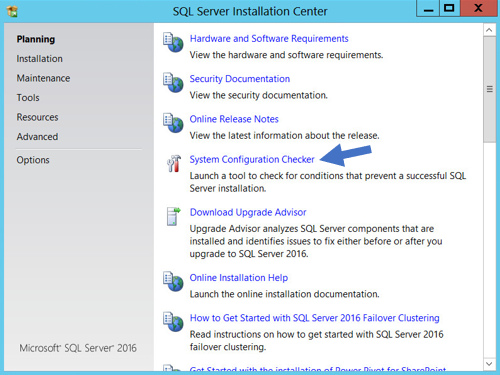
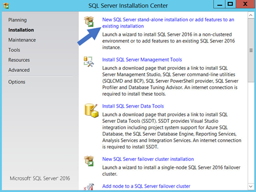
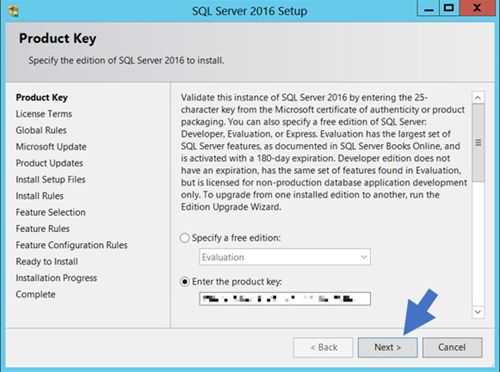
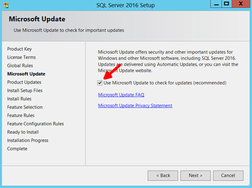
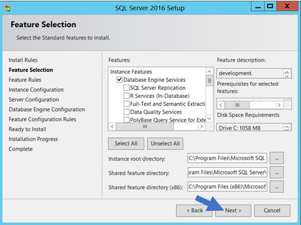
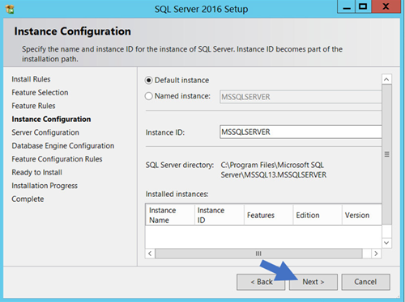
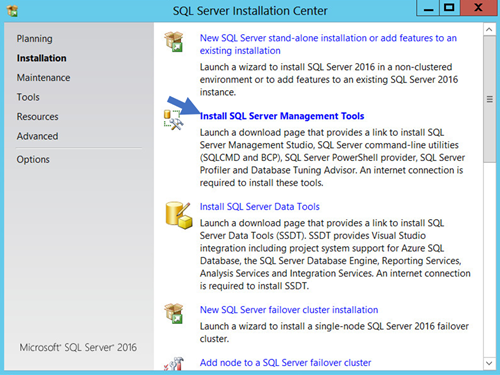
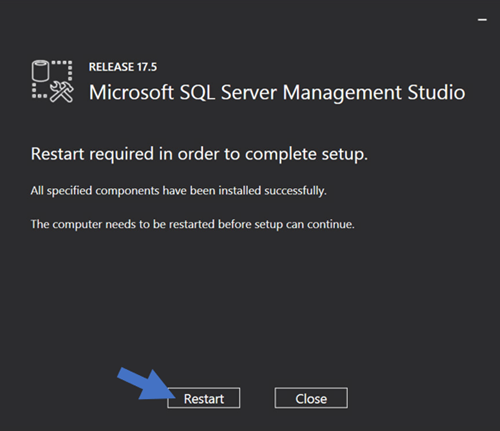

[title]: # (SQL Server 2016 Standard Edition Installation)
[tags]: # (Installation, SQL Server 2016)
[priority]: #

# SQL Server 2016 Standard Edition Installation

## Overview

The following steps walk you through setup and configuration for SQL Server 2016 Standard Edition as an example. For the most up to date resources on installing SQL see [Microsoft SQL Technical Documentation](https://docs.microsoft.com/en-us/sql/?view=sql-server-ver15) for more information.

 At the completion of this article you will have: 

- Installed a basic stand-alone instance of SQL Server 2016 Standard with the minimum features necessary for SQL Server.
- Installed SQL Server Management Studio for managing the local database.
- Created a database in SQL for your Thycotic product
- Created a new SQL Server user login for your SQL database

> **Note:** This document uses Thycotic's Secret Server product as example in the instructions, but the same steps apply for Privilege Manager advanced installs.

## Procedures

### Installing SQL Server 2016

1. Launch the SQL Server installer from CD or file download. The SQL Server Installation Center opens to the Planning window:

   

1. Click the **System Configuration Checker** link. This runs a tool that checks for conditions on your server that could prevent SQL Server from installing.

1. When the tool launches, click the **Show details** button. A successful scan should look like the one shown below. If you encounter any issues, look at the detailed report, resolve the reported issues, and rerun the scan.

   

1. Click the **OK** button when done to return to the “SQL Server Installation Center” window.

1. In the SQL Server Installation Center window, click the **Installation** link. The Installation Window appears:

   

1. Click **New SQL Server stand-alone installation…** link. The Product Key page appears:

   

1. Click to select the **Enter the Product Key** selection button.

1. Type your product key in the the **Enter the Product Key** text box.

1. Click the **Next \>** button. The License Terms page appears:

   

1. Click to select the **I accept the license terms**. check box.

1. Click the **Next \>** button. The Global Rules page appears (not shown) after the rule check runs.

1. Click the **Next \>** button. The Microsoft Update page appears:

   

1. Click to select the **Use Microsoft Update…** check box to check for updates (recommended), unless your software update process does not use automatic updates from Microsoft

1. Click the **Next \>** button twice to bypass the Product Updates page. The Install Setup Files page appears. 

1. Wait for the installation to complete.

1. Ensure that all operations pass.

1. Click the **Next \>** button twice to bypass the Install Rules page. The Feature Selection page appears:

   

   

1. Ensure the **Database Engine Services** check box is selected. This is the only feature necessary for Secret Server. Unless you are using Geo-Replication, you can leave everything else unchecked. Leave the directory locations unchanged.

1. Click the **Next \>** button twice to bypass the Feature Rules page. The Instance Configuration page appears:

   

1. Ensure the **Default Instance** selection button is selected.

1. Type a name for your SQL Instance in the **Instance ID** text box.

1. Click the **Next \>** button twice to bypass the Server Configuration page. The Database Engine Configuration page appears:

   

1. You have the choice to select either **Windows Authentication Mode** or **Mixed Mode**. Select the option that will work best for your environment:

    - **Mixed Mode (for easiest configuration)**: This mode is required if you intend on using a SQL Server account to authenticate Secret Server to your SQL Server instance. We recommend using mixed mode if you are setting up a test or demo environment. Selecting this option will also require you to set a password for the SQL Server system administrator (sa) account. See [Adding a SQL Server User ](https://thycotic.force.com/support/s/article/Adv-Install-SQL-2016#user)(section below) for instructions on adding more users.

    - **Windows Mode (recommended for best security)**: This mode prevents SQL Server account authentication. We recommend using Windows mode for production environments. Whatever user or group assigned will have administrative access to your SQL instance. According to best security practices, limit this number to as few users as possible.

    > **Note:** If choosing **Windows Mode** you will also need to  [run the IIS application pool as a service account](../running-ss-iis-app-pool-service-account/index.md) later in the installation process. 

1. You can leave the options in the remaining tabs at their default values or change the file locations in the **Data Directories** and **TempDB** tabs if you wish to store the database and log data in a different drive or directory. 

1. Click the **Next \> button** twice to bypass the Feature Configuration Rules page. The Ready to Install page appears:

   

1. Click the **Install** button.

1. Wait for installation to complete. This may take several minutes. 

1. Click the **Close** button.

****

### Installing SQL Server Management Studio

1. In the “SQL Server Installation Center” window, click the **Installation** menu item. The Installation page appears:

   

1. Click the **Install SQL Server Management Tools** link.

1. Wait for the Web page to load then click the **Download SQL Server Management Studio…** link. A file downloads.

1. Run the downloaded file (varies by browser). The SQL Server Management Studio installer starts.

   

1. Click the **Install** button.

1. Wait for the installer to complete. This may take several minutes. 

   

1. Click the **Restart** button if prompted. Otherwise, click the **Close** button.

1. Close “SQL Server Installation Center.”

### Creating the SQL Server Database

To install SS, the Thycotic installer creates the SQL database for you if it does not exist and if the user account has permission to create a new database, which requires the dbcreator server role.

If not using the Thycotic Installer, use the following steps to create a database manually through SQL Server Management Studio:

1. Open SQL Server Management Studio.
1. Connect to your SQL Server instance.
1. Right click the **Databases** folder and select **New Database…** The New Database page appears.
1. Type a name for your database in the **Database Name** text box.
1. Click the **OK** button.

### Adding a SQL Server User

According to security best practices, limit the number of users with access to your SQL database as much as possible. Use the following instructions to add a SQL Server account for SS to use to access the SQL database:

1. Open SQL Server Management Studio.

1. Connect to your SQL Server Database.

1. Expand the **Security** folder.

1. Right-click the **Logins** folder and select **New Login…**

1. Select a method of authentication:

   - **SQL Server Authentication**:  Use this option to create a new SQL Server account (this requires mixed mode to be enabled). To create the account, enter a new username and password and then deselect the **Enforce Password Policy** check box to prevent the account from expiring.

   - **Windows Authentication**:  Use this option to add access to SQL Server for an existing Windows account. To add the account, enter the login name or click **Search** to find the account. It is recommended to use a domain account rather than a local Windows account.

1. Click **User Mapping** in the left menu.

1. Click to select the check box next to your SS database.

1. In the **Database Role Membership** window, click to select the **db_owner** check box.

1. Click the **OK** button.

 