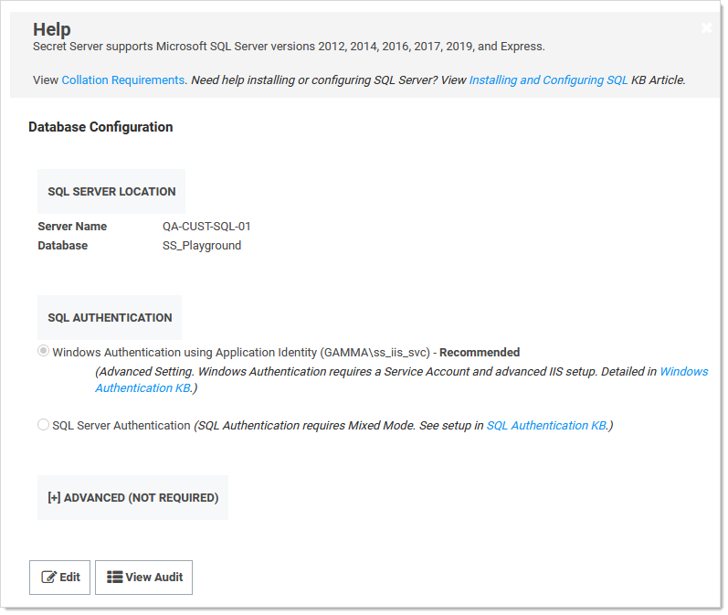

[title]: # (Moving the Microsoft SQL Server Database to Another Machine)
[tags]: # (Setup,Install,sql server)
[priority]: # (1000)

# Moving the Microsoft SQL Server Database to Another Machine

> **Important**: This article only applies if your MS SQL Server database is only for Secret Server. If you have a MS SQL Server database  for a combined installation of Privilege Manager and Secret Server, see [Moving MS SQL Server Database for Privilege Manager and Secret Server Combined Installation](https://thycotic.force.com/support/s/article/Moving-MS-SQL-Server-Database-for-Privilege-Manager-and-Secret-Server-Combined-Installation).

  Follow the steps below for moving MS SQL Server database for Secret Server (SS).

## Task 1: Backing up and Restoring the Database

To back up your SS installation:

> **Note:** Your SS instance may be running during this procedure.

1. Stop the SS site in Internet Information Server (IIS) to prevent any changes to the database.

1. Navigate to the directory where SS is installed.

1. Copy the  folder (holding the application) to your back up location.

1. Open your SQL Server Management Studio.

1. Right click the database your SS is running on, and select **Tasks \> Backup**.

1. Click the **Add** button. You are prompted to enter a file path for the `.bak` file. This can be the final destination (not recommended) or a temporary one (for later moving to a back up location).

1. Make sure SQL Server has permissions for this location. That is, create (if needed) and or grant access to the account that will access the database (see the [Installation Guide](../index.md) for account creation instructions). See [Running the IIS Application Pool As a Service Account](../running-ss-iis-app-pool-service-account/index.md) (Task 2) for details.

1. Copy the resulting database backup file (`.bak`) to your backup location.

> **Note:** You can also automate steps 2-4 using the command: `osql -S myserver\SQLEXPRESS -E - Q "BACKUP DATABASE SECRETSERVER TO DISK = 'c:\backup\ss.bak' `.

> **Note:** We recommend taking the old database offline after all steps are complete.

##  Task 2: Connecting Secret Server to the New Database

1. Restart your SS website in IIS.

1. Log on SS as a local admin.

1. Navigate to `https://<your_SS_URL>/Setup/Database`. The Database Configuration page appears:

   

   > **Note:** The setting here are stored in `C:\inetpub\wwwroot\Playground\database.config`. You can back that file up to revert or simply return to this page to reset the connection again. See the [Privilege Manager documentation](https://docs.thycotic.com/privman/) if you need to change its configuration too.

1. Click the **Edit** button. The page becomes editable.

1. Type your new SQL Server location (server name) and database.

1. Click the **Save Database Connection Settings** button, and the site will connect to the new database.

1. Your site is now pointing the new database.

> **Note:** To roll back changes and restore the original database, complete both tasks again to move the database back to the original database server.

> **Note:** If you are also moving  the SS application to another server, see [Moving Secret Server to Another Machine](https://thycotic.force.com/support/s/article/ka037000000DpDfAAK/Moving-Secret-Server-to-another-machine) (KBA) for more information.