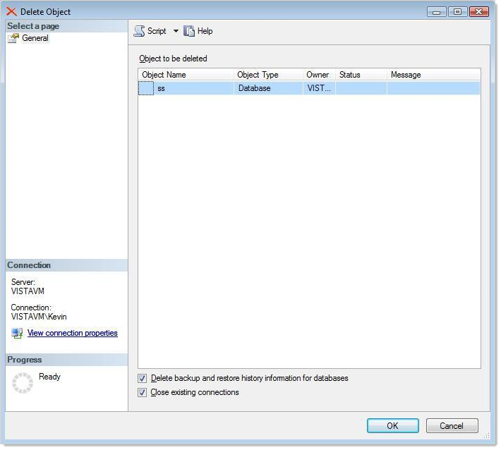
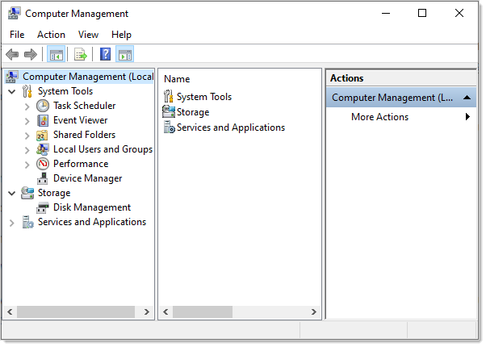

[title]: # (Uninstalling Secret Server)
[tags]: # (Setup,uninstall)
[priority]: #

# Uninstalling Secret Server

Following these instructions ensures there is absolutely no residue or trace of Secret Server on the server.

Uninstalling Secret Server is a quick, three-step process:

1. Delete the database.

1. Delete the virtual directory.

1. Delete SS files.

## Task 1: Deleting the Database

Dropping the database deletes all of your data.

> **Warning:** You cannot undo this procedure once you are done. We strongly suggest backing up the installation first in case you need to restore it.

Procedure:

1. Open the Microsoft Management Studio.

1. Connect to the database.

1. Locate your SS database in the object explorer, which is normally in the **Databases** folder. If necessary press F8 to show the object explorer.

1. Right click the database and select **Delete**. The Delete Object dialog appears:

   

1. Ensure the **Drop Existing Connections** check box is selected. This disconnects all connections to the SS database.

1. Ensure the **Delete backup and restore history information for databases** check box is selected.

1. Click the **OK** button. The database is permanently deleted.

## Task 2: Deleting the Virtual Directory

If you installed SS as a virtual directory, the virtual directory must be deleted first. If SS is not configured as a virtual directory, skip this task.

1. In the search text box in your **Start Menu**, type `Computer Management`.

1. Click the **Computer Management** result. The Computer Management Console appears:

   

1. Click to expand the **Services and Applications** node.

1. Click the **Internet Information Services (IIS) Manager** node.

1. Click to expand the **Web Sites** subfolder.

1. Click to expand the SS Web site.

1. Right click the virtual directory and select **Delete** or **Remove**. The directory is deleted.

1. (Optional) Delete ASP.NET's cached version of SS:

   1. Open the directory `C:\Windows\Microsoft.NET\Framework\<version number>\Temporary ASP.NET Files`, substituting your ASP.NET version number.

   1. Delete the subfolder with the same name as your virtual directory.

      > **Note:** These files are not a security risk, but removing them eliminates any evidence that SS was installed.

## Task 3: Deleting Secret Server Files

> **Warning:** The `encryption.config` file is crucial to restoring any backup. Ensure this file is backed up if you may want to restore SS.

1. Locate the directory where SS is was installed.

2. Click to select it.

3. Press **\<Shift\>** + **\<Delete\>** to **permanently** delete the files. Holding shift bypasses the recycle bin. SS is now permanently removed from the system.

   > **Note:** Even "permanently" deleted files can sometimes be recovered with special tools. If that is a concern, we suggest using a file shredding application to delete the folder.