[title]: # (Minimizing Upgrade Downtime)
[tags]: # (Setup, Upgrade, downtime)
[priority]: # (1000)

# Minimizing Upgrade Downtime

## Introduction

Large enterprise Secret Server (SS) customers with clustered environments often have a strong interest in minimizing downtime during their upgrade process. This document details our recommendations for accomplishing that.

> **Note:** This strategy may require close coordination between networking, server administration, and SQL DBA teams. We recommend they are available at the same time during the upgrade to minimize downtime. This procedure works best for those upgrading from the prior most recent version of SS.

We recommend that you have a QA or test environment mirroring your production environment and that you first run this procedure through that environment to ensure the desired results occur, prior to attempting this in a production environment. As with any third-party application upgrade, we strongly recommend taking snapshots or virtual machine backups of your web, SS distributed engine, and database servers so you can easily revert to a pre-upgrade state if issue arise during the upgrade.

> **Note:** Distributed engines auto-upgrade as part of the upgrade process to the latest release. It is possible that you will have up to 10 minutes of downtime while the engines upgrade, regardless of this procedure.

> **Note:** Customers using IWA and upgrading from 10.6 or lower to 10.6 or greater need to follow the steps in [Configuring Integrated Windows Authentication](../../../authentication/integrated-windows-authentication/configuring-iwa/index.md) to configure their distributed engines.

## Procedures

### Load Balanced Configuration Upgrade

#### Prerequisites

The upgrade procedure requires that you do these steps outside of the SS install.

- Download the upgrade package (step 1)

- Backup your database (step 2)

- Obtain the database upgrade script from support (step 4)

- Backup any customized web.config or web-appsettings.config files (step 10)

#### Procedure

1. Download the latest version of Secret Server from the [Thycotic Support Website](https://thycotic.force.com/support/s/download-onprem).

2. Perform a full backup of your SS database using the preferred backup method used by your company. For a quicker recovery procedure in case of disaster, we recommend creating a local SQL backup, engaging your SQL DBA team as needed. If you use an AlwaysOn configuration, perform the backup from your primary node. If desired, you can choose the option to do a “copy only” backup to avoid interrupting any log truncation performed by your enterprise backup tool.

3. Restore the database onto a separate SQL server or separate instance within your environment. This restored backup is used to test the upgrade process. For this instruction, we call this server the "Test SQL Server."

> **Note:** Depending on your circumstances, you might want to provision a standalone SQL server to accommodate this need in the future.

4. Request a database upgrade script from the Thycotic Support team. You must provide them the current **exact** version of software you are on. The script can **only** be provided by Thycotic. You can be request it prior to your upgrade.

5. Run the upgrade script on the Test SQL Server to verify the upgrade script runs without errors. If the upgrade script completes without errors, you can proceed.

6. Remove the database from the Test SQL Server. This may require your restarting SQL Server Engine services prior to removal.

7. Choose one of the web servers in a load balancer pool. For this instruction, we call this the "Target Web Server A." The pool has three servers total (Target Web Server A, B, and C).

8. Stop IIS on Target Web Server A. That server will appear offline in the pool list on your load balancer configuration application. For now, leave the other target web servers as is.

9. Temporarily remove Target Web Server A from the load balancer pool using your load balancer configuration application. Leave the server itself running. For example, on a F5 Big-IP load balancer:
   1. Click Local Traffic.
   1. Click Pools.
   1. Click to select the desired pool.
   1. Click Advanced in the Configuration section.
   1. Ensure Reject is selected for Action on Service Down.

10. Copy the SS application files you downloaded to Target Web Server A. Copy all files in the SS_update.zip file into SS directory on Target Web Server A. This typically takes less than five minutes, depending on VM resources.

> **Important:** If you have any customized settings that are per-node-specific in the existing web.config or web-appsettings.config files on the target servers, consider whether you want to protect those changes from being overwritten during the upgrade. Because the default contents of those files might change with the upgrade, we strongly recommend copying any customizations line-by-line to the new files, rather than simply replacing the new files with your customized ones. We suggest running a diff or comparison operation on the file pairs to see what, if anything, was customized in the existing files or changed in the new files.

11. When you are prompted, instruct the system copy dialog to overwrite all files.

12. Modify the script you received earlier for use on your production database. You can probably do this while the SS files are copying. For this instruction, we call this the "Production SQL Server."

13. (Optional) When the SS files are finished copying, enable maintenance mode on Target Web Servers B and C to eliminate the possibility of password changes occurring during your database upgrade. The SS read-only vaulting function is still possible from these nodes.

>  **Note:** See [Maintenance Mode FAQ](../../../admin/maintenance-mode/index.md) for more on maintenance mode.

14. Start IIS on Target Web Server A. Wait until the site fully loads. This may take some time.

> **Note:** Once the site loads, when you locally access that web server, you will see a SS error message saying your database does not match your SS. You can ignore that and click the Continue button.

15. Run the script you modified on the Production SQL Server.

16. Once the script completes, disable Target Web Servers B and C on your load balancer pool.

17. Enable Target Web Server A on your load balancer pool.

18. Access the web server through the load balancer URL. The SS Login page should appear, and you should be able to log on immediately.

> **Note:** If the warning message about the database not matching SS appears, ignore it and click the Continue button.

19. Make Target Web Server A the primary load balancer node in the load balancer pool until the other target web servers are upgraded and online.

20. Disable IIS on Target Web Servers B and C.

21. Manually upgrade the SS application files as previously discussed.

22. Enable IIS on Target Web Servers B and C.

23. Enable Target Web Servers B and C in the load balancer pool.

24. If you earlier put any of the target web servers in maintenance mode as a precaution, return them to normal function.

### Manual Rolling Upgrade

#### Introduction

The manual rolling upgrade provides a way to upgrade SS with little to no downtime. That is, users will continue to have secret access during the upgrade.

> **Note:** This procedure only applies to clustered (multiple Web node) SS environments environment.

#### Prerequisites

The administrator role needs the following permissions:

- Administer Configuration

- Administer Nodes

- Administer Backup

In addition, the role:

- Needs a database login with permission to change the database

- Requires access with permission to update files on web servers

- Must go through the current upgrade process

- Must not turn on maintenance mode until needed

#### Procedure

#####  Task One: Uploading the Upgrade

1. Download the latest version of SS from the [Thycotic Support Website](https://thycotic.force.com/support/s/download-onprem).

1. Navigate to **Admin \> See All \> Upgrade Secret Server:**

   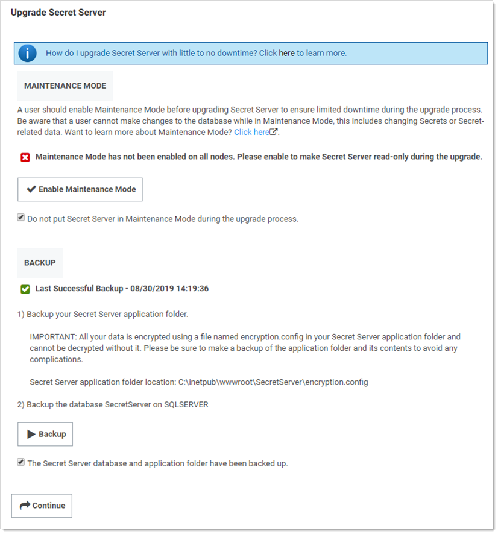

1. **Important:** Click to select the **Do not put Secret Server in Maintenance Mode during the upgrade process** check box.

1. Backup the SS application folder.

   > **Important:** Ensure the encryption.config file is backed up. It is located at `c:\inetpub\wwwroot\SecretServer\encryption.config`.

1. Click the **Backup** button to back up the SS database.

1. Click the **Continue** button. The Upgrade Secret Server page appears:

   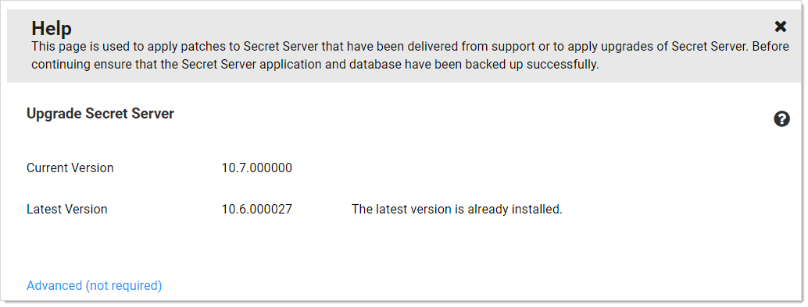

1. Click the **Advanced (not required)** link. The Advanced section appears:

   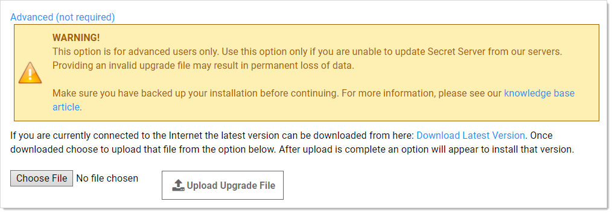

1. Click the **Choose File** button, and select the zip file you downloaded earlier to upgrade to.

1. Click the **Upload Upgrade File** button. The new version appears as available for installation:

   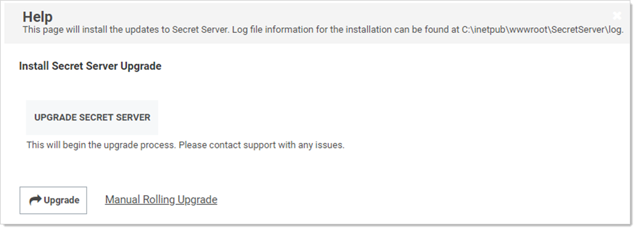

1. Click the **Manual Rolling Upgrade** link. The Manual Rolling Upgrade wizard appears.

##### Task Two: Verifying SQL Changes (Wizard Step One)

1. Click the **Next** Button. The Verify SQL Deltas tab appears:
 
   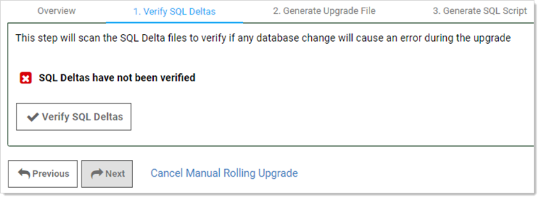
 
   >  **Note**: Clicking the "Cancel Manual Rolling Upgrade" link, at any time, will take you to the Install Secret Server Upgrade page.
 
1. Click the **Verify SQL Deltas** button. This tests the prospective changes to see if errors result. If errors result, please contact Thycotic Technical Support. If the verification succeeds:

   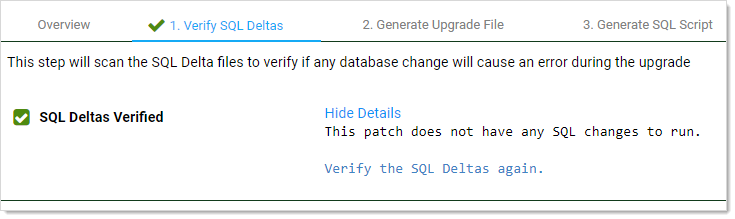

##### Task Three: Generating the Upgrade File (Wizard Step Two)

1. Click the **Next** button. The Generate Upgrade File tab appears:
 
   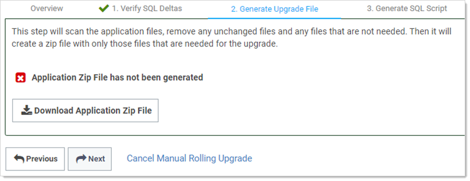
 
1. Click the **Download Application Zip File** button. This generates a zip file with only the changed files needed to upgrade the application files on the Web server nodes.

   > **Note:** This may take a few minutes to generate and download.
 
   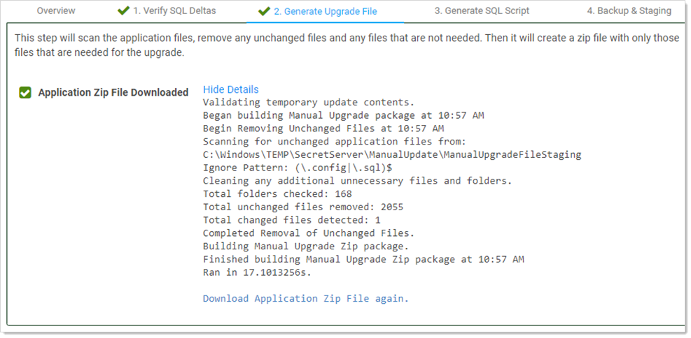

##### Task Four: Generating the SQL Script (Wizard Step Three)

1. Click the **Next** button. The Generate SQL Script tab appears:

   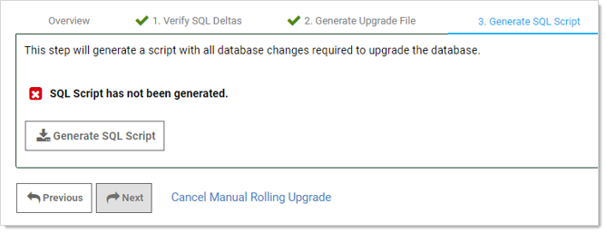

1. Click the **Generate SQL Script** button. This generates script file with all the database changes needed to upgrade the database. When finished:
 
   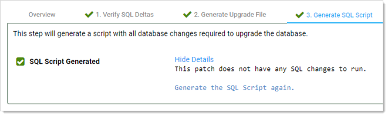
 
   The wizard proceeds to step four:

##### Task Five: Backing up and Staging (Wizard Step Four)

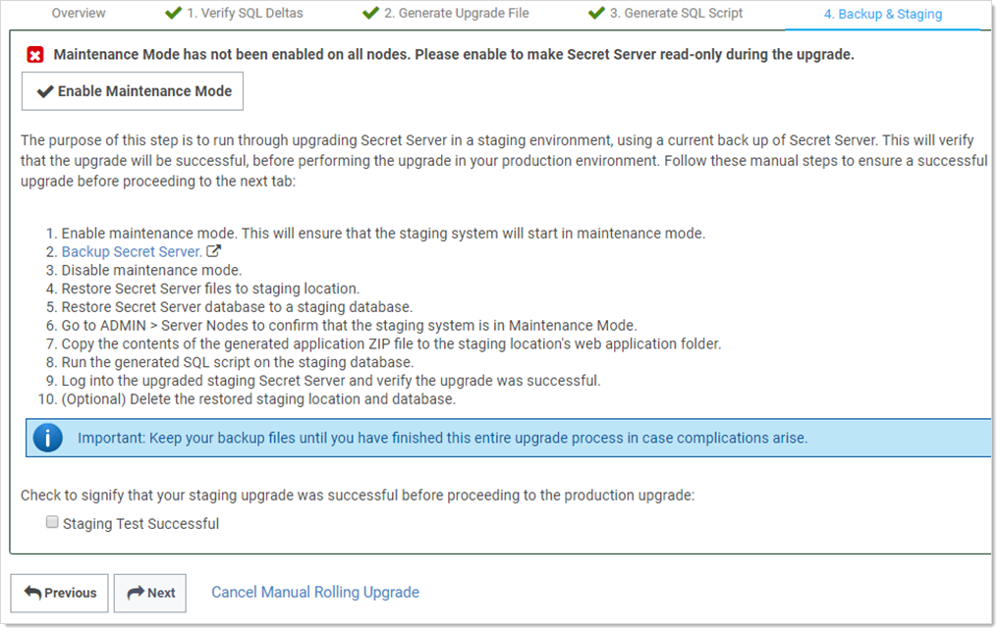

1. Click the **Enable Maintenance Mode** button.

1. Back up SS: Type “backup” in the Admin search text box, and click the item that appears in the dropdown list to access the Backup Configuration page. Click the **Backup Now** button.

1. Click the **Disable Maintenance Mode** button.

1. Restore SS files to the staging location:

   1. Copy the backup zip file to the staging location.
   1. Unzip the backup file.
   1. Copy the files to the web application folder.

1. Restore the SS database to a staging database:

   1. In SQL Server Management Studio, right click on **Databases**.

   2. Click **Restore Database**.

   3. In **Source**, select **Device**.
   3. Select and add the backup database file location.

   4. Click **Ok**.

1. Go to **Admin \> Secret Nodes** to confirm the staging system is in maintenance mode.

1. Copy the contents of the generated application Zip file to the staging location’s web application folder. Typically, this is `C:\inetpub\wwwroot\SecretServer`.

1. Run the generated SQL script on the staging database.

1. Log on the upgraded staging SS to verify the upgrade was successful.

1. (Optional) Delete the restored staging location and database.
 
   > **Important:** Keep the backup files till you verify the upgrade was successful. You may need them if an issue develops.
 
1. Click to select the **Staging Test Successful** check box to confirm your staging upgrade was successful. This is your confirmation that there were no errors before performing the actual upgrade in your production environment. The confirmation is recorded.

##### Task Six: Starting Upgrade Mode (Wizard Step Five)

1. Click the **Next** button. The Enter Upgrade Mode tab appears:

   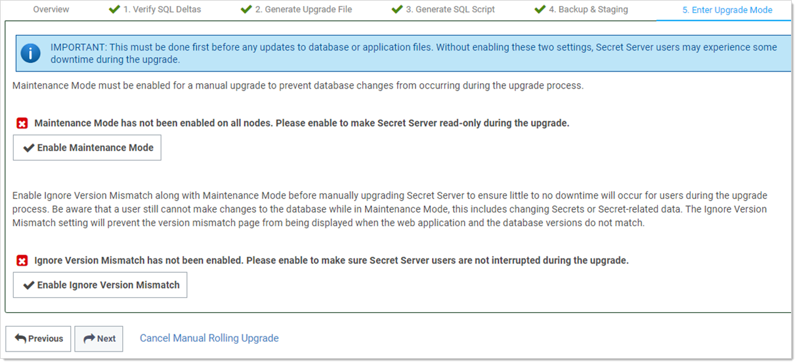

1. Click the **Enable Maintenance Mode** button. This mode limits the activities of users on secrets, secret templates, password requirements, and others and can take several minutes to start. A confirmation popup appears.

1. Click the **Enable** button to confirm the mode change. The popup disappears.

1. Click the **Enable Ignore Version Mismatch** button. This prevents users from being redirected to the Version Mismatch page. A confirmation popup appears.

1. Click the **Enable** button to confirm the setting change. The popup disappears.

1. Click the **Next** button. The Manual Steps tab appears:

   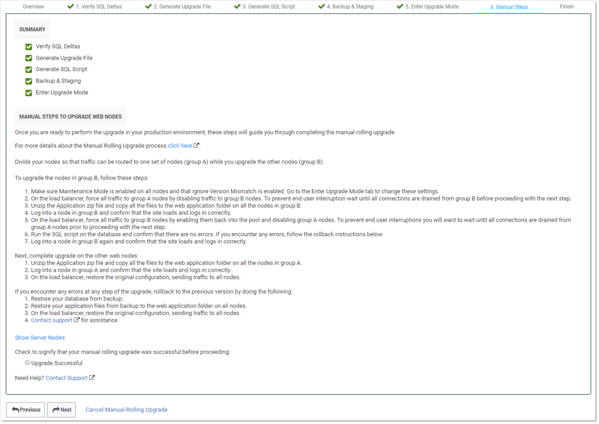

 

##### Task Seven: Upgrading Web Nodes (Wizard Step Six)

To upgrade Web nodes:

1. Split your nodes into two approximately even groups (A and B) so that one group can service traffic while the other is upgrading.

1. Ensure "maintenance mode" and "ignore version mismatch" are enabled on each node. You can change them from the Enter Upgrade Mode tab.

1. On the load balancer, disable traffic to group B. To prevent traffic interruptions, ensure those nodes are all completely disabled before proceeding to the next step. Group A, alone, now handles the traffic. For example, on a F5 Big-IP load balancer you:

   1. Select the Members tab on the pool page.
   1. Select the node to disable.
   1. Click Force Offline.

1. For each node in group B:

   1. Navigate to the Downloads folder.
   1. Extract all the files from the application zip file downloaded earlier.
   1. Copy the extracted files to the Web application folder.
   1. Log onto the node to ensure the site correctly loads and logs on.

1. On the load balancer, enable the group B nodes to return them to the pool.

1. Disable traffic to group A. To prevent traffic interruptions, ensure those nodes are all completely disabled before proceeding to the next step. Group B, alone, now handles the traffic.

1. Execute the script you created on the database, confirming there are no errors. If there are errors, follow the [rollback instructions](#rolling-back-to-the-previous-version).

1. Log onto each group B node again to ensure the site correctly loads and logs on.

1. For each node in group A:

   1. Navigate to the Downloads folder.
   1. Extract all the files from the application zip file downloaded earlier.
   1. Copy the extracted files to the Web application folder.
   1. Log onto the node to ensure the site correctly loads and logs on.

1. On the load balancer, enable the group A nodes to return them to the pool, restoring the original configuration and returning traffic to all nodes.
 
1. Click to select the **Upgrade Successful** check box.
 
1. Click the **Next** button. The Finish tab appears:

   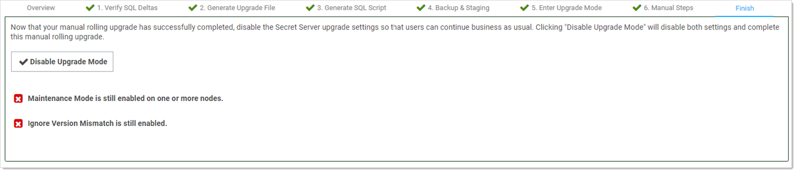
 

##### Task Eight: Finishing up (Wizard Step Seven)

1. Click the **Disable Upgrade Mode** button. A Finish Manual Rolling Upgrade popup appears. This popup both disables maintenance mode and disables the ignore version mismatch setting.

1. Click the **Disable** button. The popup disappears, and a completion message appears:

   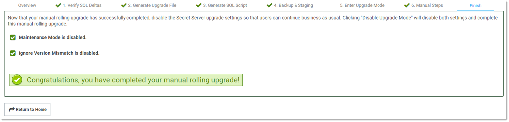
 

## Troubleshooting and Notes

### Rolling Back to the Previous Version

If you encounter errors at any step of the upgrade, rollback to the previous SS version:

1. Restore the database from the backup.

1. Restore the application files from the backup files to the Web application folder on all nodes.

1. On the load balancer, restore the original configuration, sending traffic to all nodes.

1. For assistance, contact us at the [Thycotic Support Website](https://thycotic.force.com/support/s/download-onprem).

### Version Guard

If an uploaded upgrade file cannot be used to upgrade the current version of SS, then "Version Guard" will block the upgrade and provide instructions on how to continue:

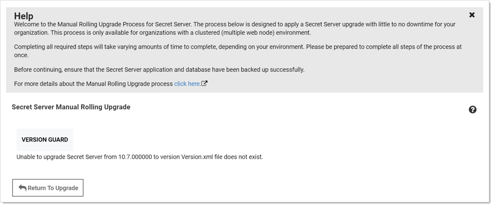

This usually occurs when not completing the perquisite steps in order. Click the **Return To Upgrade** button to return you to the first upgrade page to remedy the situation.

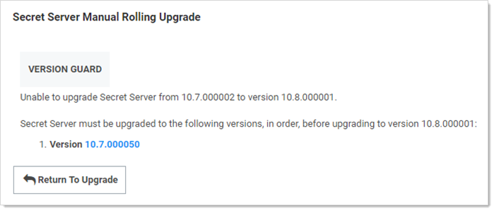

This page also list the blocking versions that you must upgrade to prior to running the manual rolling upgrade.

### New Advanced Configuration Setting

There is a new setting called "Manual Upgrade: Allow version mismatch while in Maintenance Mode." This setting, which only applies in maintenance mode, prevents SS from redirecting users to the version mismatch message page.

### New Audit Type

To support the manual rolling upgrade, there is a new audit type—ManualUpgrade. Its audits are stored in the tbAudit table and record the following actions:

- CANCEL

- COMPLETED

- GENERATE DB SCRIPT

- GENERATE UPGRADE ZIP

- STAGING TEST

- STARTED

- VERIFY DELTAS

