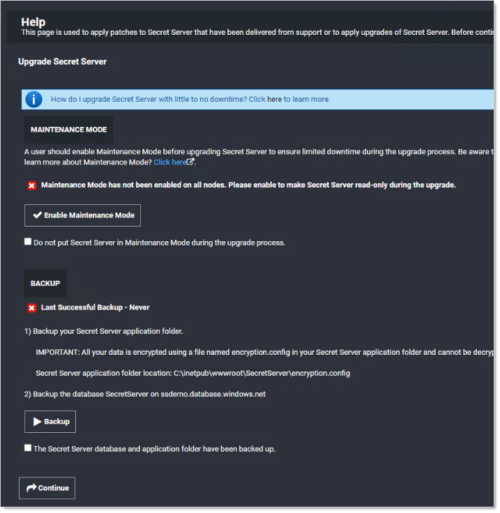
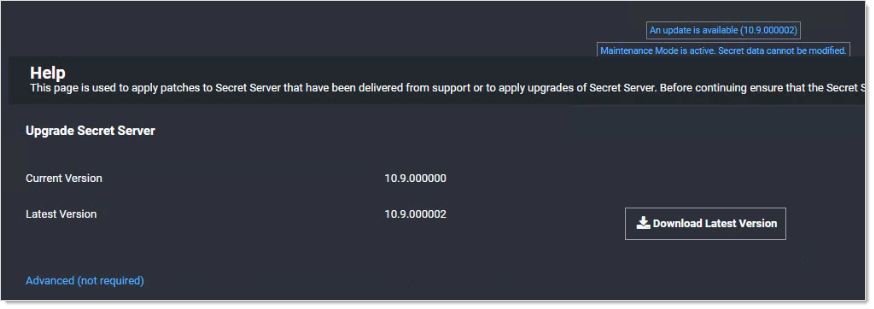
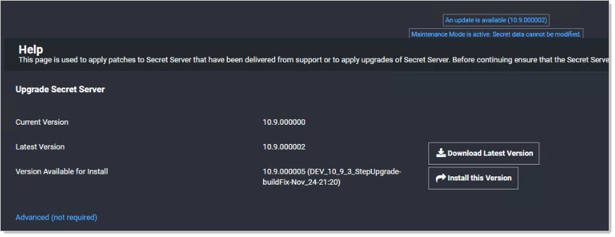
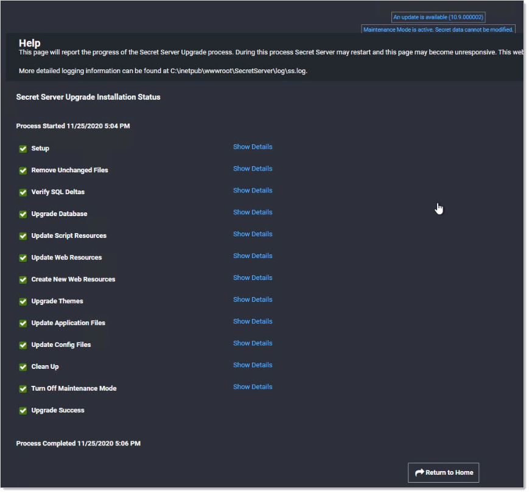
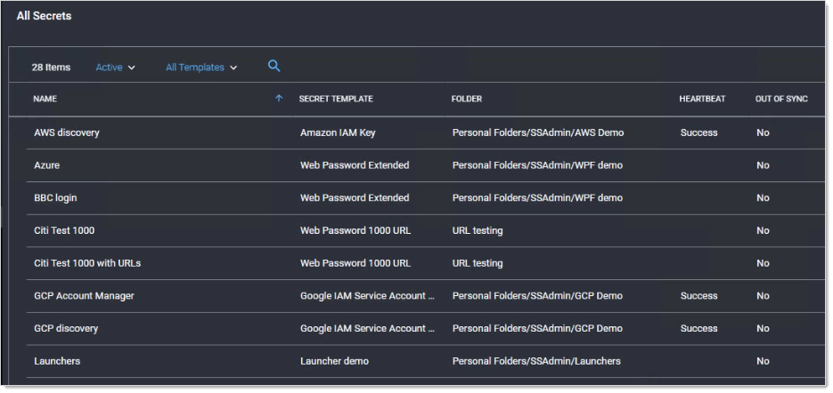

[title]: # (Upgrading to 10.9.000005/33)
[tags]: # (Setup, Upgrade)
[priority]: # (1000)

# Upgrading to 10.9.000005/33

This upgrade of Secret Server (SS) is a two-step process where you first upgrade to version 10.9000005 and then to 10.9.000033. The reasoning behind this is to provide a safeguard that warns you if the new .NET system requirement is not met *prior* to the installation making irreversible changes, potentially resulting in a non-functioning SS installation. The second step to 10.9.000033 depends on the .NET update in the first step and deploys the new features for this release.

> **Important:** Customers upgrading to 10.6.000000 or later and are using RabbitMQ, please see [How to clear message accumulation in RabbitMQ queues after upgrading to 10.6](https://thycotic.force.com/support/s/article/How-to-clear-message-accumulation-in-RabbitMQ-queues-after-upgrading-to-10-6)[ How to clear message accumulation in RabbitMQ queues after upgrading to 10.6](https://thycotic.force.com/support/s/article/How-to-clear-message-accumulation-in-RabbitMQ-queues-after-upgrading-to-10-6) (KBA).

> **Important:** Upgrading to Secret Server version 10.0.000000 and above requires configuring integrated pipeline mode on the Secret Server Application Pool. Please  see [Manual IIS Installation](http://updates.thycotic.net/link.ashx?IisPiplineIntegratedKnowledgeBase) for details on configuring integrated pipeline mode in IIS. If using  Integrated Windows Authentication you will also need to update IIS  authentication settings as detailed in [Configuring Integrated Windows Authentication](../../../authentication/integrated-windows-authentication/configuring-iwa/index.md). If you are at version 9.1.000000 and below, you will need to first  upgrade to 9.1.000001 before you can upgrade to 10.0.000000 and above.

> **Important:** If you have Privilege Manager installed, the  Secret Server upgrade process will begin an upgrade for Privilege  Manager as well. 

> **Important:** The ***existing* MS SQL database must be version 2012 or later for this upgrade**. Otherwise, if the upgrade fails and you attempt to roll it back, the previous installation will not work.

## How Upgrades Work 

Secret Server periodically polls the update server to detect new updates. If the "Allow Automatic Checks for Software Updates" option is enabled in the Admin \> Configuration menu, you will see the "An update is available (xx.x.xxxxxx)" link after logging in with an administrator account.  The steps below can be used to  perform an upgrade for versions 7.1.000015 and higher. If you have an  older version of SS, please contact Thycotic technical  support for assistance. 

## Before You Begin

1. Ensure you will have access to account credentials for the server hosting SS AND the SQL Server instance hosting your SS database.

1. Ensure you have a recent backup of the application files and database available.

3. If you use clustering, stop the application pools on all of the servers except the one being upgraded.

1. Conduct the [SS and SSC .NET Framework 4.8 Upgrade](../net-4-8-upgrade/index.md).

## How to Upgrade

1. From a computer that has outbound network access, click on the upgrade link to go to: `http://<yourinstance>/SecretServer/Setup/Upgrade`. The Secret Server Setup Home page appears:

   > **Note:** If your computer does not have outbound network access, please see [Upgrading Secret Server Without Outbound Access](../upgrading-without-outbound-access/index.md).

   

1. Download the two zip files (`Version_10_9_000005.zip` and `Version_10_9_000033.zip`), which contain the installs, using the link at the top of the page.

1. Click the **Enable Maintenance Mode** button to enter maintenance mode.
   
1. Backup your SS application folder.
   
   > **Important:** All your data is encrypted the `encryption.config` file in your SS application folder. **Your data cannot be decrypted without it**. Thus, it is critical that you make a backup of the application folder and its contents before proceeding.
   
1. Backup the database named SecretServer at the IP address listed.
   
1. When finished backing up both, click to select the **The Secret Server database and application folder have been backed up** check box. 
   
1. Click the **Continue** button. The download page appears:
   
   
   
1. Click the **Advanced (not required)** link. The section appears:
   
   
   
1. Click the **Choose File** button and locate the `Version_10_9_000005.zip` file you downloaded.
   
1. Click the **Upload Upgrade** button. The file uploads, which can take several minutes. When the upload is complete the 10.9.000005 version appears:
   
   
   
1. Click the **Install this Version** button. The Install Secret Server Upgrade page appears:

    

1. Click the **Upgrade** button. An upgrade installation status page appears (not shown), and the upgrade begins. This will take several minutes. When done, an "Installation Complete" message appears.

1. Click the **Show Details** link to view the entire upgrade process:

    

1. Click the **Return to Home** button. You return to the previous page. The first installation of the two is complete. The new installation of SS starts, which may take a bit of time. SS opens to the All Secrets page:

    

1. If you intend to use Web clustering, proceed to [Upgrading Secret Server with Web Clustering](../upgrading-with-web-clustering/index.md).

1. Repeat the install procedure using the `Version_10_9_000033.zip` file you downloaded. 

1. Once again, if you intend to use Web clustering, proceed to [Upgrading Secret Server with Web Clustering](../upgrading-with-web-clustering/index.md).
