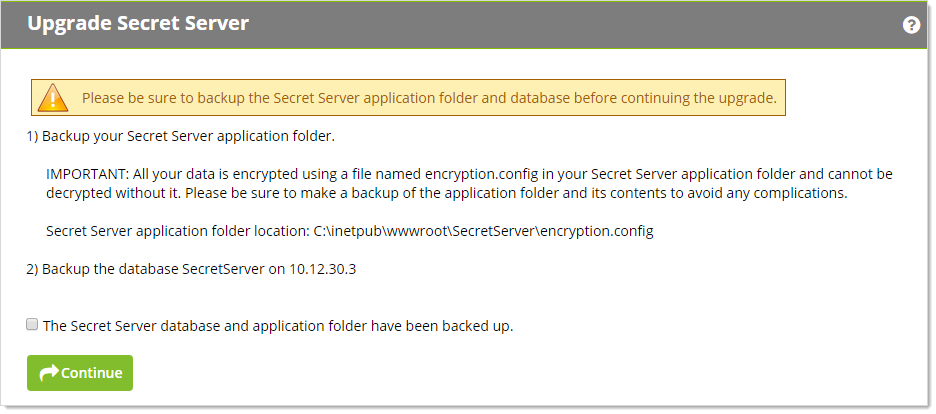
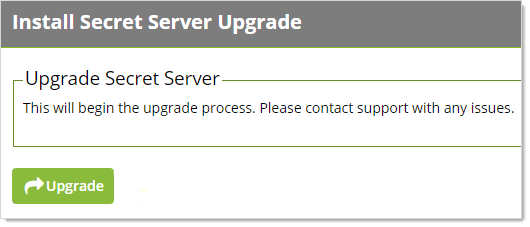
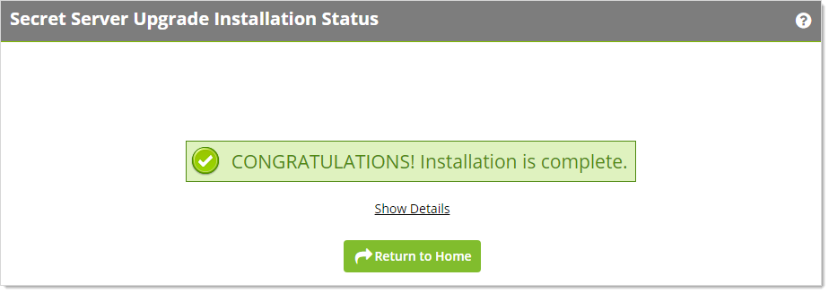

[title]: # (Upgrading Secret Server)
[tags]: # (Setup, Upgrade)
[priority]: # (1000)

# Upgrading Secret Server

> **Note:**  See [Upgrading to Secret Server 10.9.000005/10.9.000032](../upgrading-secret-server-10.9.000005/index.md) for instructions specific to that upgrade.
>
> **Important:** If upgrading to 10.7.000000, using SQL Server 2008 R2 as the SS database is no longer supported. For more information, see the [release notes](../../../release-notes/index.md).

> **Important:** Customers upgrading to 10.6.000000 or later and are using RabbitMQ, please see [How to clear message accumulation in RabbitMQ queues after upgrading to 10.6](https://thycotic.force.com/support/s/article/How-to-clear-message-accumulation-in-RabbitMQ-queues-after-upgrading-to-10-6)[ How to clear message accumulation in RabbitMQ queues after upgrading to 10.6](https://thycotic.force.com/support/s/article/How-to-clear-message-accumulation-in-RabbitMQ-queues-after-upgrading-to-10-6) (KBA).

> **Important:** Customers using the Integrated Windows Authentication (IWA) feature  need to perform a workaround when upgrading to Secret Server 10.6 with a Distributed Engine. IWA is the Windows feature where users log on their Windows domain only once—once logged on, any additional domain logons  are done automatically without having to reenter a user name and  password. Please see the [Workaround for Integrated Windows Authentication When Upgrading to Secret Server 10.6](https://thycotic.force.com/support/s/article/SS-CFG-EXT-Workaround-IWA-10-6) KB article.

> **Important:** Upgrading to Secret Server version 8.9.00000 and above will require **Windows Server 2008 R2 or greater.** 

> **Important:** If you are upgrading to Secret Server version 8.5.000000 and above, there  are changes in the .NET Framework version you will need to be aware of  along with some additional steps in the upgrade process. For more  information, see [Secret Server Moving to .NET Framework 4.5.1](https://thycotic.force.com/support/s/article/Secret-Server-Moving-to-NET-Framework-4-5-1) (KBA).

> **Important:** Upgrading to Secret Server version 10.0.000000 and above will require configuring integrated pipeline mode on the Secret Server Application Pool. Please  see [Manual IIS Installation](http://updates.thycotic.net/link.ashx?IisPiplineIntegratedKnowledgeBase) for details on configuring integrated pipeline mode in IIS. If using  Integrated Windows Authentication you will also need to update IIS  authentication settings as detailed in [Configuring Integrated Windows Authentication](../../../authentication/integrated-windows-authentication/configuring-iwa/index.md). If you are at version 9.1.000000 and below, you will need to first  upgrade to 9.1.000001 before you can upgrade to 10.0.000000 and above.

> **Important:** If you are doing an incremental upgrade from Version 9.1.000000 to a  higher version, the system may require additional time to process the  changes before proceeding. A typical symptom of this behavior will be  the software will redirect you to the home page. If this happens, please allow up to 24 hours before retrying the upgrade. If the issue  persists, please contact technical support. You should lose no other  functionality of the software whilst this occurs.

> **Important:** Please be aware that if you have Privilege Manager installed, the  Secret Server upgrade process will begin an upgrade for Privilege  Manager as well. 

## How Upgrades Work 

Secret Server periodically polls the update server to detect new updates. If the "Allow Automatic Checks for Software Updates" option is enabled in the Admin \> Configuration menu, you will see the "An update is available (xx.x.xxxxxx)" link after logging in with an administrator account.  The steps below can be used to  perform an upgrade for versions 7.1.000015 and higher. If you have an  older version of SS, please contact Thycotic technical  support for assistance. 

## Before You Begin

1. Ensure you will have access to account credentials for the server  hosting Secret Server AND the SQL Server instance hosting your Secret  Server database.

1. Ensure you have a recent backup of the application files and database available.

3. If you use clustering, stop the application pools on all of the servers except the one that is currently the "primary."

## How to Upgrade

1. From a computer that has outbound network access, click on the upgrade link to go to: `http://<yourinstance>/Setup/Home`. If you are upgrading from a version lower than 10.2.000000, the URL will be `http://<yourinstance>/installer.aspx`.  The Secret Server Setup Home page appears:

   > **Note:** If your computer does not have outbound network access, please see [Upgrading Secret Server Without Outbound Access](../upgrading-without-outbound-access/index.md).

    

1. Click the **Secret Server Upgrade Available** link to continue. The Upgrade Secret Server page appears:
   
   
   
1. Backup your SS application folder.
   
   > **Important:** All your data is encrypted the `encryption.config` file in your SS application folder. **Your data cannot be decrypted without it**. Thus, it is critical that you make a backup of the application folder and its contents before proceeding.
   
1. Backup the databased named SecretServer at the IP address listed.
   
1. When finished backing up both, click to select the **The Secret Server database and application folder have been backed up** check box. 
   
1. Click the **Continue** button. Another Upgrade Secret Server page appears:
   
   
   
1. Click the **Download Latest Version** button to download SS. Wait for the download to finish. The Install Secret Server Upgrade page appears:
   
   
   
1. Click the **Upgrade** button. The upgrade starts. When it is finished, the Secret Server Upgrade Installation Status page appears:
   
   
   
1. Click the **Return to Home** button to return to the dashboard. The upgrade is complete.
   
1. If you intend to use Web clustering, proceed to [Upgrading Secret Server with Web Clustering](../upgrading-with-web-clustering/index.md).
