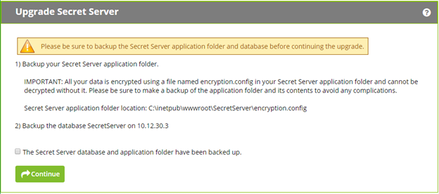
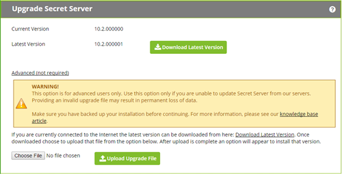
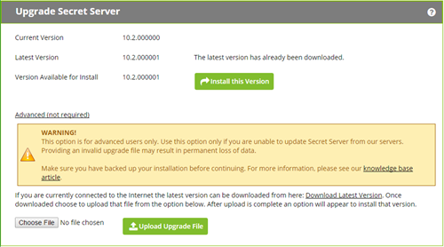

[title]: # (Upgrading Secret Server Without Outbound Access)
[tags]: # (Setup, Upgrading)
[priority]: # (1000)

# Upgrading Secret Server Without Outbound Access

> **Important:** Upgrading to Secret Server version 8.9.000000 and above will require **Windows Server 2008 R2 or greater.**

> **Important:** Upgrading to Secret Server version 8.5.000000 and above, there are changes in the .NET Framework version you will need to be aware of along with some additional steps in the upgrade process. For more information, see [Secret Server Moving to .NET Framework 4.5.1](https://thycotic.force.com/support/s/article/Secret-Server-Moving-to-NET-Framework-4-5-1).

> **Important:** Upgrading to Secret Server version 10.0.000000 and above will require configuring integrated pipeline mode on the Secret Server Application Pool. Please see [this KB](http://updates.thycotic.net/link.ashx?IisPiplineIntegratedKnowledgeBase) for details on configuring integrated pipeline mode in IIS. If using Integrated Windows Authentication you will also need to update IIS authentication settings as detailed in [this KB](http://updates.thycotic.net/link.ashx?SS_10_IntegratedWindowsAuthentication). If you are at version 9.1.000000 and below, you will need to first upgrade to 9.1.000001 before you can upgrade to 10.0.000000 and above.

## How Upgrades Work

Secret Server periodically polls our update server to detect updates. If your Secret Server is on an internal network that has no outbound access or goes through a proxy, Secret Server will not be able to perform updates automatically, therefore, outbound access to the below connections on your firewall is needed if you want to perform updates automatically:

- `d36zgw9sidnotm.cloudfront.net:443`

- `updates.thycotic.net:443`

- `updates.thycotic.net:80`

The steps below can be used to perform an upgrade for versions 7.1.000015 and higher. If you have an older version of Secret Server, please contact Thycotic technical support for assistance.

## Procedure

### Step 1: Open the Upgrade Secret Server Wizard

1. From a computer that does have outbound network access and Secret Server access, go to the Secret Server Upgrade page by browsing to: `http://<yourinstance>/Installer.aspx?patch=true` (filling in your Secret Server URL for `<yourinstance>`). The wizard appears:

   

1. Backup your Secret Server application folder and your Secret Server database.

1. Click to select the The **Secret Server database…** check box on the page.

1. Click the **Continue** button. The next page appears:

   

### Step 2: Get and Upload the Latest .zip File

1. Download the latest version .zip file by clicking the **Download Latest Version** button on the installer page. The file name will appear something like `Version_10_2_000000.zip`. Note where you save it.

   > **Note:** You also can find the downloadable update files [below](#Offline-Installation-Download-Files).

1. Click the **Choose File** button to select the Secret Server .zip file you just downloaded.

   > **Note:** You can [verify the file hashes for the latest version using the posted hash values](https://thycotic.force.com/support/s/article/Secret-Server-Download-Hashes) (KBA).

   > **Note:** You should **not** use the fresh install SecretServer.zip or setup.exe that is first downloaded from [thycotic.com](http://thycotic.com). Only use the Get Latest Version link—there is a difference between the upgrade file and fresh install zip.

1. Click the **Upload Upgrade File** button. You see a message confirming the file was successfully uploaded, and the Install This Version button appears.

   

1. Click the **Install this Version** button. The Upgrade Secret Server page appears (not shown).

###  Step 3: Upgrade Secret Server

1. Click the **Upgrade** button. The upgrade automatically processes and once it has finished you will see a confirmation page.

1. Click **Return to Home** to return to the dashboard.

## Offline Installation Download Files

If you do not have access to another installation of SS or you are upgrading from an earlier version, click one of the following links, depending on your *current* installed version:

- [8.4.000003 or earlier](https://updates.thycotic.net/secretserver/getlatestversion.aspx)
- [8.4.000004 to 9.1.000000](https://updates.thycotic.net/secretserver/getlatestversion.aspx?myv=9.1.000000)
- [9.1.000001 to 10.9.000003](https://updates.thycotic.net/secretserver/Version_10_9_000005.zip)
- [10.9.000005 or later](https://updates.thycotic.net/secretserver/getlatestversion.aspx?alwayslatest=true) 