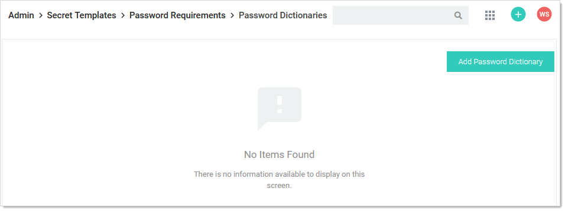
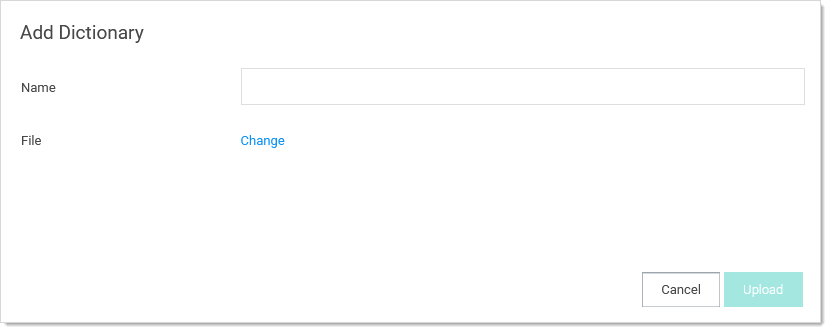
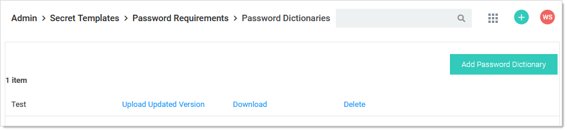
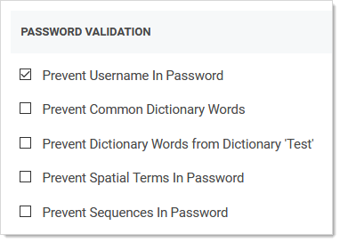
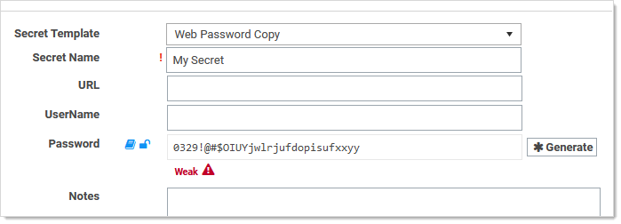
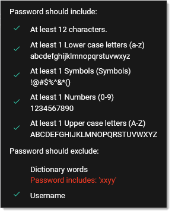

[title]: # (Creating and Editing Custom Password-Exclusion Dictionaries)
[tags]: # (Template, custom dictionaries)
[priority]: # (1000)

# Creating and Editing Custom Password-Exclusion Dictionaries

A custom password-exclusion dictionary is a list of words that you do not want users to choose as part of a password, for example, your company name. The dictionary becomes an option when creating or editing a password requirement object. Those, in turn, appear as options when creating a secret template. Finally, when a secret is created based on that template, the words in the dictionary are not allowed when creating a password (the "weak" warning appears).

### Creating a Custom Dictionary

To create a new custom password-exclusion dictionary for use by secret templates:

1. Create a text file containing the words you want to exclude, one word per line. These words cannot be used as part of a password on applicable secrets.

1. Go to **Admin \> Secret Templates**. The Manage Secret Templates page appears:

   

1. Click the **Password Requirements** button. The Password Requirements page appears:

    

1. Click the **Edit Custom Dictionaries** button. The Password Dictionaries page appears:

   

1. Click the **Add Password Dictionary** button. The Add Dictionary popup page appears:

    

1. Type the name of the dictionary in the **Name** text box.

1. Click the **Change** link to locate your dictionary text file. The name of the file appears on the popup.

1. Click the **Upload** button. The popup disappears, and the file appears on the Password Dictionaries page:

    

1. Now, when defining a password requirement, the custom dictionary you created ("test") appears as a prevention option:

    

    When a user attempts to include one of the excluded words in the dictionary in a secret based on the template using the password requirement, the "weak" warning appears and the user cannot save the password. For example, our dictionary contains the word (string) `xxyy`. The user enters a strong password that contains the string, and SS rejects it anyway:
    
    > **Note:** The excluded words are not case sensitive. `XXyY` would have triggered a password rejection too.
    
    
    
    When you hover the mouse pointer over the password strength bar, the disallowed string appears in red:
    
    

### Editing a Custom Password-Exclusion Dictionary

To edit a custom password-exclusion dictionary for use by secret templates:

1. Go to **Admin \> Secret Templates**. The Manage Secret Templates page appears:

   

1. Click the **Password Requirements** button. The Password Requirements page appears:

   

1. Click the **Edit Custom Dictionaries** button. The Password Dictionaries page appears:

   

1. Click the **Add Password Dictionary** button. The Add Dictionary popup page appears:

   

1. Click the **Download** link for the desired dictionary.

1. Save the file to your computer.

1. Edit the text file as desired. Do not change the name of the file.

1. Click the **Upload Update Version** link to locate and upload your dictionary text file. The existing dictionary, of the same name, is overwritten.