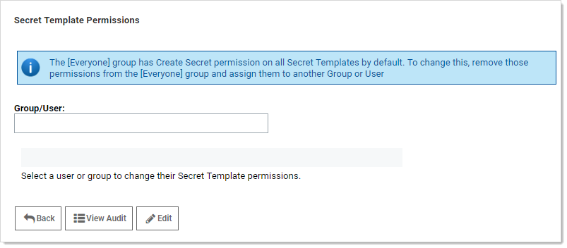
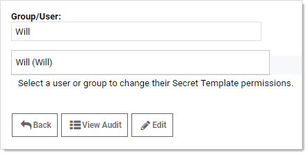
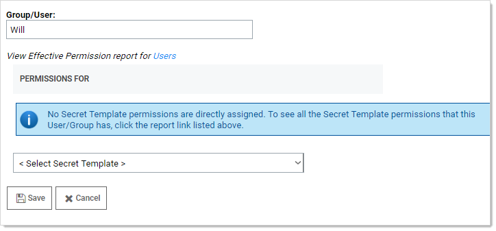

[title]: # (Configuring Secret Template Permissions)
[tags]: # (Template)
[priority]: # (1000)

# Configuring Secret Template Permissions

As of SS 10.3 it is possible to assign users and groups to specific secret templates so they can either manage or create secrets based on those templates. This allows you to have more granular control over what secret templates are seen by users and groups when they are managing the templates or creating secrets. To configure permissions:

1. Select **Admin \> Secret Templates**. The Manage Secret Templates page appears:

   

1. Click the **Configure Secret Template Permissions** button. The Secret Template Permissions page appears:

   

1. Select a group or user by typing in the **Group/User** text box. The page changes:

   

1. Click the desired user or group in the **Group/User** dropdown list that appeared.

1. Click the **Edit** button. A drop-down list appears:

   

1. Click to select a secret template you wish to assign them to. You may either assign "Template Create secret" or "Template Owner" to a user or group.

   - Template Create secret allows a user or group to create secrets based on the selected secret template.
   - Template Owner allows a user or group to edit a secret template and create secrets based on the selected secret template. By default, the Everyone group that targets all users of SS can create secrets based on any secret template.

   > **Note:** Users' secret Template permissions are based on the permissions directly assigned to them, as well as the permissions assigned to all of the groups they are a member of. If a user or group does not have Template Create secret or Template Owner permissions, they are unable to create a secret based on that secret template or see that it exists in SS.

1. Click the **Save** button.
