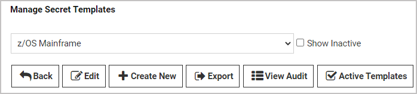
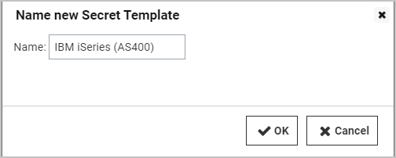
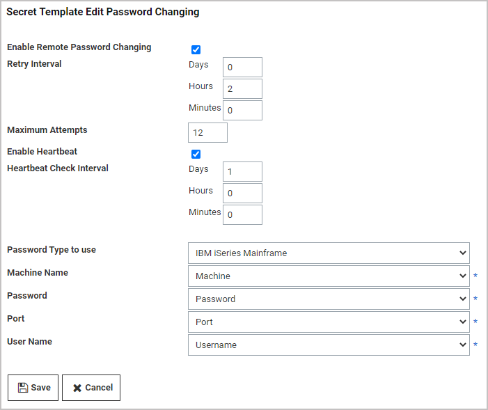
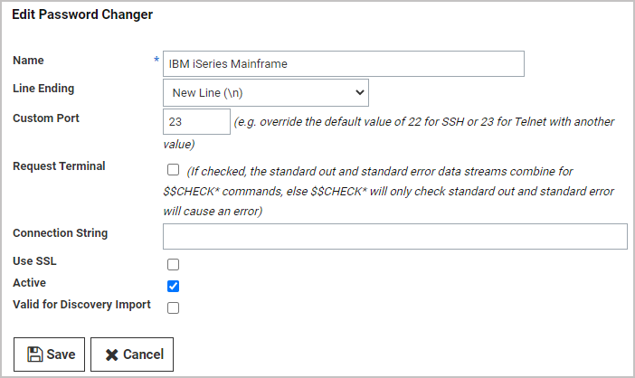

[title]: # (Create and Customize an AS/400 Template for an AS/400 Password Changer)
[tags]: # (Create,Customize,AS,400,AS400,AS/400,template,password changer)
[priority]: # (1000)

# Create and Customize an IBM iSystem (AS/400) Template to use the new IBM iSeries (AS/400) Password Changer

The IBM iSeries (AS/400) Terminal password changer is based on the z/OS Mainframe password changer. It uses the 5250 terminal connection and scripting to perform the password change and heartbeat. You can modify the script for any advanced configuration requirements, and Thycotic Professional Services is available tp help you.

>**Note**: You can also change passwords on the AS/400 using SSH. See [Creating a Custom Password Changer for IBM AS/400](../../../remote-password-changing/custom-password-changers/creating-a-custom-as400-pw-changer/index.md).

## Create an AS/400 Secret Template

1. Navigate to **Admin > Secret Templates**.

1. On the **Manage Secret Templates** page, select the **z/OS Mainframe** template from the drop-down list.

1. Click the **Edit** button.

   

1. On the **Secret Template Designer** page, click the **Copy Secret Template** button.

1. On the popup page, type `IBM iSeries (AS400)` in the **Name** text box.
   

1. Click the **OK** button.

1. On the confirmation page, click the **Continue** button.

   

Optional: on the **Secret Template Designer** page, you can deactivate the **Passphrase** field by clicking the deactivate icon  to the right of the **Passphrase** row. Unlike the z/OS, the iSeries does not need an additional passphrase and will not have an option for it unless adjusted. Unless your environment specifically requires the passphrase text-entry field, we recommend deactivating it.

## Modify Your AS/400 Secret Template to use the AS/400 Password Changer

1. On the **Secret Template Designer** page, click the **Configure Password Changing** button.

1. On the **Secret Template Edit Password Changing** page, click the **Edit** button. The page becomes editable.

   

1. Next to **Password Type to Use**, click the drop-down list and select **IBM iSeries Mainframe**.

   

1. Make required changes, if any, to the text boxes and lists.

1. Click the **Save** button. The page is no longer editable.

1. Click the **Back** button.

1. On the **Secret Template Designer** page, create secrets based on the new template as desired.

## Customize Your AS/400 Password Changer for Your Environment

>**Note**: For the default IBM iSeries (AS/400) systems, the default password changer configuration requires no adjustment. However, additional parameters and connection string options are available.

1. Navigate to **Admin > Remote Password Changing**.

1. Click the **Configure Password Changers** button.

1. On the **Password Changer Configuration** page, click the **IBM iSeries Mainframe** link.

1. On the **IBM iSeries Mainframe** page, scroll to the bottom and click **Edit**.

1. On the **Edit Password Changer** page, adjust ports and other parameters as desired.

   

1. Click the **Save** button.

>**Note**: The *trace* function can be a powerful tool for troubleshooting and debugging, especially for complex RPC implementations in unique environments. The trace function logs emulator input, mainframe output, and ASCII screenshots of what is happening on the terminal GUI. To write a trace file to the Secret Server website or engine, just add `TRACE` to the connection string.

## Additional Functions, Adjustments, and Parameters

For unique IBM iSeries environments, the IBM iSeries password changer offers extra features, options, adjustments and parameters for customization, including the commands in the table below. To implement these commands successfully, it helps to keep in mind that the password changer is emulating user input. Some of these commands are designed for very fine emulations of unique IBM iSeries environments, and Thycotic Professional Services can help you with these. Other commands are implemented and tested on a base environment, so before implementing them in a production environment, you should verify that they are working as expected through testing or by using the trace function.

| Command | Action | Description or Example |
|------|------|-----|
| \<Backtab\> | Tab to the previous input field. | |
| \<Clear\> | Clear the screen. | Mostly used for trace. |
| \<Close\> | End the session to the mainframe. | |
| \<Delete\> | Delete a character under the cursor; can be used with \<MoveCursor(#, #)\> | |
| \<DeleteField\> | Delete the entire text input or field. | |
| \<DeleteWord\> | Delete the current word if available, otherwise delete the previous word. | |
| \<Disconnect\> | Disconnect the password changer’s connection to the mainframe. | |
| \<Down\> | Move cursor down. | |
| \<Enter\> | Send the Enter key press command. | |
| \<Erase\> | Erase previous character on a selected text input. | \<Erase\> |
| \<EraseEOF\> | Erase end-of-field of current text input. | \<EraseEOF\> |
| \<Execute( )\> | Execute commands in shell. | \<Execute(USRMGR)\> |
| \<HexString( # )\> | Insert a control character in a text field or string. | \<HexString(41)\> | |
| \<Key( # )\> | Execute named iSeries keys. | Execute unique keys via hex, character code, or key symbol. | Examples: \<Key(41)\>, \<Key(Aunderbar)\>, \<Key(A underbar)\> |
| \<Left\> | Move cursor left. | |
| \<PF( # )\> | Execute program function. | Program function keys 1 to 24 |
| \<PA( # )\> | Execute program attention. | Program attention functions 1 to 3 |
| \<MoveCursor(#, #)\> | Move the cursor by row and column. | \<MoveCursor(10,2)\> |
| \<Right\> | Move cursor right. | |
| \<Tab\> | Tab to the next line. | |
| \<Up\> | Move cursor up. | |
