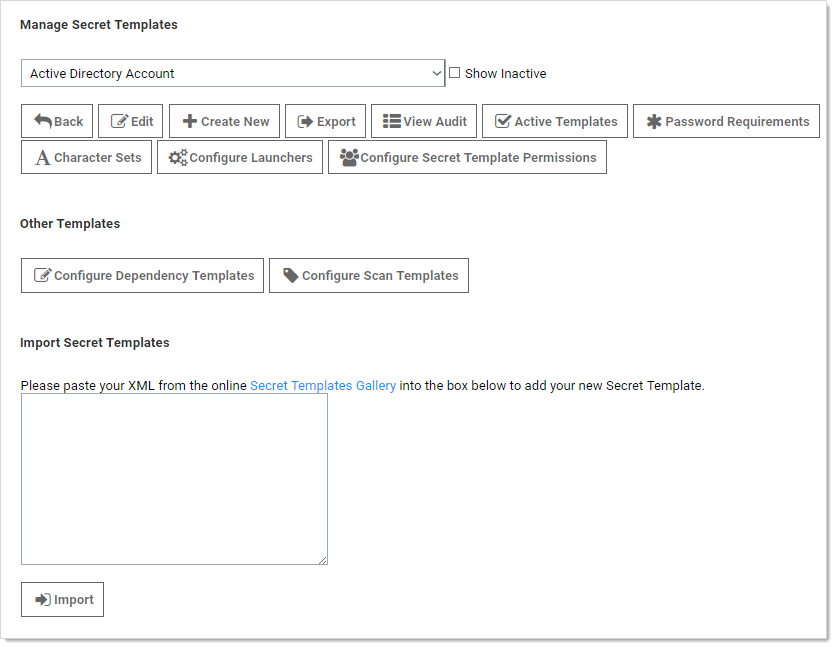
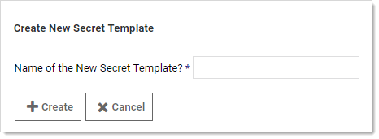
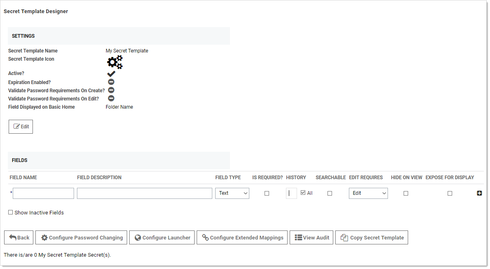
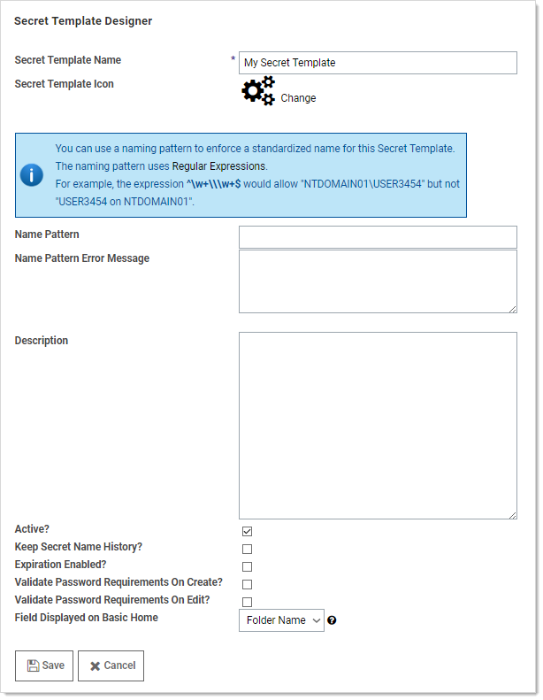

[title]: # (Creating or Editing Secret Templates)
[tags]: # (Template)
[priority]: # (10)

# Creating or Editing Secret Templates

Select **Admin \> Secret Templates**. The Manage Secret Templates page appears:

If editing an existing template:

1. Click to select that template in the unlabeled secret template dropdown list.
1. Click the **Edit** button. The Secret Template Designer page appears (see below).

If creating a new template:

1. Click the **Create New** button. The Create New Secret Template pop-up page appears:

   

1. Type the name of the new template in the text box.

1. Click the **Create** button. The Secret Template Designer page appears:

   

   The Secret Template Designer page provides all the options for configuring a secret template, as well as which text-entry fields appear on any secret created from that template.

Add template fields as desired. See [Secret Template Settings](#Secret-Template-Settings).

Click the **Edit** button to customize the template general settings. The Secret Template Designer appears:

These settings are available:

- **Secret Template Name** check box.
- **Secret Template Icon** link: Click to change the icon displayed for the template.
- **Name Pattern** text box. See [Template Naming Patterns](#Template-Naming-Patterns).
- **Name Pattern Error Message** text box. See [Template Naming Patterns](#Template-Naming-Patterns).
- **Keep Secret Name History?** check box: If Keep Secret Name History is enabled, SS keeps the specified number of entries for viewing. This feature creates a record of every name used when a new secret is created.
- **Expiration Enabled?** check box: Secret templates allow expiration on certain text-entry fields. When the check box is selected, an expiration time interval can be specified for a selected text-entry field using the dropdown menu. With this option enabled and a time duration specified, SS begins providing alerts if the secret text-entry field is not changed within the specified expiration requirements. See [Secret Expiration](#secret-expiration).
- **Validate Password Requirements on Create?** check box: Ensure requirements are met on secret creation.
- **Validate Password Requirements on Edit?** check box: Ensure requirements are met when editing secret.
- **Field Displayed on Basic Home** dropdown list box: Choose the field that appears on the Basic Home view.

Click the **Save** button. The Secret Template Designer page reappears.

Select the following buttons to further configure the secret template:

- **Edit Passwords Button:** Only visible for templates that contain a text-entry field that is of the password type. It is used to alter the minimum password length, as well as the character set used, for the auto-generation of the secret's password. See [Editing or Deleting Secrets](#editing-or-deleting-secrets) for further details on password auto-generation.
- **Configure Password Changing Button:** Used to enable RPC on these secrets. For details, see [Remote Password Changing](#remote-password-changing).
- **Configure Launcher Button:** Used to enable Remote Desktop or PuTTy Launcher or custom launchers on these secrets. For details, see [Secret Launchers](#secret-launchers).
- **Configure Extended Mappings Button:** Extended Mappings allows you to tie a text-entry field value to a SS defined system type for additional functionality. For example, you may have a generic password secret template that has a username and password text-entry field. For purposes of looking up credentials, such as a ticket system authentication secret, SS needs to know that actual type of the text-entry fields since the text-entry field name can be custom. Extended mappings available are:
- **SSH Private Key:** Defines which text-entry fields make up the SSH Key components of Private Key, Private Key Passphrase, and Public Key.
- **Username and Password:** Defines which text-entry fields contain the username and password.
- **Remote Server SSH Key for Validation:** Ensures the machine SHA1 digest for validating the machine connected to is correct.
- **OATH Secret Key**: For password changing on the Amazon Root Account using the Web Password Changer. If you enter the OATH secret for two factor, SS generates the one-time password (OTP) automatically for password changing and heartbeat, allowing you to automate that while enforcing two-factor authentication on the AWS root credential.
