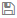

[title]: # (Secret Template Settings)
[tags]: # (Template)
[priority]: # (1000)

# Secret Template Settings

> **Note:** Please click the table of contents on the left to see any sub-pages to this one. Click the table of contents on the right to see headings on this page.

The secret template designer provides several settings to customize secret template text-entry fields:

- To add a secret text-entry field, fill out the values and click the **+** button.
- To delete a text-entry field, click the  icon. There is a confirmation dialog box before deletion takes place.
- To edit a text-entry field, click the icon. Click either the  icon to save or the **X** icon to discard the changes.
