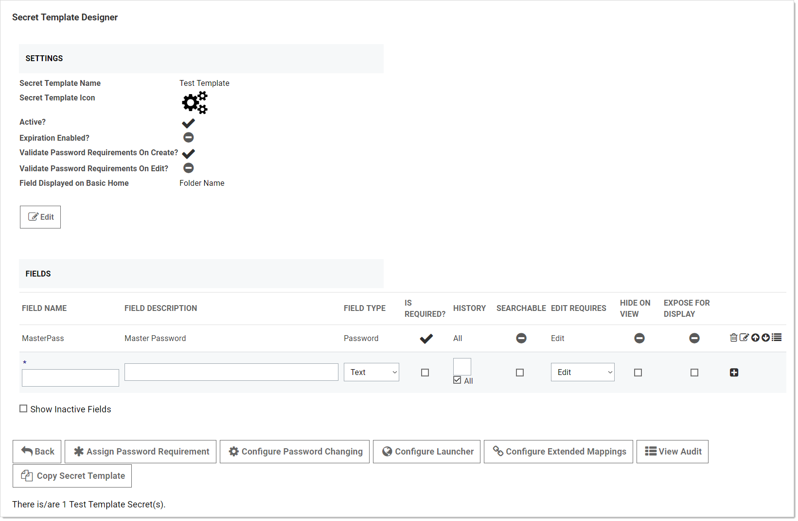
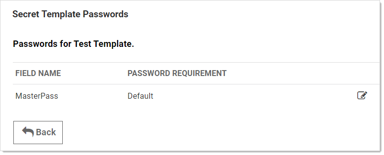

[title]: # (Setting the Password Requirement for a Secret Template)
[tags]: # (XXX)
[priority]: # (20)

# Setting the Password Requirement for a Secret Template

To set the password requirement for a text-entry field for a secret template:

1. Go to **Admin \> Secret Templates**. The Manage Secret Templates page appears:

   

1. Click to select the desired template in the unlabeled dropdown list.

1. Click the **Edit** button. The Secret Template Designer page appears:

   

1. Click the **Assign Password Requirement** button. The Secret Template Passwords page for that template appears:

   

1. Click the pencil edit icon for the field you desire. The password requirement turns into a dropdown list.

1. Click to select the desired password requirement.

1. Click the **Save** icon to save the changes.
