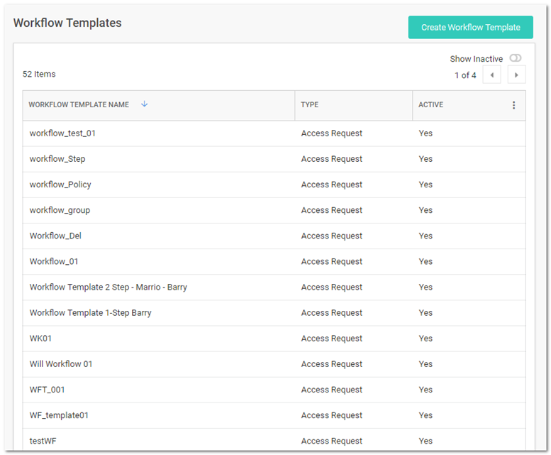
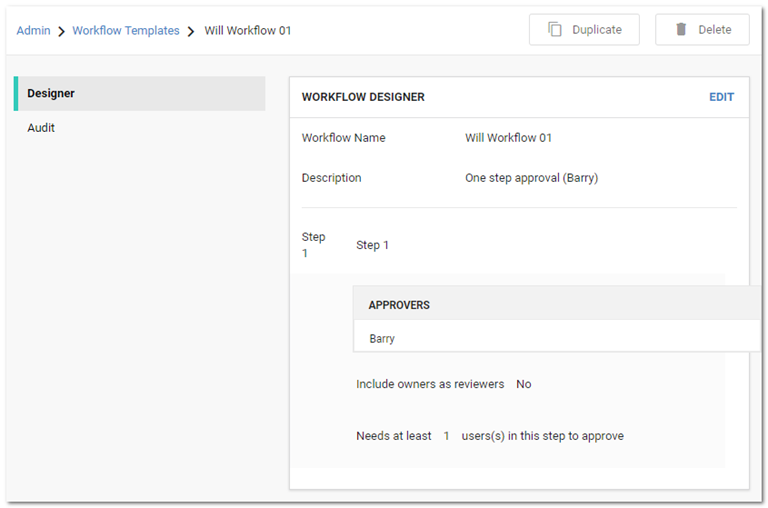

[title]: # (Accessing the Workflow Designer)
[tags]: # (Workflow)
[priority]: # (1000)

# Accessing the Workflow Designer

To access workflow templates:

1. Go to **Admin > Workflows**. The Workflow Template page appears:

   

   The page lists all active workflow templates.

1. (Optional) Click to enable the **Show Inactive** toggle button, under the **Create Workflow Template button**, to show both active and inactive templates. When the toggle button is disabled, it only shows active workflow templates.

1. Click any workflow template in the list to go to the designer page for that workflow:

   
