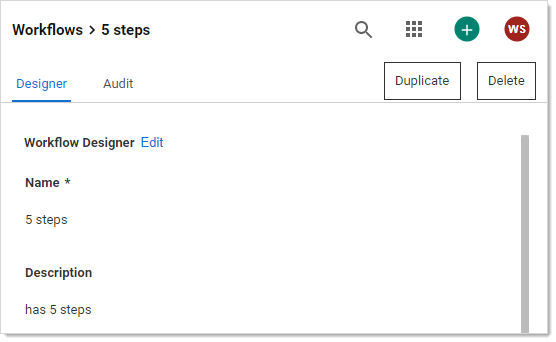

[title]: # (Accessing the Workflow Designer)
[tags]: # (Workflow)
[priority]: # (1000)

# Accessing the Workflow Designer

To access workflows:

1. Go to **Admin > Workflows**. The Workflows page appears:

   

   The page lists all active workflows.

1. (Optional) Click to enable the **Show Inactive** toggle button, under the **Create Workflow** button, to show both active and inactive templates. When the toggle button is disabled, it only shows active workflows.

1. Click any workflow in the list to go to the designer page for that workflow:

   
