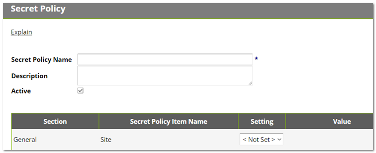
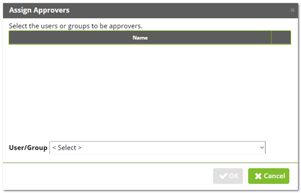

[title]: # (Assigning Workflows to Secret Policies)
[tags]: # (Workflow)
[priority]: # (1000)

# Assigning Workflows to Secret Policies
$1
$2
   
$1
$2$1
$2
   
$1
$2$1
$2
   
$1
$2$1
$2
   
$1
$2   
   > **Note:** You cannot set approvers and use a workflow at the same time. The intent of the next few instructions is avoid attempting to do so, which causes an error.
   
   
   
$1
$2$1
$2$1
$2$1
$2