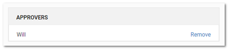
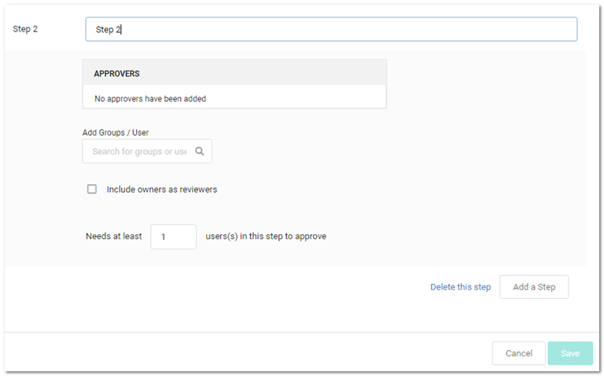

[title]: # (Creating New Workflow Templates)
[tags]: # (Workflow)
[priority]: # (1000)

# Creating New Workflow Templates

**Task 1:** Access the Workflow Designer:
$1
$2
   
$1
$2$1
$2

​A new workflow template has only one empty step by default.

**Task 2:** Set up the first step:
$1
$2$1
$2$1
$2$1
$2
   
$1
$2$1
$2$1
$2
**Task 3:** (Optional) Add more steps:
$1
$2
   
$1
$2$1
$2$1
$2
   
$1
$2