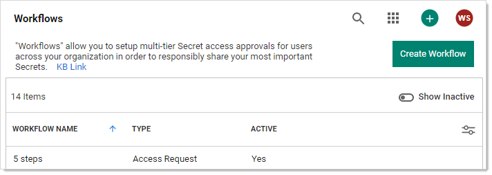
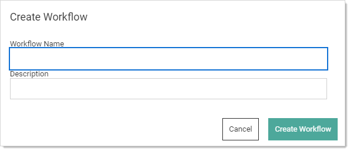
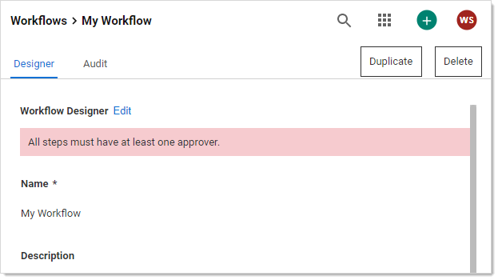
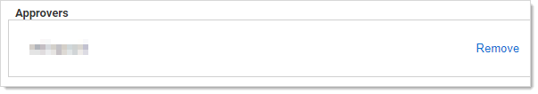
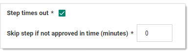
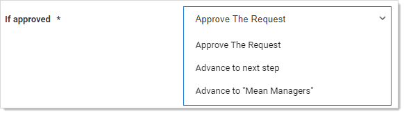

[title]: # "Creating New Workflow Templates"
[tags]: # "Workflow"
[priority]: # "1000"

# Creating New Workflows

### **Task 1:** Access the Workflow Designer

1. Go to **Admin \> Workflows**. The Workflows page appears:

   

   

1. Click the **Create Workflow** button. The Create Workflow popup appears:

   

1. Type the workflow template's name and descriptions in their text boxes. Once you type the name, the Create Workflow  button becomes enabled.

1. Click the **Create Workflow** button. The Edit page for the new workflow template appears on the Designer tab.

A new workflow template has only one empty step by default.

### **Task 2:** Set up the First Step

1. Click the **Edit** link next to the **Workflow Designer** heading. The page becomes editable.

1. (Optional) Type a name for the first step in the **Step 1** **Name** text box, such as "Line Managers."

1. Click the **Add Groups / Users** dropdown list to select the domain where you want to get your approvers from.

1. Type the name of the user or group you desire as an approver in the unlabeled search box to the right. Options appear in the dropdown.

1. Click the desired user or group. It appears in the Approvers table:

   

1. Repeat as desired.

1. (Optional) To automatically include the owner of the secret the template is assigned to, click to select the **Include owners as reviewers** check box.

1. If you wish to have multiple approvers required on the step, type the minimum required in the **Number of approvers required** text box. Otherwise, leave it set to 1.

1. If you want the step to time out, click to select the Step Times out check box. Another text box appears:

   

   > **Note:** 
   >
   > - Timeout minutes must be a positive integer set to 1 or greater. 
   > - If a step is set to time out and then all following steps are deleted, the step will no longer time out because the last step in a workflow is not allowed to time out.
   > - Multiple steps can time out, so cascading timeouts are possible. That is, step one times out to step two and step two times out to step three.

1. Replace the 0 in the **Skip step is not approved…** text box with the number of minutes for the desired timeout.

1. Click the **If approved** dropdown list to select what to do next:

   

   You can:

   - Approve the request
   - Advance to the next step in a linear fashion
   - Jump to another already defined step that is presented as an option in the list box.

### Task 3: Complete the Second Step

All workflows have at least two steps, otherwise a simple access request would suffice, so a second step is provided for you below. Repeat the process as for step one.

### **Task 4:** (Optional) Add More Steps

1. Click the **Insert a Step** button. A new step appears below the first two.

1. Repeat the process as for steps one and two.

1. (Optional) Keep adding steps till satisfied.

1. Click the **Save** button to create the access-request workflow template. The template exits editable mode:

   

1. Click the **Workflows** bread crumb link on the top of the page to return to the table.
