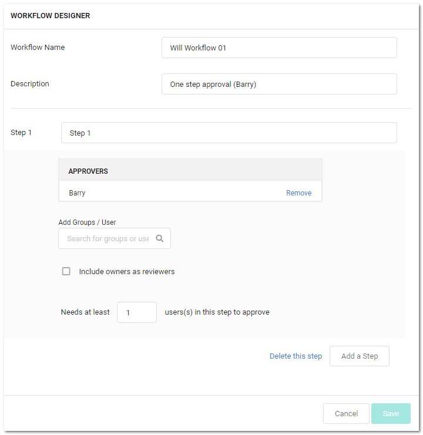

[title]: # (Deleting Workflow Templates)
[tags]: # (Workflow)
[priority]: # (1000)

# Deleting Workflow Templates

To delete a workflow template:
$1
$2
   
$1
$2
   
$1
$2$1
$2
> **Note:** Because workflows based on the template may still be in play, the template is not completely deleted. Instead, it is inactivated. You can reactivate the template later. See [Accessing the Workflow Designer](../accessing-the-workflow-designer/index.md)."
