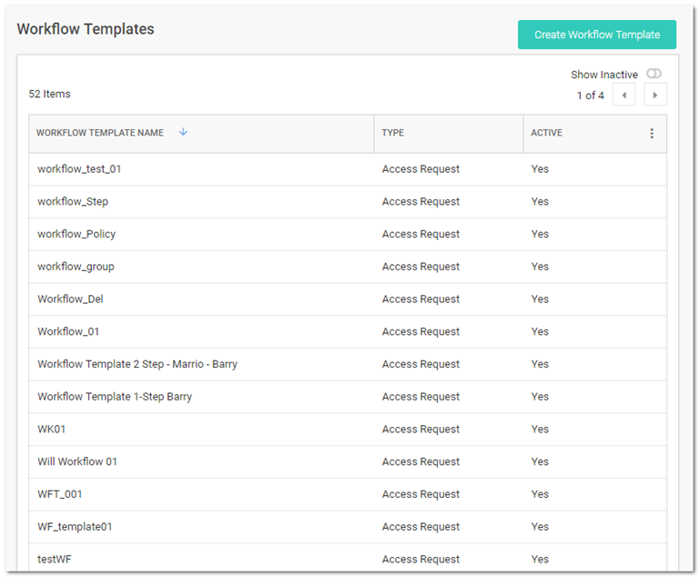
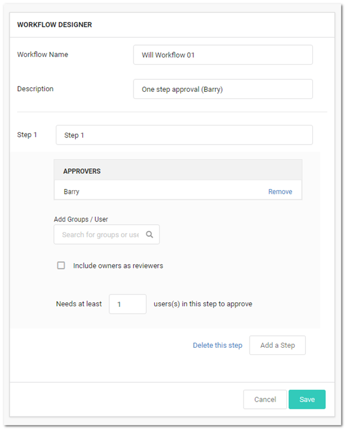

[title]: # (Duplicating Workflow Templates)
[tags]: # (Workflow)
[priority]: # (1000)

# Duplicating Workflow Templates

If you need to create a new workflow template that is like one your already have, you can save time by copying the similar template and then making the any changes:
$1
$2
   
$1
$2
   
$1
$2
   
$1
$2$1
$2