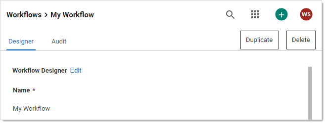
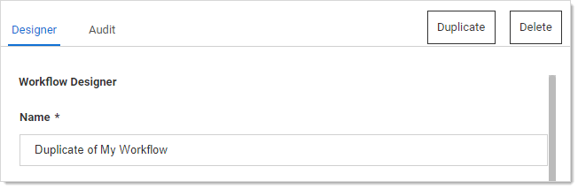

[title]: # "Duplicating Workflow Templates"
[tags]: # "Workflow"
[priority]: # "1000"

# Duplicating Workflow Templates

If you need to create a new workflow template that is like one your already have, you can save time by copying the similar template and then making the any changes:

1. Go to **Admin > Workflows**. The Workflows page appears:

   

   The page lists all active workflow templates.

1. (Optional) Click to enable the **Show Inactive** toggle button, under the **Create Workflow** button, to show both active and inactive templates. When the toggle button is disabled, it only shows active workflows.

1. Click the workflow template you want to copy in the **Workflow Templates** table. That template appears:

   

1. Click the **Duplicate** button. The new template appears, filled in the same as the original but with a "Duplicate of" name:

   

1. Change the name and edit as desired.

1. Click the **Save** button when finished.
