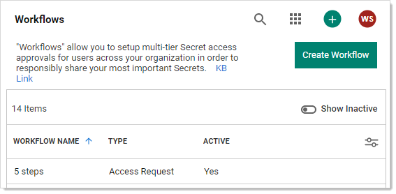

[title]: # "Editing Workflow Templates"
[tags]: # "Workflow"
[priority]: # "1000"

# Editing Workflow Templates

To edit the template:

1. Go to **Admin > Workflows**. The Workflows page appears:

   

   The page lists all active workflow templates.

1. (Optional) Click to enable the **Show Inactive** toggle button, under the **Create Workflow** button, to show both active and inactive templates. When the toggle button is disabled, it only shows active workflows.

1. Click the workflow to edit in the list to go to the designer page for that workflow (not shown).

1. At this stage the process is nearly identical to creating a new workflow template. The only difference is many of the parameters and additional steps are already completed. Change them as desired. If you want to eliminate an entire step, click the **Delete This Step** link for that step.

> **Note:** You cannot make any changes to the behavior of a workflow template if there are active requests using that template without cancelling those requests. An active request is any unexpired request that has not been approved, denied, or canceled by the user. If you do make an alteration, any requests are canceled and those affected are notified by email so they can resubmit their requests. Any user editing the template is notified when he or she tries to save changes on the canceled request.

