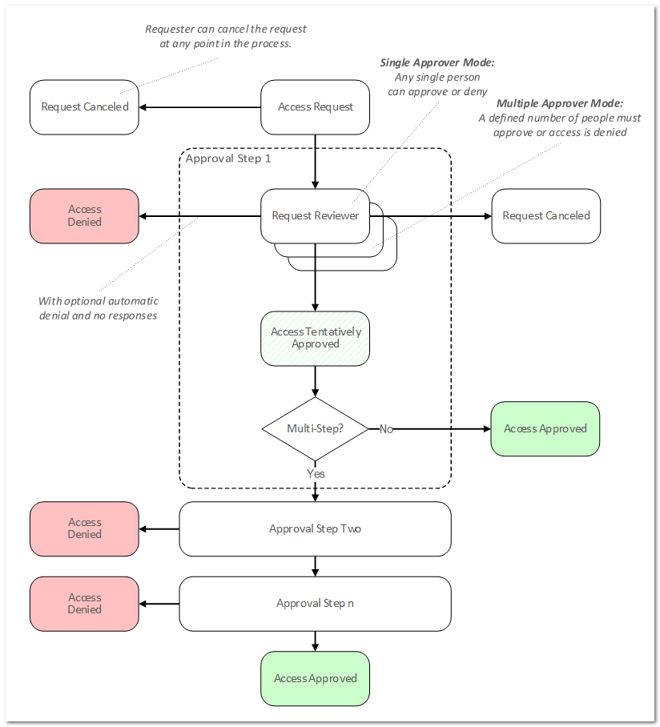

[title]: # "Secret Workflow Templates"
[tags]: # "Workflow"
[priority]: # "1000"

# Secret Workflow Templates

Starting in 10.6, SS introduced _access-request_ _workflow templates_. These allow users to build more complex interactions based on events within SS than currently possible. The first release of workflows offers access requests. Workflow templates define the series of steps and reviewers required for an access request. You can assign workflow templates to secrets or secret policies.

With Access-Request Workflow Templates, you can:

- Require that multiple people approve a request before access is granted

- Require multiple workflow steps, each with different reviewers and number of required approvers, if desired.

- Select "Owners" as a review group

> **Note:** Access Requests already existed in SS, but with 10.6 they become much more powerful. Previously, if access requests enabled on a secret, requests were granted after a single reviewer approved the request. Now, approval workflows can require multiple approvers, and multiple approval levels.

## Multi-Level Workflow

The original access requests are one level or step—anyone approving approves the request—no other input is required. Workflows allow up to 15 approval steps where approval by reviews in step 1 moves the request to step 2, approval at step 2 moves it to step 3 and so forth. Denial at any step denies the request.

## Multiple Approvers to Advance

The new workflow feature can be configured where one approver at a given step is not enough. In effect, approvers in each step can "vote" for approval—you stipulate how many approvers at a step must approve for the approval to move on to the next step.

## Approval Process Workflow

The following diagram is the entire process summarized:

**Figure:** The Approval Process Workflow

## Workflow Versus Basic Access Requests

In general, "simple access requests," the only type available to older versions of SS, are the same as a one-step stepped approval. The major exception is that with stepped requests, once a workflow access request has been approved, denied, or canceled, its status cannot be changed. In contrast, simple, non-workflow, access requests retain the original behavior of allowing a request to be approved after it has been denied or denied after it has been approved.
