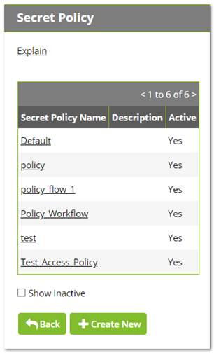
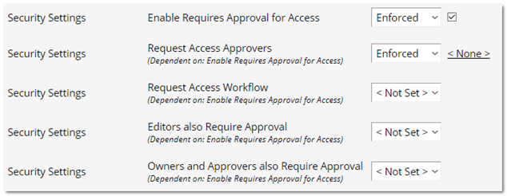

[title]: # (Assigning Workflows to Secret Policies)
[tags]: # (XXX)
[priority]: # (20)

# Assigning Workflows to Secret Policies

1. Click **Admin > Secret Policy**. The Secret Policy page appears:

   

1. For this instruction, we are going to create a new policy.

1. Click the **+ Create New** button. Another Secret Policy page appears:

   

1. Type the new policy name in the **Secret Policy Name** text box.

1. Scroll down the page to the **Security Settings**:

   

1. Click the **Enable Requires Approval for Access** list and select **Enforced**.

1. Click to select the check box next to the list. The Assign Approvers popup page appears:

   

1. Click the **Cancel** button. The other access approval setting become enabled:

  > **Note:** You cannot set approvers and use a workflow at the same time. The intent of the next few instructions is avoid attempting to do so, which causes an error.

9. Click the **Request Access Approvers** list and select **Not Set**.

9. Click the **Request Access Workflow** list and select **Enforced**. A new list appears alongside.

9. Click the new unlabeled list and select the access template workflow to associate with the policy.

9. Click the **Save** button at the bottom of the page. The policy is now available for assignment to secrets and folders, just like any other policy.
