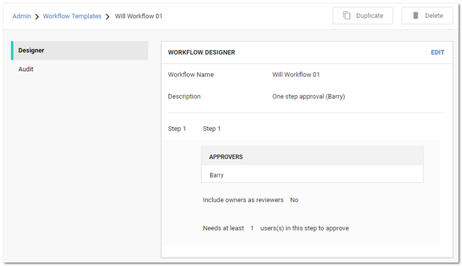

[title]: # (Duplicating Workflow Templates)
[tags]: # (XXX)
[priority]: # (60)

# Duplicating Workflow Templates

If you need to create a new workflow template that is like one your already have, you can save time by copying the similar template and then making the any changes:

1. Access the Workflow Templates page:

   

1. Click the workflow template you want to copy in the **Workflow Templates** table. That template appears:

   

1. Click the **Duplicate** button. The new template appears, filled in the same as the original, including the name:

   

1. Change the name and edit as desired.

1. Click the **Save** button when finished.
