[title]: # (Common Criteria Hardening Guide)
[tags]: # (common critreria,security,hardening,cchg)
[priority]: # (1000)

# Common Criteria Hardening Guide

# Introduction
================

This guide provides the information an administrator would need to install and configure Thycotic Secret Server v 10.1 in compliance with the Common Criteria evaluated configuration. Follow this guide in its entirety to ensure that the settings of each parameter match the specific configuration that was evaluated and certified as secure by the Common Criteria certification.

## Audience
-------------

This document is intended for use by administrators who are responsible for installing, configuring, and operating enterprise infrastructure for their organization. To use this guide you must have knowledge of your organization’s network infrastructure, applicable policies, and have administrative access to configure your operational environment.

## About Common Criteria
--------------------------

The Common Criteria for Information Technology Security Evaluation (ISO/IEC 15408) is an international standard for certification of the security of computer systems, networks, and application software. The certification ensures that claims about the security attributes of the evaluated product were independently verified in the evaluated configuration operated in the specific environment. The certification assumes specific evaluated configuration and does not validate any security claims when the product is used outside of this specific configuration.

## Related Documents and Resources
-----------------------------------
Table 1: Guidance Documentation

| **Title**                               | **Edition**                   | **URL**                                                                                                                                                                            |
|-----------------------------------------|-------------------------------|------------------------------------------------------------------------------------------------------------------------------------------------------------------------------------|
| Installation Guide – Government Edition | Version 0.1                   | <https://thycotic.force.com/support/s/article/Installing-Secret-Server-Government-Edition- **SEEMS TO BE ARCHIVED**                                                                                       |
| Security Hardening Guide                | Version 0.5                   | <https://thycotic.force.com/support/s/article/Security-Hardening-Secret-Server- **SEEMS TO BE ARCHIVED**                                                                                                 |
| User Guide                              | Version 0.5                   |  https://thycotic.force.com/support/s/article/User-Guide-Secret-Server **SEEMS TO BE ARCHIVED**                                                                                                                 |
| Security Hardening Report               | Secret Server UI Version 10.1 | Click **Reports \| Security Hardening**  *\*Follow this checklist inside Secret Server to enhance the default settings that the Government Installer and Common Criteria require.* |

For more information about Thycotic Secret Server please refer to the Secret Server Documentation provided on Thycotic’s Support Portal at:

<https://thycotic.force.com/support/s/secretserver> **UPDATE TO RELATIVE LINK**

*\*While many Common Criteria requirements are automatically set as default through the Secret Server – Government Edition Installer, for ensuring that all of Thycotic’s security best practices are in place, the Security Hardening Configuration Settings Report can be found by navigating to the Reports \| Security Hardening tab. After installing Secret Server, follow the checklist on this page to ensure your environment is as secure as possible:*

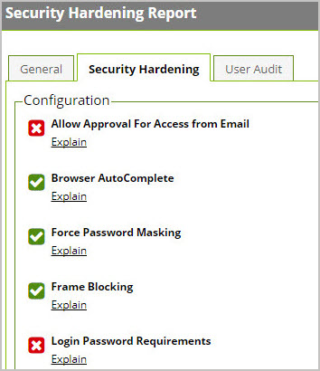

## Evaluated Configuration
---------------------------

The **Target of Evaluation (TOE)** is Thycotic Secret Server Government Edition v10.1, a software application used in the enterprise settings to define and maintain user credentials within a large organization. The evaluated configuration consists of the software application running on Windows Server 2016 (or later) with Microsoft .NET Framework 4.6.2 (or later) and Microsoft SQL Server 2016 (or later) database, installed locally.

Thycotic Secret Server – Government Edition can manage any IT asset compatible with the following types of credentials:

- Windows Accounts

- Active Directory accounts

- Unix accounts (SSH)

These credential types define a broad range of compatible ESM products. Generally, Linux 2.6.32 or later, Windows Server 2008 R2 or later, Windows 7 Enterprise or later would be compatible.

## Assumptions and Operational Environment
-------------------------------------------

There are specific conditions that are assumed to exist in the TOE’s Operational Environment. The following table lists assumptions about the Operational Environment as specified by the Protection Profile:

Table 2: Operational Environment

| **Assumption Name**                 | **Assumption Definition**                                                                                            |
|-------------------------------------|----------------------------------------------------------------------------------------------------------------------|
| A.CRYPTO                            | The TOE will use cryptographic primitives provided by the Operational Environment to perform cryptographic services. |
| A.ENROLLMENT                        | There will be a defined enrollment process that confirms user identity before the assignment of credentials.         |
| A.ELECTRONIC SUPPORT MEASURES (ESM) | The TOE will be able to establish connectivity to other ESM products in order to share security data.                |
| A.FEDERATE                          | Third-party entities that exchange attribute data with the TOE are assumed to be trusted.                            |
| A.MANAGE                            | There will be one or more competent individuals assigned to install, configure, and operate the TOE.                 |
| A.SYSTIME                           | The TOE will receive reliable time data from the Operational Environment.                                            |

The following table identifies the organizational security policies applicable to the TOE as specified by the Protection Profile:

Table 3: Organizational Security Policies

| **Policy Name** | **Policy Definition**                                                                                                                                                       |
|-----------------|-----------------------------------------------------------------------------------------------------------------------------------------------------------------------------|
| P.BANNER        | The TOE shall display an initial banner describing restrictions of use, legal agreements, or any other appropriate information to which users consent by accessing the TOE. |

# How to Install Your System
==============================

## Prerequisites
-----------------

**Minimum Hardware**

- **CPU:** Intel 2.4 GHz 4 core 64-bit

- **RAM:** 8GB

- **Data storage:** 60GB of free space

- **Network**: Gigabit Ethernet adapter

**Recommended Software**

- Windows Server 2016 or later

- Microsoft .NET Framework 4.6 or later

- IIS v10 or later

- Microsoft SQL Server 2016 or later

For more information on SQL licensing, see Microsoft’s [2016 editions and components list](https://docs.microsoft.com/en-us/sql/sql-server/editions-and-components-of-sql-server-2016).

Use of SQL Server Express, although included in the installation package, was not covered by the evaluation.

Windows Server 2016 ships with .NET 4.6.2 included; .NET 4.6.2 is backwards compatible with all previous .NET 4.x versions. Microsoft ensures that new .NET framework versions are backwards compatible. The .NET framework is updated through Windows Update, where Microsoft dictates specific release of the .NET framework on a fully patched system.

**Operational Environment**

- Audit Server: syslog-ng 3.9 or later

- Domain Controller: Active Directory version 2008 R2 or later

Click to see [more detailed System Requirements](https://thycotic.force.com/support/s/article/System-Requirements-for-Secret-Server) **NOT ARCHIVED MAYBE SHOULD BE MIGRATED** 

## SQL Installation and Configuration
--------------------------------------

To maintain Common Criteria Compliance, **SQL must be installed locally** on the Secret Server web application machine before running the **Secret Server—Government Edition** installer. During the install process for SQL, ensure that you use *Windows authentication mode*.

The following steps walk you through setup and configuration for **SQL Server 2016 Standard Edition**. At the completion of this section you will have:

- Installed a basic stand-alone instance of SQL Server 2016 Standard with the minimum features necessary for SQL Server.

- Installed SQL Server Management Studio for managing the local database.

- Created a local windows account to be used as the database account for the Secret Server installation.

### Installing SQL Server 2016 Standard Edition

1. Launch the SQL Server installer from CD or file download.

   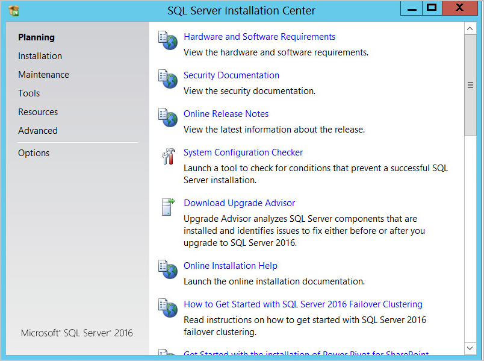

1. Click **System Configuration Checker.** This will launch and run a tool that checks for conditions on your server that could prevent SQL Server from installing.

1. When the tool launches, click the **Show details** button. A successful scan should look like the one shown below. If you encounter any issues, look at the detailed report, resolve the reported issues, and rerun the scan.

   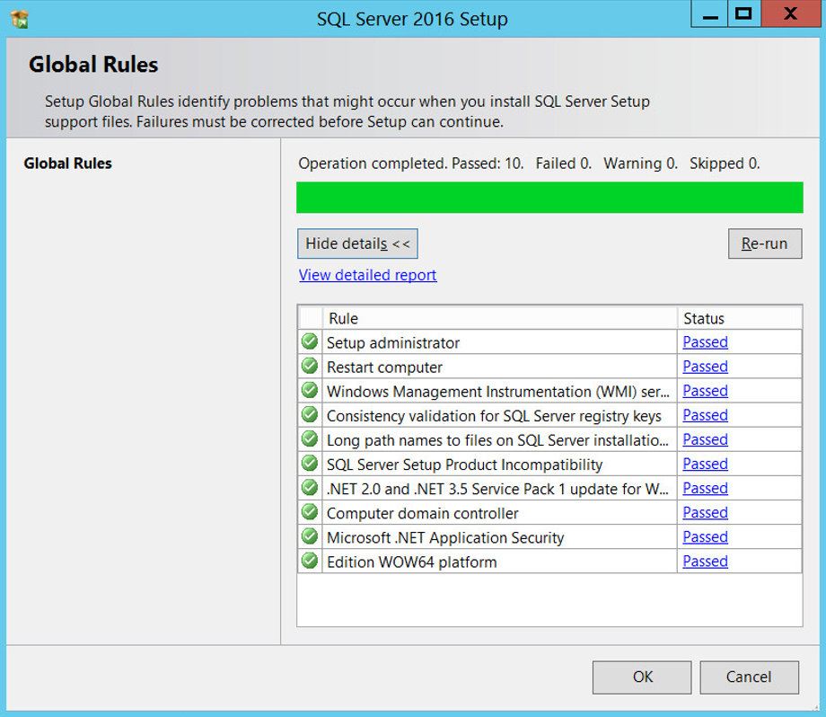

1. Click **OK** when done to return to the “SQL Server Installation Center” window.

1. In the “SQL Server Installation Center” window, click **Installation** then **New SQL Server stand-alone installation or add features to an existing installation**

   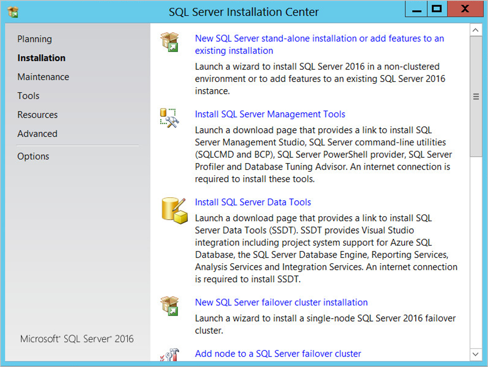

1. Enter your product key and click **Next**.

   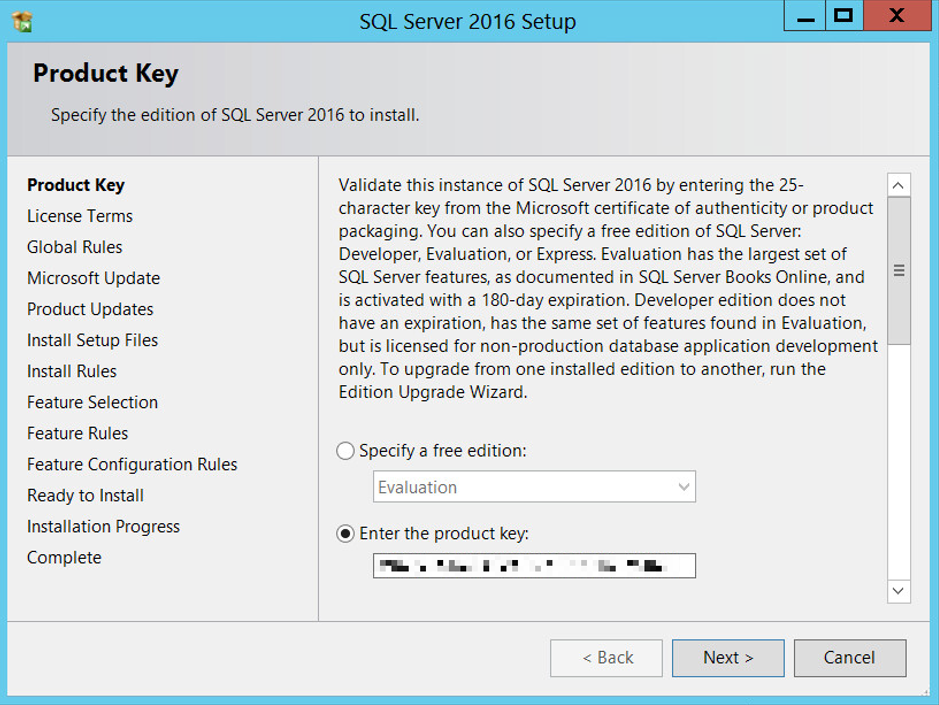

1. Check the **I accept the license terms**. checkbox and click **Next**.

   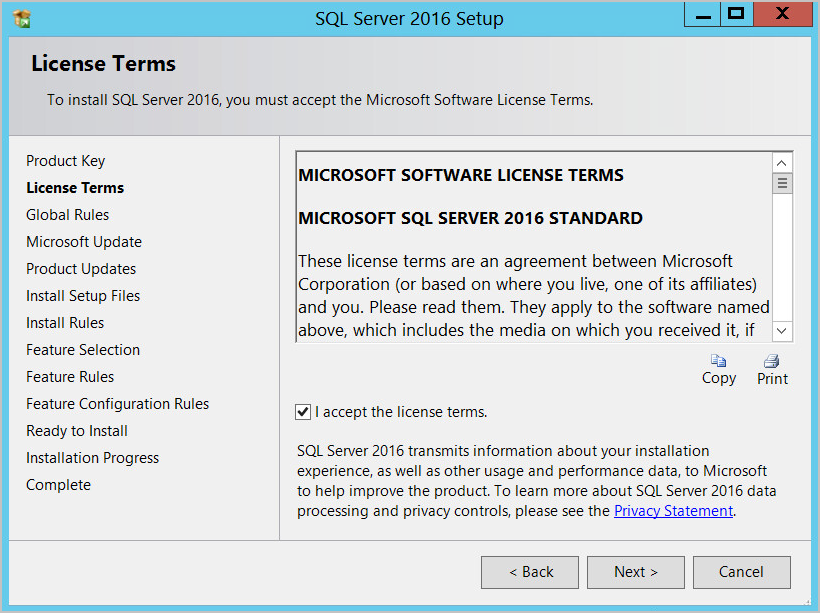

1. Wait for the **Rule Check** to run.

1. At the “Microsoft Update” step, check **Use Microsoft Update to check for updates (recommended)** unless your software update process does not utilize automatic updates from Microsoft and click **Next**.

   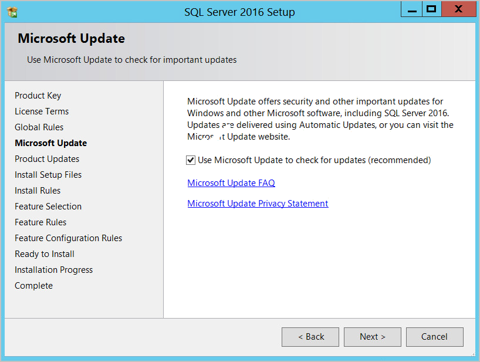

1. At the “Product Updates” step leave all defaults and click **Next**.

1. Wait for the “Install Setup Files” step to complete. Check that all operations pass (with the exception of Windows Firewall, which may return a warning status since the database will not be accessed from outside the firewall). The “Install Rules” screen (below) will appear upon completion. When the installation is successful, click **Next**.

   

   The only feature in “Feature Selection” necessary for Secret Server is “Database Engine Services” (see screenshot below). Unless you are using Geo-Replication (this is not in scope for Common Criteria standards) you can leave everything else unchecked and leave the directory locations unchanged 

1. Click **Next**.

   

1. At the “Instance Configuration” step, leave “Default instance” selected and click **Next**.

   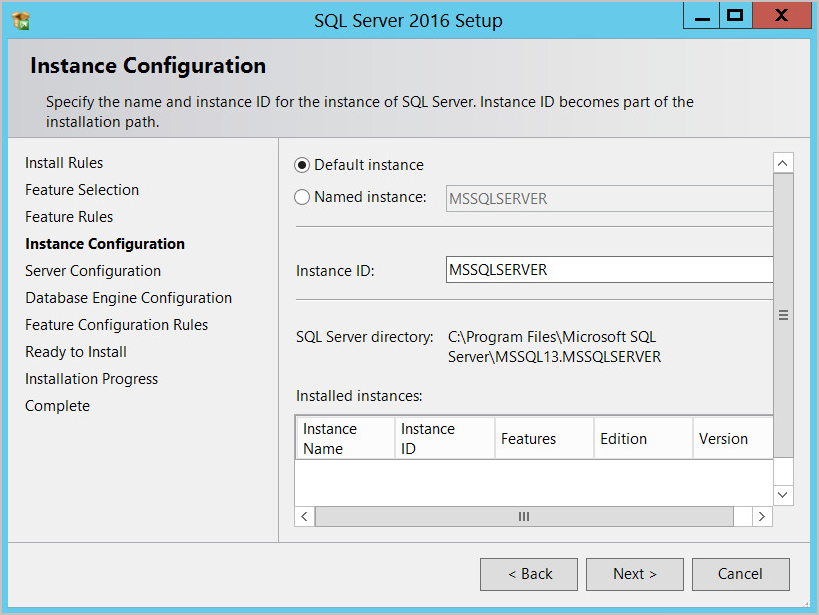

1. At the “Server Configuration” step, (screenshot below) leave the defaults and click **Next**.

   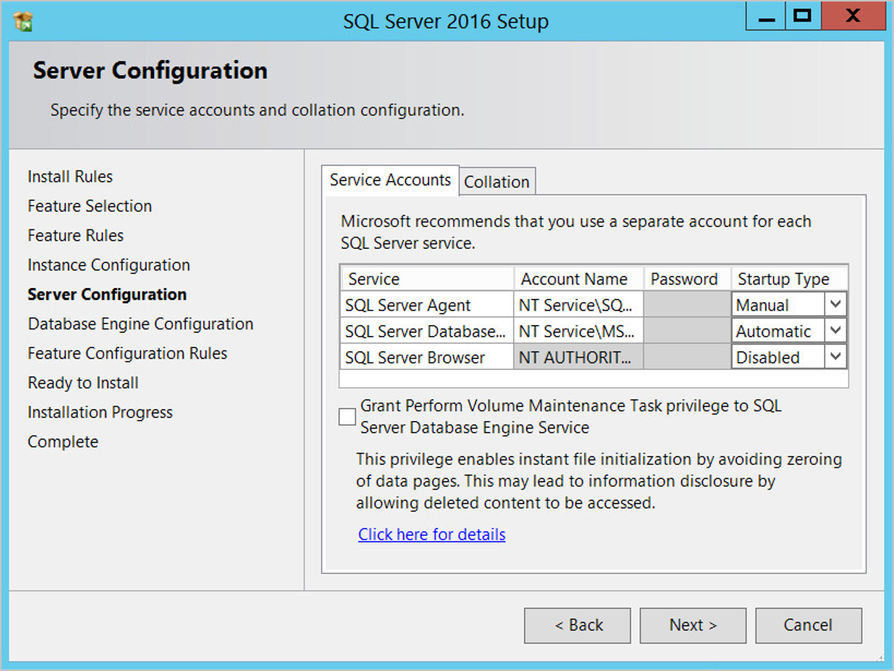

1. At the “Database Engine Configuration” step, make sure that **Windows authentication mode** is selected in the “Server Configuration” tab. Scroll down and add at least one Local Windows or Active Directory user or group in “Specify SQL Server administrators.” Click the **Add Current User** button to find and then **Add** the Administrator account.

   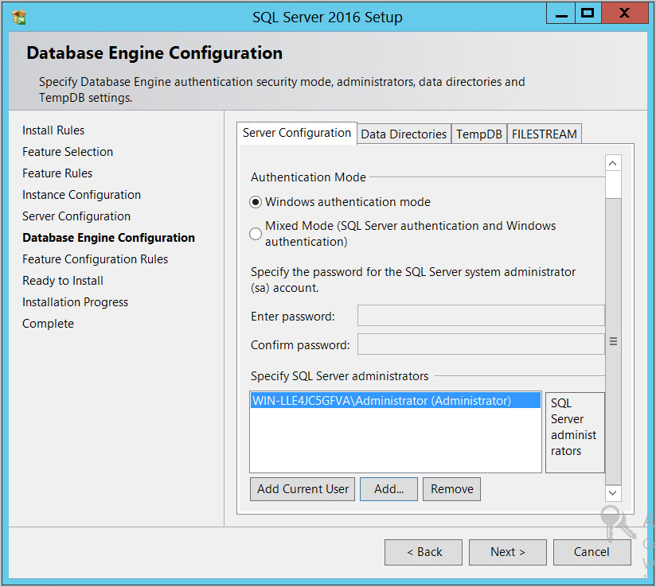

   You can leave the options in the remaining tabs at their default values or change the file locations in the “Data Directories” and “TempDB” tabs if you wish to store the database and log data in a different drive or directory. Click **Next**.

1. Wait for the setup wizard to progress to the “Ready to Install” step and click **Install**.

   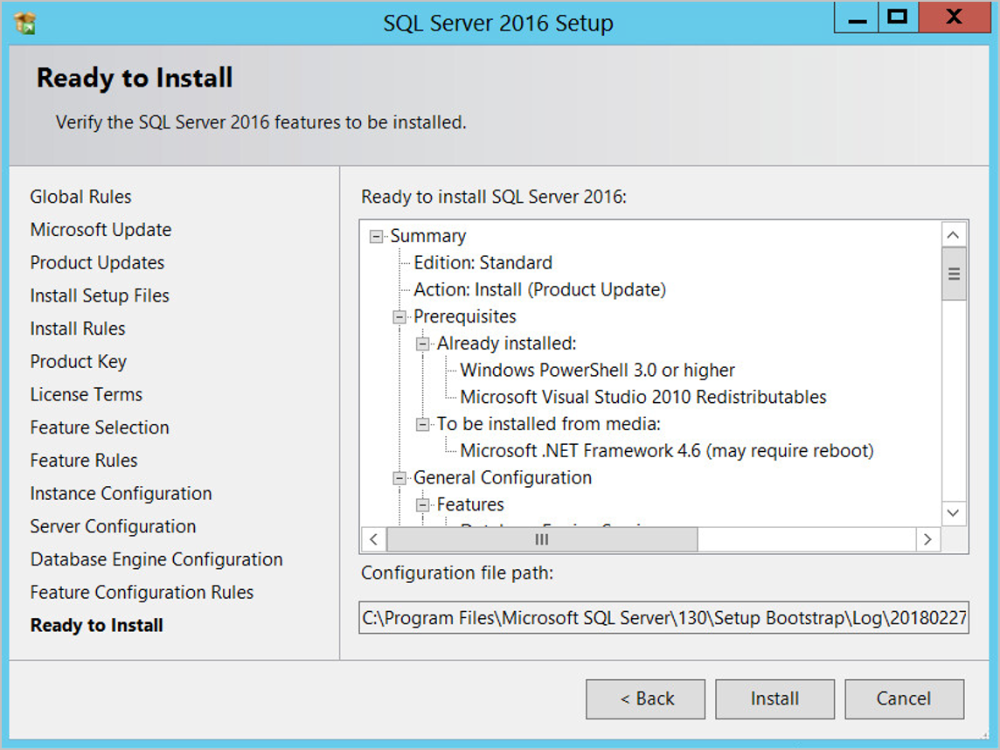

1. Wait for the installation to complete. This may take several minutes. Click **Close**.

>**Note**: you may need to reboot the computer before proceeding.

### Installing SQL Server Management Studio

1. Back in the “SQL Server Installation Center” window, click **Installation** then **Install SQL Server Management Tools**

   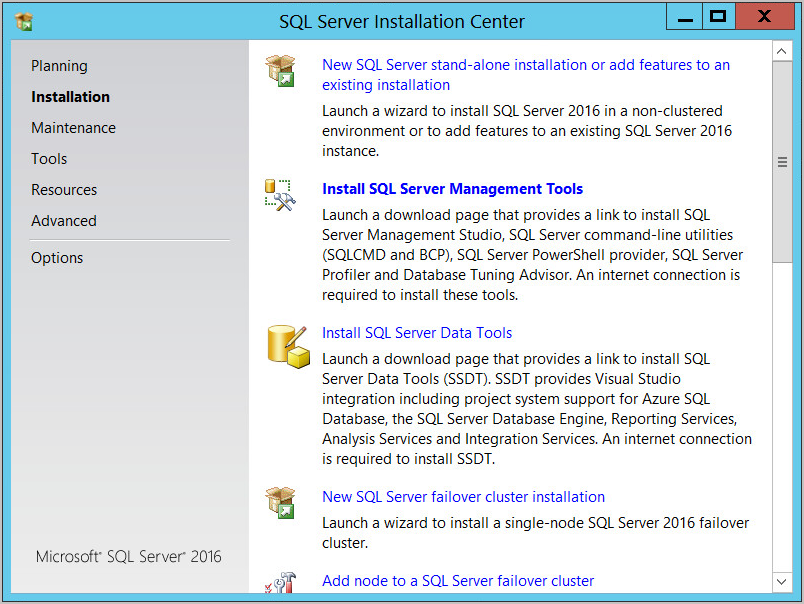

1. Wait for the web page to load then click the **Download SQL Server Management Studio 17.6** link *(note: actual version \# may be different if a newer version is available).*

   >**Note**: You may need to ‘enable downloads’ in your browser security settings to download this file.*

1. After the download is complete, click **Run** (if using Internet Explorer to download the file; if using a different browser, follow the conventions for that browser to run the file or open the download folder and run the file).

1. Click **Install** when the SQL Server Management Studio installer starts.

   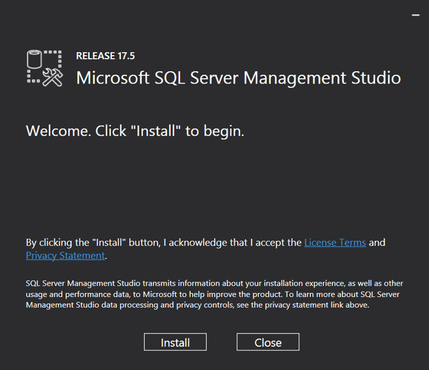

1. Wait for the installer to complete. This may take several minutes. When the installation has completed, click **Restart** if prompted. Otherwise, click **Close** and then close “SQL Server Installation Center.”

   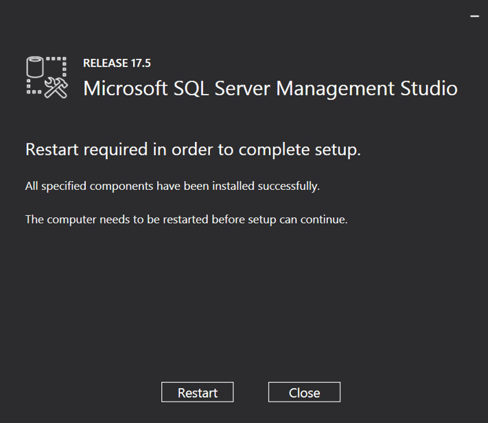

### Configuring SQL Server for Secret Server Installation

#### Create the SQL Server user account

1. Open **Control Panel \| System and Security \| Administrative Tools** and double-click **Computer Management**.

   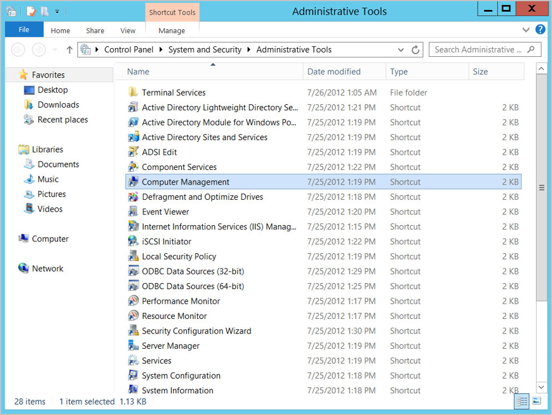

1. Expand the “Local Users and Groups” folder, right-click **Users**, and select
**New User…**

   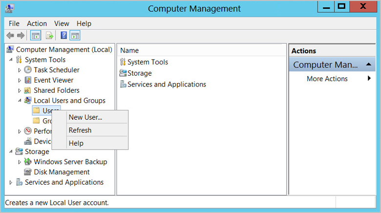

1. Give the user *any desired user name and a very strong password*. This account will be added as a user in **SQL Server Management Studio** in the next step and its credentials will be saved to an encrypted file during Secret Server setup.

1. Uncheck the default “**User must change password at next logon**” and check “**Password never expires**.”

1. Click **Create** followed by **Close** when done.

   

#### Add the User Account to SQL Server

1. Start SQL Server Management Studio. This may take several minutes the first time the application is started.

1. Connect to SQL Server by browsing for the database **Server name** (click the drop down box beside **Server name** then “**Browse for more..**” and select the name of the database installed). Click **Connect** to login using **Windows Authentication** (login as the user that you selected in the “Database Engine Configuration” step of the SQL Server installation).

1. Open the “Security” folder, right-click on **Logins**, and select **New Login…**

   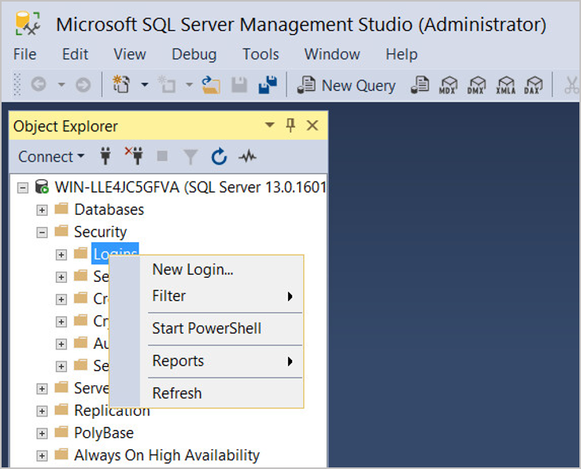

1. In the “Login – New” dialog, click the **Search** button, enter the full name of the Windows account you created in the previous step, and click **Check Names**. If entered correctly, the user name should be underlined. If it is not, correct the name and repeat. When the name is entered correctly, click **OK**.

1. Back in the “Login – New” dialog, click **Server Roles**, check **dbcreator**
and then click **OK**.

   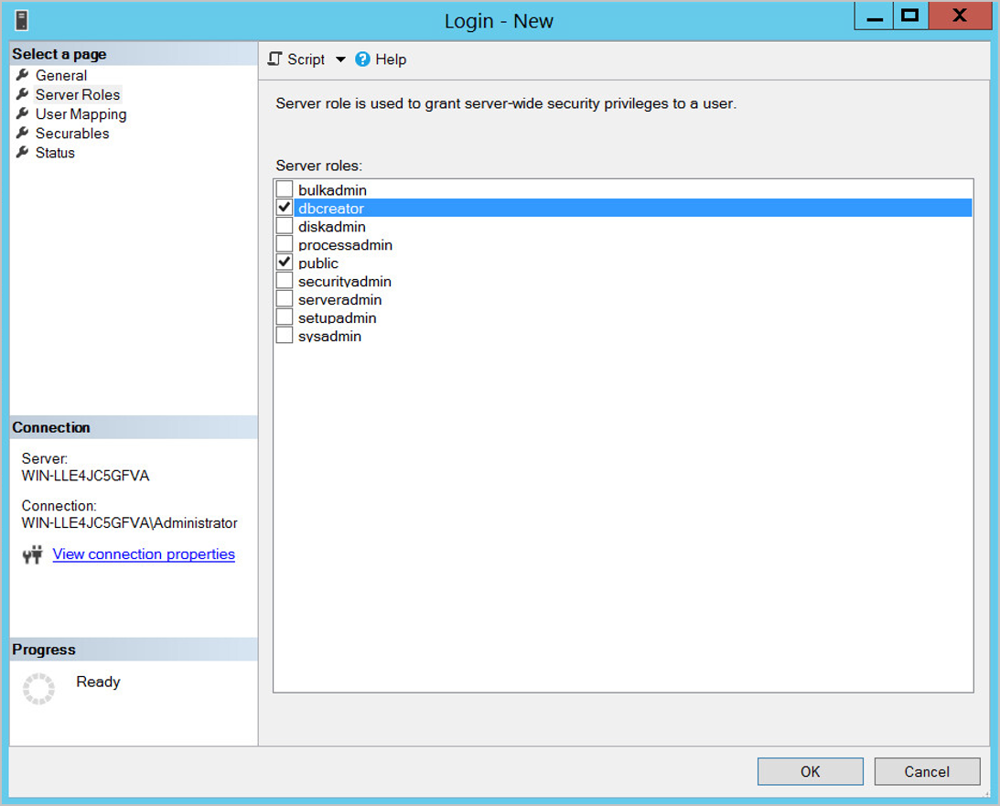

#### Additional Pre-Requisites for Secret Server

Windows Authentication to access the SQL database, it is recommended that you create a service account.

**To run the Secret Server IIS Application Pool with a Service Account:**

1. Open a command prompt window, change the directory to your .NET framework installation directory using the "cd" command (that is, "C:\\Windows\\Microsoft.NET\\Framework\\v4.0.30319" or "C:\\Windows\\Microsoft.NET\\Framework64\\v4.0.30319")

1. Type in `.\\aspnet_regiis -ga \< user name\>` and press enter. Replace the field with the relevant value from the SQL Server user account created in “Create the SQL Server user account”.

1. Give your service account "modify" access to C:\\Windows\\TEMP

1. Next open the Local Security Policy App from your start menu and grant batch logon permissions to your service account...
   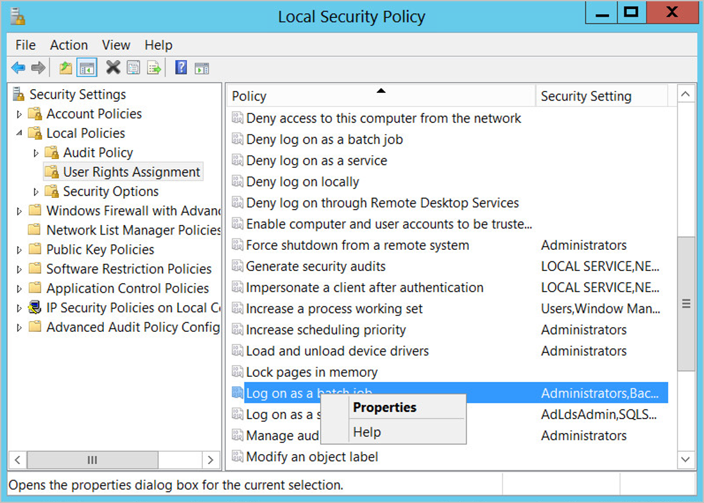

1. Open the Local Security Policy Console (Search-\>secpol.msc-\>[Enter]), expand "Local Policies", click on "User Rights Assignment", right click on "**Log on as a batch job**", click "properties", click "Add User or Group", and add your service account, then click "OK".

   >**Note**: If you utilize Group Policy to enforce the "Log on as a batch job" and
have group managed service accounts, take note that this will overwrite any
local permissions to the "Log on as a batch job" on all computers that have the
policy applied. Utilizing the local security policy is a safer option if you are
not sure about your usage across your domain.

1. Grant "**Impersonate a client after authentication**" permission to the service account under "User Rights Assignment" the same way "Log on as a batch job" was assigned above.

1. If you now get a "Service Unavailable" after applying "Log on as a batch job" permissions, then you need to update your group policy settings (start-\>run-\>cmd, type in gpupdate /force) and restart the Windows Process Activation Service.

For information about configuring a Windows account for database access, see <https://thycotic.force.com/support/s/article/Using-Windows-Authentication-for-Database-Access>. **UPDATED TO** https://thycotic.force.com/support/s/article/Best-Adv-Install-Using-a-Service-Account-to-Run-IIS-App-Pool-and-SQL-DB, **WHICH IS DEPRECATED AND POINTS TO** https://docs.thycotic.com/ss/10.9.0/secret-server-setup/installation/running-ss-iis-app-pool-service-account

## Secret Server Installer
---------------------------

### Downloading and Verifying the Installer

The latest version of Secret Server is available for download from the Thycotic Portal Downloads page:

<https://thycotic.force.com/support/s/article/Download-Secret-Server>-Government-Edition. **BAD LINK POINTS TO** https://thycotic.force.com/support/s/article/Using-Windows-Authentication-for-Database-Access **WHICH WAS UPDATED TO** https://thycotic.force.com/support/s/article/Best-Adv-Install-Using-a-Service-Account-to-Run-IIS-App-Pool-and-SQL-DB, **WHICH IS DEPRECATED AND POINTS TO** https://docs.thycotic.com/ss/10.9.0/secret-server-setup/installation/running-ss-iis-app-pool-service-account

You must login to the Thycotic Support Portal to access this download page. Select the **Government Edition Installer** link and a ThycoticSetup.exe file will be downloaded to your machine. For Common Criteria standards you must run the ThycoticSetup.exe file as an Administrator on a ‘clean’ Secret Server web server, with a full licensed version of SQL on the same database.

#### Installer Verification and Authentication

Thycotic generates SHA1 and SHA256 hashes for each software release. These are publicly available on Thycotic’s website:

<https://thycotic.force.com/support/s/article/Secret-Server-Download-Hashes> **DEPRECATED POINTS TO** https://docs.thycotic.com/ss/10.9.0/secret-server-setup/download-hashes

To verify that the installer has not been altered from our official release, run the Get-FileHash PowerShell command against your copy of the installer and check to make sure that the hash generated from that file matches the official hash value we publish. Assuming the copy of the installer you are checking is in the C:\\temp\\ folder, the command you would run is:

Get-FileHash -path `c:\\temp\\gov\\ThycoticSetup.exe -algorithm SHA256`

This will generate the hash and output the results. The output will look something like this:

Algorithm Hash Path  
--------- ---- ----
SHA256 588D130AE766C34E53072DFA4B900A372A99B5E413B3D1667CB17C2738ACD046
C:\\temp\\gov\\ThycoticSetup.exe

The second step to take when checking the authenticity of the installer is to check the code signing certificate to confirm that it is signed by Thycotic and has a valid certificate chain. To do this:

1. Right-click ThycoticSetup.exe and select “Properties” from the context menu.

1. Switch to the “Digital Signatures” tab.

   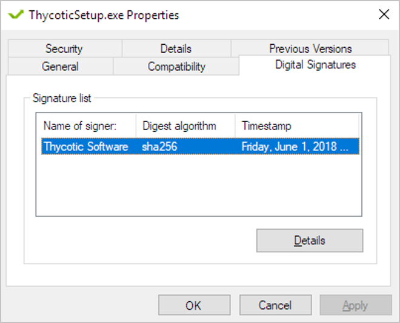

1. Verify that the name of signer is “Thycotic Software” and make note of the date in the Timestamp. Select that entry in the Signature list and click “Details.”

   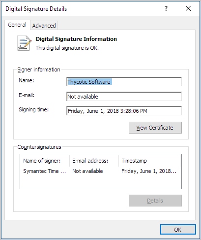

1. Click “View Certificate” to view the signing certificate.

   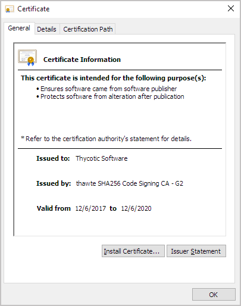

1. Verify that the certificate is issued to “Thycotic Software” and that the signing timestamp from the signature list is within the “Valid from” date range.

1. Switch to the “Details” tab.

   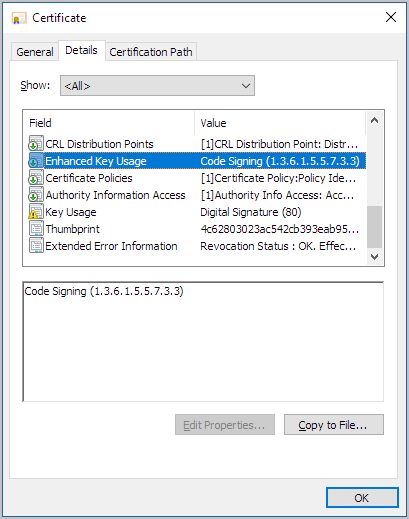

1. Verify that the “Enhanced Key Usage” field lists that the key is valid for code signing, as shown above.

1. Select the “Extended Error Information” field.

   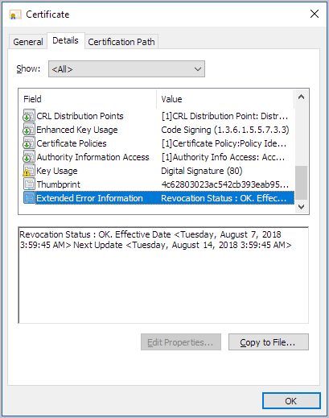

1. Verify that the certificate’s revocation status is “OK”

1. Switch to the “Certification Path” tab.

   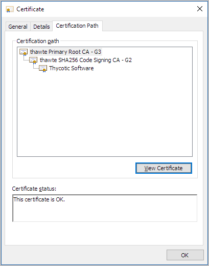

1. View each certificate in the chain above “Thycotic Software” and verify that the certificates are all valid.

### Running the Installer

If the following components are not already installed in your environment the Thycotic Installer will automatically set them up for you:

-  Microsoft .NET 4.6.2+ Framework or newer

-  Application and Web Server roles enabled in IIS

-  SQL License (Login with **dbcreator** rights needed)

-  SSL certificate (Troubleshooting self-signed certificates is not supported by Thycotic, we recommend a Certificate Authority for the certificate)

We strongly recommend that your Web Server is "clean," meaning that you should have no other running applications installed on this server to avoid
complications between multiple applications.

If an existing SQL server does not exist in your environment already, the installer
will give you the option to install SQL Express, however, *using SQLExpress is ONLY
intended for trials or sandbox environments and is not acceptable for production use*.

If your web server does not already have an SSL certificate, the installer will
create and install a self-signed certificate, however, *self-signed certificates
are NOT recommended for production environments.*

The installer will walk you through the steps required to perform your **Secret
Server – Government Edition** install. The following steps comprise a shortened
version for the install, highlighting Common Criteria Compliance requirements.
For a comprehensive step-by-step guide see our KB on **Installing Secret Server
– Government Edition** at:

<https://thycotic.force.com/support/s/article/SS-Installing-Secret-Server-Government-Edition> **INTERNAL ONLY SUGGESTS** https://thycotic.force.com/support/s/article/System-Requirements-for-Secret-Server

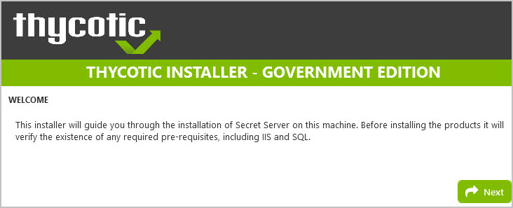

1. Click on the **Government Edition** of Secret Server to download the installer
(see “Downloading and Verifying the Installer” for link) and execute the installer on your joint Web
Application + Database Server. The first installer page you will be presented
with is the **Welcome** splash screen. Click **Next**, then read and **Accept**
the End User Licensing Agreement.

   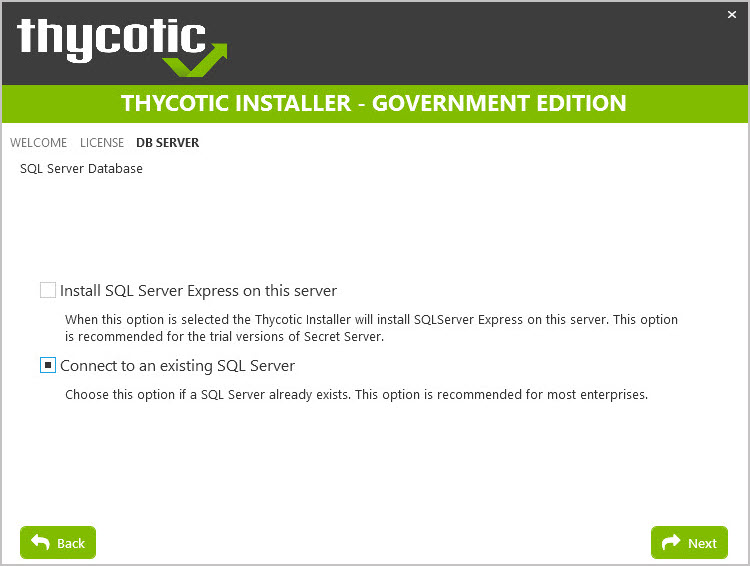

1. For Common Criteria compliance, select **Connect to an existing SQL Server**. To
uphold compliance a full licensed version of SQL must be installed locally (e.g.
on the same server where Secret Server is installed).  

   

   >**Note**: Installing SQL Express is only intended for the trial version of
Secret Server and is *NOT* suitable for production environments. If you choose
"Install SQL Server Express on this server," the Thycotic Installer will
automatically install a fresh instance of SQL Express locally, but your instance
will not be supported and will not be up to standard for production use.  

1. When you arrive at the **Pre-Requisites** window the Thycotic Installer will
check to make sure that all required conditions are met. If there are issues or
failures, choose **"Fix Issues"** to automatically install the necessary
Pre-Requisites. This may take several minutes. If an “Installing Dependencies”
windows pops up during this process, close to continue. When successful,
click **Next.**

   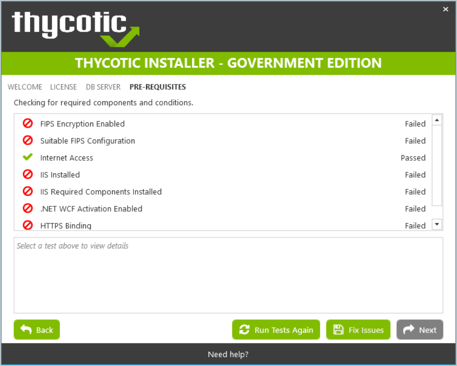

#### Troubleshooting

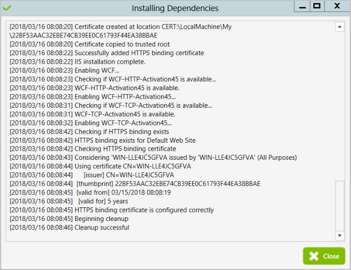

**Troubleshooting Note:** If the **FIPS Encryption Enabled, Suitable FIPS
Configuration,** or **HTTPS Binding** settings *Fail* during this Pre-Requisites
check, click the **Fix Issues** button. After the tests run again, if the
settings still list as “Failed,” close the installer as directed, and then
re-open the Installer. **Run the installer again** and the settings should pass.

If the FIPS Encryption Enabled setting continues to fail the pre-requisite
check, you can manually turn on FIPS mode, Enabling FIPS Compliance in Windows
by following the steps below:

1. Go to **Windows Security Policy editor** (secpol.msc) from your search bar

1. Navigate on your left pane to **Security Settings \| Local Policies \| Security Options**

1. Find and go to the property of **System Cryptography: Use FIPS Compliant algorithms for encryption, hashing, and signing...**

1. Choose **Enable** and click **OK**.

1. Restart your IIS server with **iisreset**.

   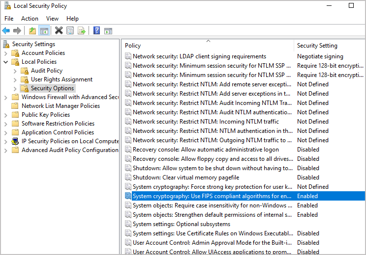

   **FIPS Encryption Enabled** means that FIPS-compatible encryption algorithms (that is, AES128, AES256) are available.

   **Suitable FIPS Configuration** means that Windows is in FIPS mode on the local server.

   For more information about enabling FIPS compliance see the “Common Criteria Configuration” section and the resources below:

   * [Enabling FIPS Compliance in Secret Server](https://thycotic.force.com/support/s/article/) **MIGRATED CHANGE TO INTERNAL LINK**  

   * [Microsoft FIPS 140 Validation](<https://technet.microsoft.com/en-us/library/cc750357.aspx>)

   >**Note**: If installing SQL Express you may need to manually install .NET 3.5 through the Server Manager Roles and Features wizard. If this is the case, the
installer will flag it for you in the details section. Remember that SQL Express is not compatible for Common Criteria compliance and is only intended for trial
or sandbox environments.*

1. Provide the Server Name or IP address for your Database server. According to
Common Criteria compliance, SQL should already be installed locally on this
machine.

   >**Note**: Using SQL Server Authentication with Administrator SQL credentials in
mixed mode is *NOT* compliant with Common Criteria. Instead, select **Windows
Authentication using Service Account**. Then click **Next**.

   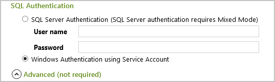

1. Choosing **Windows Authentication using Service Account** will bring you to a
new tab called **Account**. This tab will prompt you for the **DOMAIN\\User
Name** and **Password **of your pre-configured service account which we will
assign to the application pool identities in IIS when the site is created.  This
account must have the **db_creator** role. 

   >**Note**: Between the Secret Server web platform and the SQL database, **your licensed SQL database must** maintain Compliance according to Common Criteria and ensure that encryption standards are upheld by communications **installed locally (for example, on the same server that the installer is running on).**

   If your database does not yet exist when you click "**Test Connection**" the Thycotic Installer will create an instance of SQL Express, which is only intended for trial use and not suitable for production environments (see step 4).

1. Select **Validate Credentials**. 

1. When the connection has been tested successfully, click **Next**.

   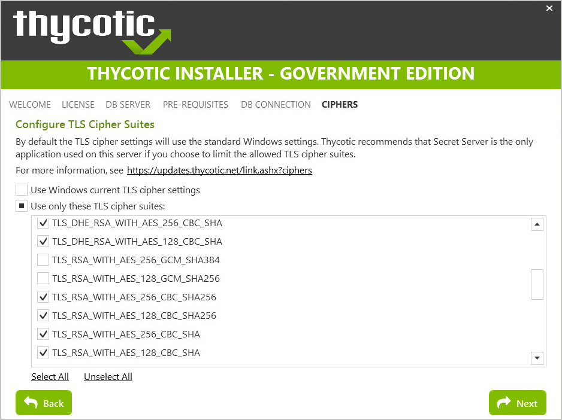

1. Verify that “Use only these TLS cipher suites” is selected, along with the six
checked cipher suites. If not, deselect the toggle for “Use Windows current TLS
cipher settings” and select **Use only these TLS cipher suites**.

   The following TLS cipher suites are required to make sure your Secret Server
instance's encryption standards are as secure as possible:

   TLS_RSA_WITH_AES_128_CBC_SHA  
   TLS_RSA_WITH_AES_256_CBC_SHA  
   TLS_DHE_RSA_WITH_AES_128_CBC_SHA  
   TLS_DHE_RSA_WITH_AES_256_CBC_SHA  
   TLS_RSA_WITH_AES_128_CBC_SHA256  
   TLS_RSA_WITH_AES_256_CBC_SHA256

   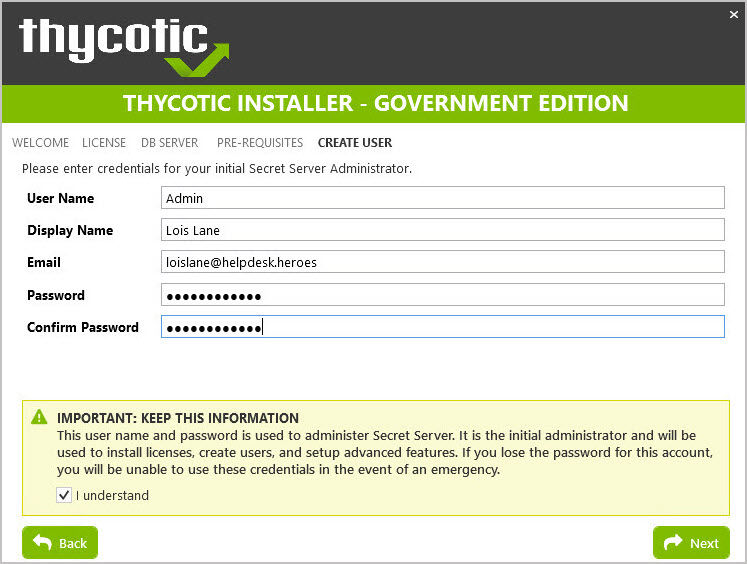

1. **Enter credentials** for your Secret Server Administrator account. Please
remember these credentials as they are necessary to login to the web application
after you complete installation. According to Common Criteria Compliance
regulations, **this local administrator user password must be 15 characters or
greater in length and include both numbers and special** characters – see the
“Password Requirements for User Authentication” section for more details.

1. If you have an **Email Server** that your organization uses for
notifications, enter its information in the Email Server Window and then click
**Next**. If this does not apply to your organization, select **Skip Email**

1. In the **Review **window (screenshot below), verify that all settings are
correctly listed. If anything needs to be changed feel free to modify the
section by clicking "Modify" on the righthand side. You may also hover over
the left-hand question mark symbols for descriptions of each point. Once
reviewed, click **Install**.

   >**Note**: Installation time will vary, most installs last between 10-40 minutes.

   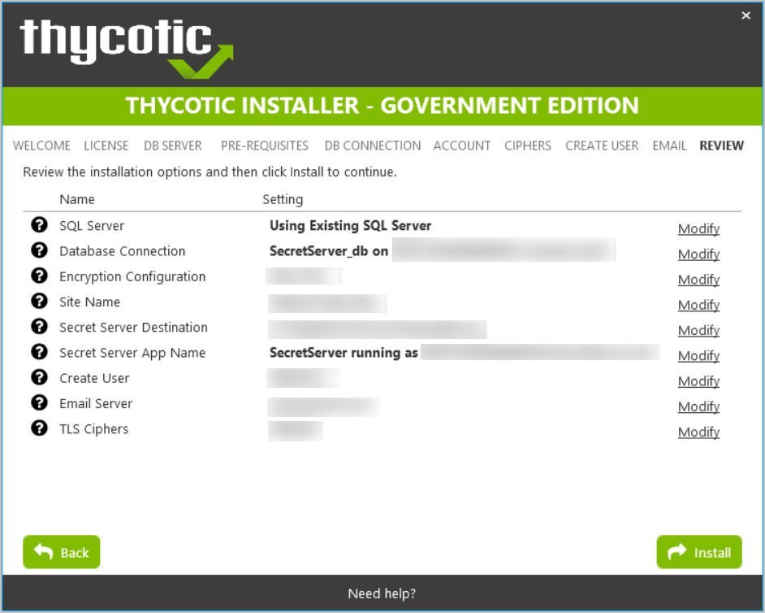

1. When the install has successfully completed, the **Clean Up** tab will direct you to move your backup file path location. Follow these instructions and move your backup encryption file to a secure location on a different machine for disaster recovery purposes. Then click **Next**.

   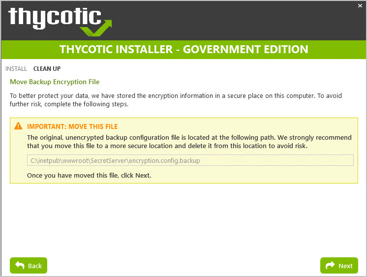

1. Because you specified TLS ciphers in step 6, after successfully completing the Secret Server Government Edition install you will be directed to fully reboot your Windows server so that the ciphers will take effect. Click **Reboot Now** to finish (screenshot below).

   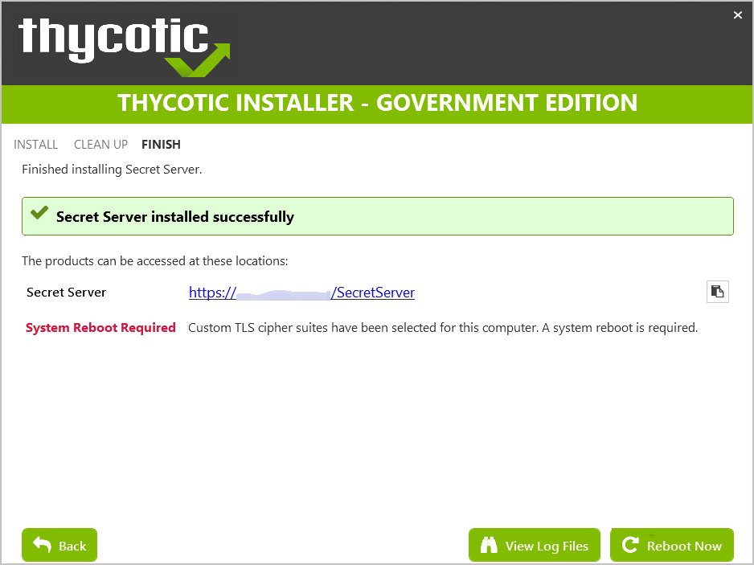

   You can click on the provided URL to navigate directly to your setup landing
page. Login using the Username and Password that you created on the “Create
User” installer screen.

#### Additional Permissions for Secret Server Folder

After installing Secret Server, check permissions on the folder:

1. Navigate to
the folder in which the web site was created (by default
**C:\\inetpub\\wwwroot\\SecretServer**)

1. Right-click the folder name and select **Properties \| Security** tab **\|
Edit** button, then click **Add…** to add the **local user account created for
the database** in step **2.2.3.1 Add the User Account to SQL Server**.

1. If not already checked, check the **Allow** boxes beside the “**Read and
Execute**,” “**List Folder Contents**,” and “**Read**” access permissions above,
click **Apply**.

# How to Access Your System
=============================

## Browser Compatibility
-------------------------

Secret Server is compatible with the following browsers and versions. Some functionality, as noted below, is not available in all browsers.

Table 4: Browser Compatibility

| Browser           | Supported?    | Compatibility Notes                                                                                                                                                            |
|-------------------|---------------|--------------------------------------------------------------------------------------------------------------------------------------------------------------------------------|
| Firefox           | version 23+   | Copy to Clipboard requires add-on. Click-once Launcher requires Microsoft add-on: <https://www.microsoft.com/en-us/download/details.aspx?id=9923> (Protocol Handler supported) |
| Chrome            | version 25+   | Copy to Clipboard requires add-on. Click-once Launcher not supported (Protocol Handler supported)                                                                              |
| Internet Explorer | version 9.0+  | IE 10+ may have issues with web filler. See <https://thycotic.force.com/support/s/article/Secret-Server-Web-Password-Filler> **SEEMS TO BE ARCHIVED** for more information.                             |
| Edge              | all versions  | Web filler not currently supported. Copy to Clipboard not currently supported.                                                                                                 |
| Safari            | version 5.0+  | Copy to Clipboard requires add-on (Snow Leopard OSX or better; not supported on Windows). Click-once Launcher not supported (Protocol Handler supported)                       |
| Opera             | not supported |                                                                                                                                                                                |

>**Note**: Click-Once launcher is not supported on any non-Windows platform.

## Web Interface
-----------------

To access Secret Server, navigate to your organization’s URL and login using
your administrator credentials. The first time you login your screen will look
like this:

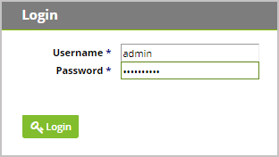

\*For information on setting up your Secret Server Local Administrator account, see the “Web Interface” section.

After enforcing the Login Policy Banner (for instructions, see the “How to Modify the Login Banner Messaging” section), the login screen will appear this way:

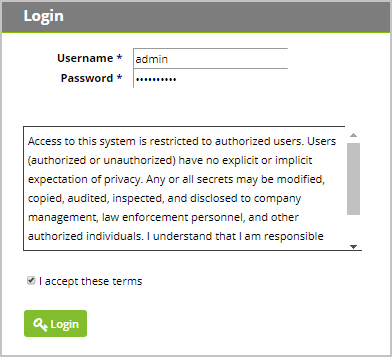

Once user accounts are configured, both Local accounts and Active Directory
users will access Secret Server through this login screen. To configure Active
Directory users, see the “Configuring Active Directory Sync” section.

You will be directed to Secret Server’s landing page for Administrator accounts.

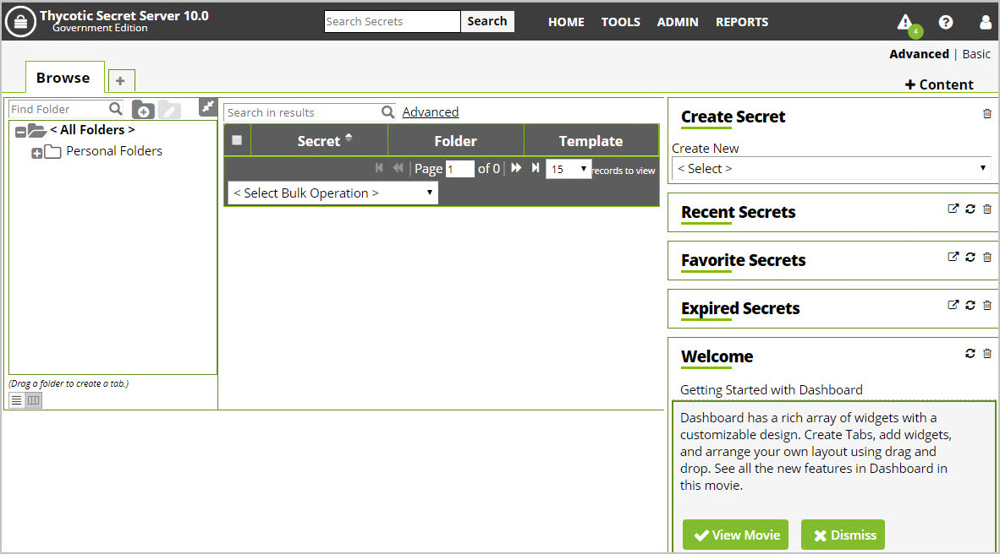

To logout, navigate to the **profile icon** in the upper right-hand corner and
select **Logout** from the dropdown list. 

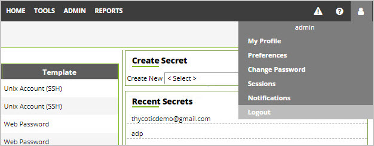

Once user accounts are created in
Secret Server from the Admin profile, users can login using user-level
credentials by navigating to your organization’s login URL.

More detailed information for setting up Secret Server including customizing
your dashboard and creating users can be found in Secret Server’s User Guide:

<https://updates.thycotic.net/secretserver/documents/SS_UserGuide.pdf> **CHANGE TO INTERNAL LINK(S)**

## Local Admin Account
-----------------------

To create Secret Server’s Local Administrator Account you will be prompted for
information through the installer (step 7 in the “Running the Installer” section of this guide). Save
the information you provide during this step so that you can login to the
administrator account when the installer finishes setting up your instance.

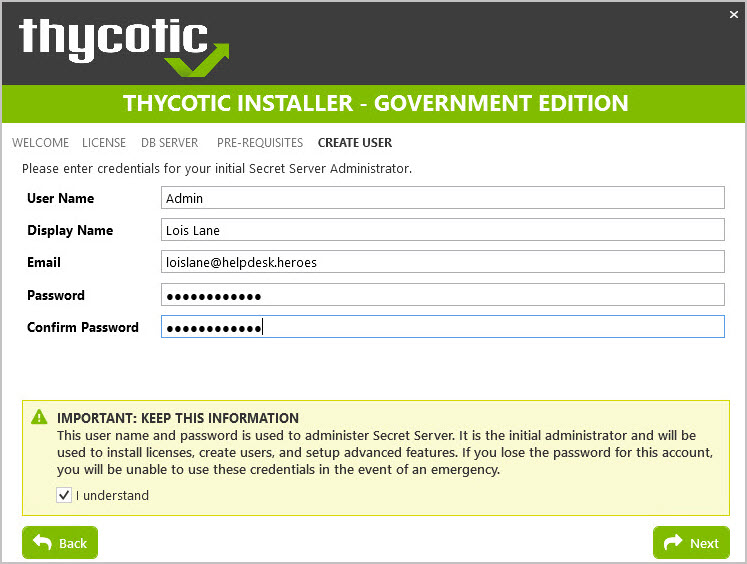

## Installing License Keys
---------------------------

After logging into Secret Server with Secret Server’s local administrator
account, the first thing you will need to do is install your organization’s
license keys. You will need three different license keys, one for the Secret
Server Edition being used, one for Support, and one for Users. Install your keys
by navigating to **Admin \| Licenses**, click **Install New License**. To
install multiple licenses at once, click the **Bulk Entry Mode** button. Add
your licenses according to the example format and click **Add Multiple
Licenses**. button, enter the required informational fields included in your
trial or purchase license email and then click **Activate**.

To Activate newly installed licenses, click the **License Activation**

# Updating Secret Server
==========================

## Checking Software Version
-----------------------------

### Verify Software Version and Components

A shorthand version of the software version is listed in the upper left-hand
corner of any user screen, along with the product edition. The full software
version number is listed in the **Secret Server Environment** section by
navigating to **Admin \| Diagnostics**:

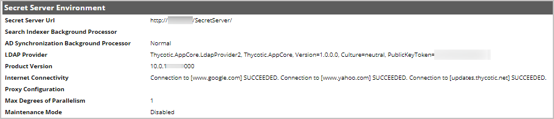

### Downloading Software Updates

By default, Secret Server is configured to notify you immediately when software
updates are available. To configure this manually, navigate to **Admin \|
Configuration \| General** tab and **Edit**, then check the box next to **Allow
Automatic Checks for Updates**. This setting will create a banner at the top of
your Administrator account’s user screen when a new update is available for
download.

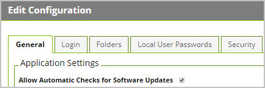

If your Secret Server web server has no outbound access, you can elect to
receive updates through Thycotic’s Support Portal by logging into your Portal
account at **thycotic.force.com**, **CHANGE TO WHAT?** navigating to your Account Settings, and
signing up for the Thycotic Mailing List.

After receiving a notification for the latest software release, navigate to
<https://thycotic.force.com/support/s/article/Download-Secret-Server> in order
to download the latest .zip file.

To perform an upgrade without outbound access, follow the steps in this
Knowledge Base article:
<https://thycotic.force.com/support/s/article/Upgrading-Secret-Server-without-outbound-access> **CHANGE TO INTERNAL LINK**

# User Authentication and Login Configuration
===============================================

The way that Secret Server authenticates interactive users depends on the type
of authentication that your organization has configured. Secret Server can use
both **Local Accounts** and/or Active Directory **Domain Accounts** for
authentication into Secret Server.

## Local Authentication
------------------------

A local user account is stored and managed by Secret Server. To successfully
authenticate a local user must login with a matching username and password. When
using local login, user credentials are checked against the internal authorized
users’ database.

To **create**, **edit**, or **remove** a local user account you must navigate to
**Admin \| Users** and locate any users whose Domain is listed as "Local" or
**Create New** users.

## Domain Authentication
-------------------------

A domain user account is stored and managed by Secret Server, but subject to
changes made in Active Directory. To successfully authenticate a user must login
with an Active Directory account that exists in Secret Server with matching
credentials. When using domain login, the TOE (Secret Server) initiates an
authentication request to the external domain controller (Active Directory)
using LDAP over TLS, and only allows access after receiving a successful result
message.

For more information on syncing Secret Server with Active Directory credentials
see the “Configuring Active Directory Sync” section.

## Account Lockout Configuration
---------------------------------

To access any information or functionality within Secret Server, users must
login with correct local or domain credentials. To comply with Common Criteria
regulations, Secret Server must be configured to prevent repeated unsuccessful
attempts at logging in. **Account Lockouts** are used for this purpose.
Configurable by the Secret Server Administrator, an account becomes inaccessible
after a limited number of unsuccessful authentication attempts until an
Administrator unlocks the user’s account.

To configure settings for Account Lockouts, navigate to **Admin \| Configuration
\| Login** tab, then click **Edit** and adjust the number for **Maximum Login
Failures**. Default for this setting is five attempts.

To Unlock a user’s account, navigate to **Admin \| Users \| Select the User**
and click **Edit**. Change the value for “**Locked Out**” from Yes to **No**,
then click **Save**.

### Lockout Window

Secret Server is programmed with a default Lockout Window of 60 minutes. This
means that once a user has locked out their account, they will be able to login
with the correct credentials after a period of one hour has passed. Account
lockouts are designed to prevent brute force attacks.

### How to Disable “Allow Remember Me” during Logins

By default, the Secret Server installer will disable the “Allow Remember Me”
caching feature during logins, however, to ensure this is feature is disabled,
navigate to **Admin \| Configuration \| Login** tab, and verify that the first
setting “**Allow Remember Me**” is set to **No**. If this is set to Yes,
**Edit** the page and uncheck the toggle, then **Save**. Audits for this setting
are logged under **Admin \| Configuration \| General** tab, by clicking the
**View Audit** button. To filter log results, search for “**AllowRememberMe**”
in the search bar.

## Configuring the Login Banner 
---------------------------------

To configure the Login Banner, navigate to **Admin \| Configuration \| Login**
tab, scroll to the bottom of the page and click the **Login Policy Agreement**
button, then **Edit** and check the **Enable Login Policy** and **Force Login
Policy** boxes.

Enabling these boxes will 1) Reveal the **User’s Policy Agreement** on the Login
page, and 2) Force users to **Agree** to the policy when logging into Secret
Server.

### How to Modify the Login Banner Messaging

To modify the display text from this **Login Policy Agreement**, go to Secret
Server’s Web Server and open **File Explorer**. Navigate to a text file called
“**policy.txt**” (default file path location is
**C:\\inetpub\\wwwroot\\SecretServer\\policy.txt**)

Open this file in Notepad and adjust the text according to your organization’s
policy requirements, then **Save**. The default text reads as follows:

- *Access to this system is restricted to authorized users. Users (authorized
- or unauthorized) have no explicit or implicit expectation of privacy. Any or
- all secrets may be modified, copied, audited, inspected, and disclosed to
- company management, law enforcement personnel, and other authorized
- individuals.*

- *I understand that I am responsible for protecting the confidentiality of
- company secrets and will comply with the company Information Security
- Policy. Unauthorized or improper use of this system may result in
- administrative disciplinary action, civil and/or criminal penalties.*

- By continuing to Login, I am indicating my awareness of and consent to these
- terms and conditions of use.

- \*\* CLOSE THIS SITE IMMEDIATELY if you do not agree to these conditions
- \*\*

## Configuring Session Timeouts
--------------------------------

To configure Session Timeouts, navigate to **Admin \| Configuration \| General**
tab, click **Edit**. Under the User Experience section, check the **Force
Inactivity Timeout** check box, then adjust the number of minutes of inactivity
before an active session in Secret Server will timeout and force users to login
again. Click on the **Save** button to save your changes.

## Configuring IP Address Restrictions
---------------------------------------

To configure IP address restrictions, navigate to **Admin \| More… \| IP
Addresses** and click **Create New**. Then provide the **IP Address User/Network
Name** and the **IP Address Range**, click **Save**.

IP address restrictions can then be set at a user-level by navigating **to Admin
\| Users** and clicking on a user name, then click **Change IP Restrictions**
and click on the Restriction checkbox for the restriction(s) you would like to
enable for that user. **Save** changes.

To restrict group access into Secret Server by a specific IP address or IP
address range, simply configure your IP address or range as listed above, then
navigate to **Admin \| Groups \| Create New**. Select all employees or groups of
employees to impose this restriction on and move left into the **Members** box.
Click **Save**. Next click the button **Change IP Restrictions** and check the
box for your desired IP Address/Range. **Save** changes to apply. Now users will
now be restricted from accessing Secret Server outside of the designated IP
Address Range.

# Managing Local Users
========================

## Create New Local Users
--------------------------

For creating a new local user in Secret Server, navigate to **Admin \| Users**
and select the **Create New** button. Provide the requested information on the
**Edit User** page.

## Manage Local Users
----------------------

To manage a local user, click on the **Username** for details about a specific
local user. Secret Server will provide information including **User** and
**Display Names**, **email address**, **Domain** affiliated, whether the user
has **Two Factor** verification set up on their account, whether the user is
**Enabled**, **Locked Out** from accessing their account, or whether the account
is not a User account but an **Application Account**. The **View User** page
also provides information about **Groups** and **Roles** for this user.

To edit these settings, click the **Edit** button. By editing a local user you
may change their **display name**, **email address**, allow **Two Factor**,
**disable/enable** the account, or **lock/unlock** the account.

You also can **create a new, one-time password** for the user’s account. If you
change a user’s password they will be prompted for a new password after logging
in with the Administrator-created password.

# Managing Domain Users
=========================

## Configuring Active Directory Sync
-------------------------------------

Secret Server can integrate with Active Directory by allowing users to use their
Active Directory credentials to login to Secret Server. According to Common
Criteria compliance, Active Directory relies **on LDAPv3 (RFC 2251) protocol**,
which is not configurable by users.  

In order to setup Active Directory in Secret Server, you will need to:

1. **Create a Sync Secret**

1. **Specify the domain to authenticate against**

1. **Configure TLS with Active Directory**

1. **Set Synchronization Groups**

1. **Turn on Active Directory Sync**

Secret Server relies on a primary “Sync” secret to connect to the LDAPv3 server
in Active Directory. Once connection has been made to Active Directory through
this secret, Secret Server needs to know which domain within Active Directory to
authenticate against, and within that domain which specific Active Directory
Group(s) to synchronize with. The Active Directory Sync in Secret Server targets
user account credentials from Active Directory. Secret Server will categorize
users according to group information from Active Directory, but **Secret Server
does not create, delete, or alter Active Directory Group Policies**.

### Create a Sync Secret

Before synchronizing users, you must first create a secret to be used as
the Sync Secret. This secret should contain **Domain Admin credentials** (or an
account with appropriate permissions for **Read Access** to all your
organization’s AD objects).

From Secret Server’s dashboard you can create this secret through the Create
Secret Widget. Next to “Create New,” select **Active Directory Account** from
the dropdown list.

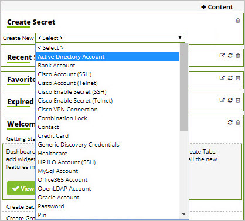

Add a **Secret Name** and provide the **Domain Name**, **Username**, and
**Password** for the Sync Secret that will be able to access Active Directory
with Admin credentials. **Save**.

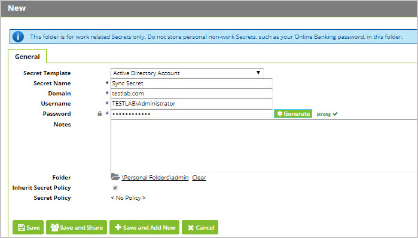

### Specify the Domain & Enable Active Directory Integration

Specify which domains Secret Server will be able to authenticate against. 
Secret Server can synchronize with any number of domains.  

- Once logged into Secret Server – Click on **Admin** \| **Active Directory** 
  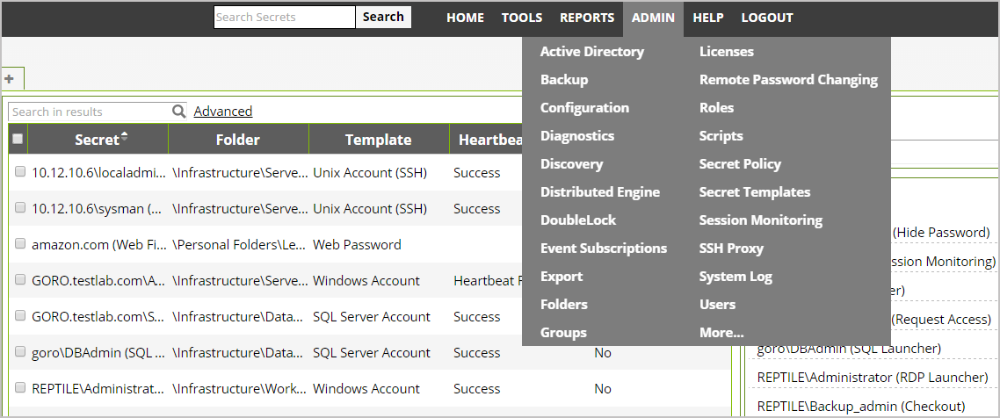

- From the AD Configuration page, click **Edit.** Check **Enable Active Directory Integration** in the Active Directory Integration section, **Enable Synchronization of Active Directory** in the Active Directory User Synchronization section, wait a few seconds for the screen to update, then next to **User Account Options** select **User status mirrors Active Directory (Automatic)** from the drop-down and click **Save**. This allows Secret Server to mirror any changes made to Active Directory automatically.

    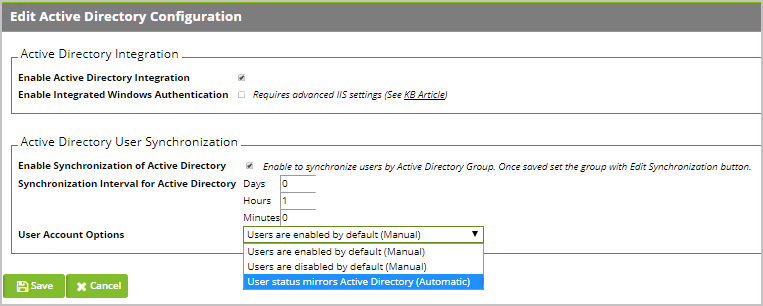

    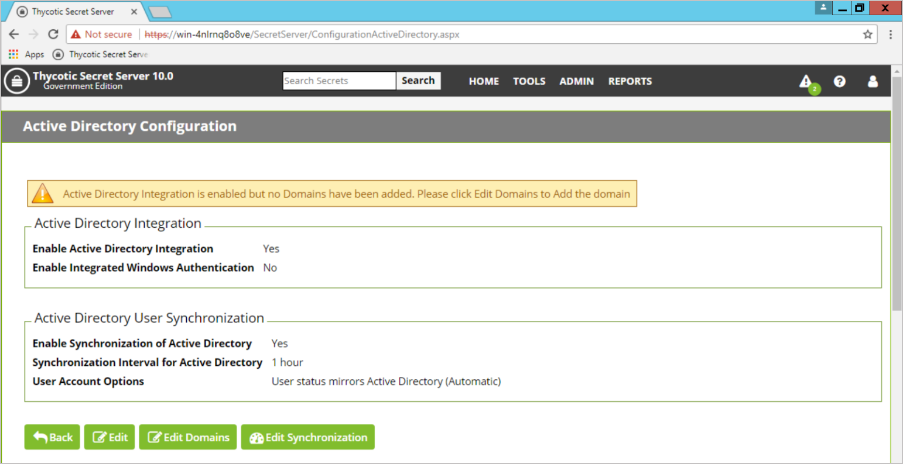

- Next click **Edit Domains** and **Create New**  

  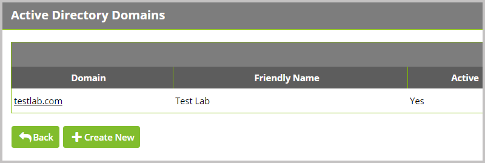

- Provide the **Fully Qualified Domain Name**, a **Friendly Name**, ensure that the box next to **Active** is checked and also check the box next to **Allow Logins From Domain**. Select your Sync Secret by clicking **No Selected Secret** and searching for the secret created in the “Create a Sync Secret” section.
  Click **Save** and **Validate**.  
  
    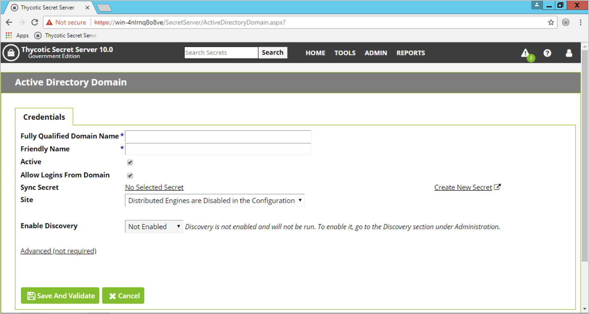

The Active Directory Sync Secret will be used to synchronize users and groups,
**it will require permission to search and view the attributes of the users and
groups. If you plan on using Discovery (NOTE: Discovery is not under Common
Criteria’s scope), the account will also need permissions to scan computers on
the network for accounts.**

### Configuring TLS with Active Directory

To ensure that TLS is configured with Active Directory:

- From the **Admin \| Active Directory** \| **Edit Domains** \| **Create New**
    page (continuing from previous section), after entering the requested
    information, click **Advanced (not required)** and check the **Use LDAPS**
    box to enable. Click **Save And Validate** to save this domain.

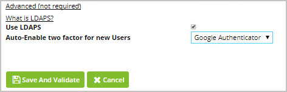

*\*If the TLS connection to Active Directory fails, the user will be notified
and the failure will be logged. Secret Server does not automatically retry to
connect to TLS but will retry the next time a user attempts to connect to AD.*

More information for setting up Active Domain with LDAPS can be found at

<https://blogs.msdn.microsoft.com/microsoftrservertigerteam/2017/04/10/step-by-step-guide-to-setup-ldaps-on-windows-server/> **"We're no longer updating this content regularly."**

### Setup Synchronization Groups

Once the domain has been added, click the “**Edit Synchronization**” button on
the Active Directory Configuration page.

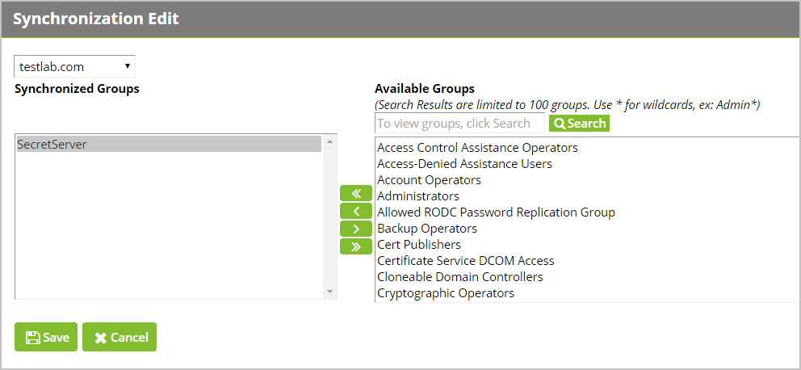

The Available Groups represent all accessible groups on the specified Active
Directory domain. The user membership can be previewed with the Group Preview
control.

- Select the desired group from the Available Groups that contains the Active Directory accounts for users you would like to create in Secret Server and move it into the **Synchronized Groups** area, click **Save**. This allows you to tailor specific Active Directory users to have domain accounts in Secret Server.

## Managing Domain Credentials
-------------------------------

### Updating Domain Credentials

Updating Active Directory (AD) Credentials and passwords happens directly
through Active Directory and syncs with Secret Server according to a schedule.
You can synchronize your Active Directory accounts at any time by navigating to
**Admin \| Active Directory** and clicking the **Synchronize Now** button. *You
cannot add or edit Active Directory credentials through Secret Server directly*.

When a user logs into Secret Server using Active Directory credentials or uses
an AD account to launch a session, the credentials are sent to the Domain
Controller in real time for authentication verification. Therefore, if an AD
user account has been updated or removed, changes will be reflected immediately
in Secret Server.

### Failed Domain Authentication

If the connection between Secret Server and the AD domain breaks, domain users
will fail to authenticate into Secret Server until the connection is
re-established. Secret Server will log all failed authentication attempts by
users.

To find these audit logs, navigate to **Admin \| Users \|** select a user **\|
View Audit** or refer to the “Local Auditing” section.

# Common Criteria Roles and Permissions 
==========================================

User Roles can be edited by navigating to **Admin \| Roles** and choosing
**Assign Roles**, then **Edit**. On the Role Assignment page you will be able to
select which users should be assigned to which role.

The **User Roles** that comply with Common Criteria standards are:

- **Administrator**

- **User**

- **Read Only User**

By default, Administrators have all possible Role Permissions. To view the list
of permissions and security attributes that associate to each User Role,
navigate to **Admin \| Roles** and select each role to view the list of
permissions. Each user session will be limited by the Role Permissions assigned
to that user.

Each can be associated with individual user identities, or can be associated
with either a local Group or an Active Directory Group. To assign a Role to a
User or Group, navigate to **Admin \| Roles \| Assign Roles**.

To administer configurations required for Common Criteria standards, an
Administrator requires the default permissions that are included for the
Administrator Role.

## Assigning Roles to Users
----------------------------

The default role assignment for new users is set by navigating to **Admin \|
General** tab **\| User Experience** section (scroll to bottom). To ensure that
no new users are created or imported with any extra privileges, make sure that
this setting is set to “None.”

To edit this default setting, click **Edit** and select “**None**” from the
dropdown list as shown by the screenshot below. Then click **Save**.

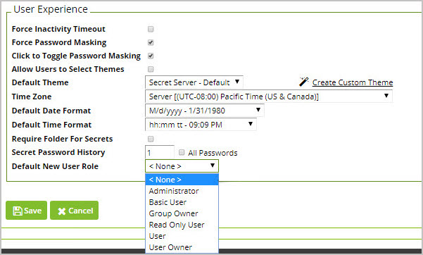

To assign users to Roles that are compliant with Common Criteria standards to
specific users or groups, navigate to **Admin \| Users** and select the user, OR
navigate to **Admin \| Roles;** then click **Assign Roles.**

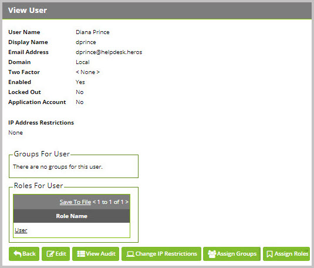

Under the **By User Or Group** tab, select a user or group from the dropdown,
then click **Edit**.

The Roles supported in Common Criteria include **Administrator, User,** and
**Read Only User**.

To apply one of these roles, select it from the righthand list and move it to
the left side under the Assigned box. Ensure that every user only is assigned
only one of these Roles. If both “Administrator” and “Read Only User” are
assigned to the same user, the user will maintain full Administrator access to
Secret Server. Click **Save Changes**:

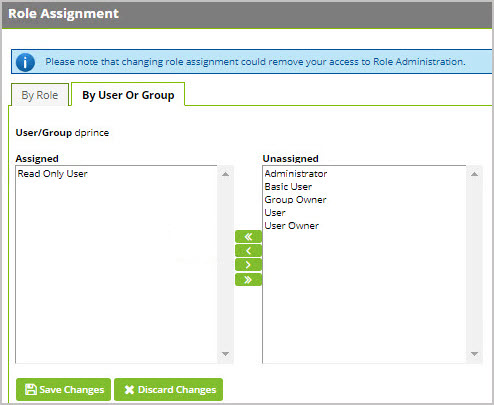

## Management Functions Based On Role
--------------------------------------

This section describes management activities and corresponding roles of the
evaluated security functionality.

| **Role**       | **Management Functions**                       |
|----------------|------------------------------------------------|
| Read-only User | Search and list Secrets                        |
| User           | Use Secret/Launch session                      |
| User           | Request access to Secret                       |
| Administrator  | Create, view, expire, edit, and assign Secrets |
| Administrator  | Perform bulk operations on Secrets             |
| Administrator  | Create and manage groups                       |
| Administrator  | Create and manage roles, assign roles to users |
| Administrator  | Create and manage containers (folders)         |
| Administrator  | Create and manage Secret policy                |
| Administrator  | Configure TOE SF (see Table 5)                 |
| Administrator  | Create, manage, and unlock local accounts      |
| Administrator  | Configure IIS, SQL, syslog                     |
| Administrator  | Update TOE                                     |

Table 5: Management Functions and Roles

By default each User Role is attached to Permission Sets. To view the specific
permissions that each role is attached to, navigate to **Admin \| Roles** and
click into the user roles listed to see the list of permissions.

Organizations can tailor these user roles to maintain whatever permissions
settings are required for your specific user environment.

8.3 Common Criteria Management Activities Based On Role
-------------------------------------------------------

The following table specifies the user role required to allow each management
activity listed according to Common Criteria Standards.

| **Requirement** | **Management Activities**                                                                                                                | **Role**      |
|-----------------|------------------------------------------------------------------------------------------------------------------------------------------|---------------|
| ESM_EAU.2       | Management of authentication data for both interactive users and authorized IT entities (if managed by the TSF)                          | Administrator |
| ESM_EID.2       | Management of authentication data for both interactive users and authorized IT entities (if managed by the TSF)                          | Administrator |
| ESM_ICD.1       | Definition of identity and credential data that can be associated with users (activate, suspend, revoke credential, etc.)                | Administrator |
|                 | Management of credential status                                                                                                          | Administrator |
|                 | Enrollment of users into repository                                                                                                      | Administrator |
| ESM_ICT.1       | Configuration of circumstances in which transmission of identity and credential data (and object attributes, if applicable) is performed | Administrator |
| FAU_STG_EXT.1   | Configuration of external audit storage location                                                                                         | Administrator |
| FIA_AFL.1       | Management of the threshold for unsuccessful authentication attempts                                                                     | Administrator |
|                 | Management of actions to be taken in the event of an authentication failure                                                              | Administrator |
| FIA_USB.1       | Definition of default subject security attributes, modification of subject security attributes                                           | Administrator |
| FMT_MOF.1       | Management of sets of users that can interact with security functions                                                                    | Administrator |
| FMT_SMR.1       | Management of the users that belong to a particular role                                                                                 | Administrator |
| FTA_SSL.3       | Configuration of the inactivity period for session termination                                                                           | Administrator |
| FTA_TAB.1       | Maintenance of the banner                                                                                                                | Administrator |
| FTP_ITC.1       | Configuration of actions that require trusted channel (if applicable)                                                                    | Administrator |
| FTP_TRP.1       | Configuration of actions that require trusted path (if applicable)                                                                       | Administrator |

Table 6: Management Functions and Roles by Common Criteria Requirement

# Managing User Passwords
===========================

## Password Requirements for User Authentication
-------------------------------------------------

The Secret Server password policy for your user accounts is determined by either
Active Directory or Settings for Local User Passwords. To configure Settings for
Local User Passwords, navigate to **Admin \| Configuration \| Local User
Password** tab and click **Edit**.

To meet Common Criteria Compliance regulations, passwords must be a **minimum of
16 characters** and include any subset of the following requirements (as
demonstrated below):

- **Upper case letters**

- **Lower case letters**

- **Numbers**

- **Special Characters: ! \@ \# \$ % \^ & \* ( )**

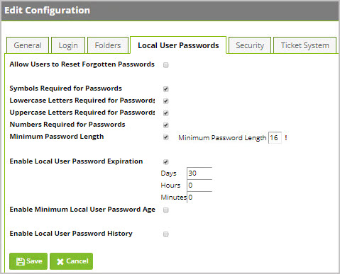

- A screenshot of a cell phone Description generated with very high confidence

Passwords in Secret Server are randomly generated according to admin-defined
password complexity policies. The default behavior of the generator is that each
password will be comprised of at least one Upper Case letter, one Lower Case
letter, one number, and one symbol. The number of each type of character can be
modified, and custom character sets can be created and used in password
policies.

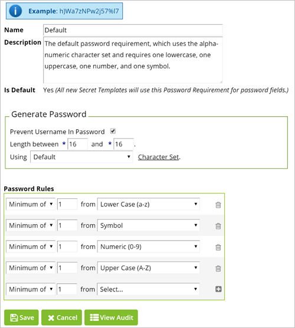

## Resetting User Authentication 
----------------------------------

To reset an Active Directory user account, the password reset must be performed
*through Active Directory*.

To reset a Local User account, navigate to **Admin \| Users** and select the
user who needs a reset, then select **Edit**. Type a new password twice, keep in
mind that this is a *temporary password* and you will need to provide this
password to the user. Immediately after the user logs into Secret Server with
this temporary password they will be prompted to change their password.

If locked out of the Secret Server Local administrator account and unable to
request a reset through a linked administrator email account, contact the
Thycotic Support Team to request a password reset. To do this you will need to
provide your organization’s **security pin code**.

## Setting Local User Password History Requirements
----------------------------------------------------

Next, according to Common Criteria standards, ensure that Local Users cannot
re-use old passwords to an administrator-settable number of past passwords used
by that user.

Navigate to **Admin \| Configuration \| Local User Passwords** and click
**Edit**. Check the toggle box next to **Enable Local User Password History**
then set the number of historic passwords you would like to block for Secret
Server Users. Click the toggle next to **All** in order to block users from ever
re-using any previous password. Click **Save** to save changes.

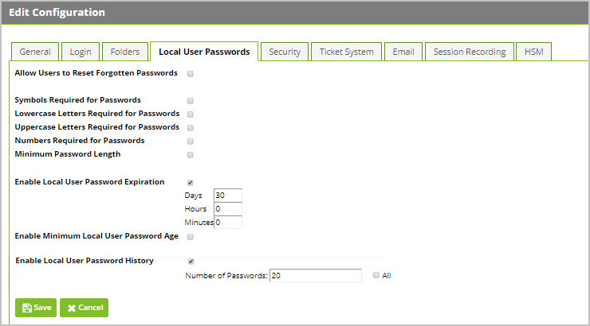

# Managing Secrets 
======================

## Creating Secrets
---------------------

Each object that is stored within Secret Server is referred to as a **Secret**.
Usually, a Secret will be a username and password combination. Other examples of
Secrets can include SSH keys, contact information, or safe combinations.

To create a Secret, use the “Create Secret” widget.

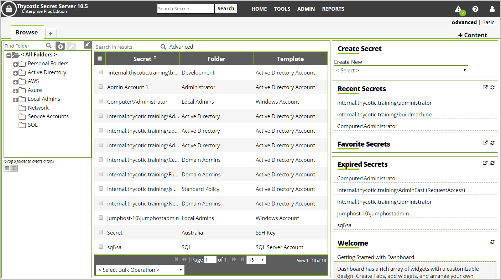

Select the type of Secret you want to create.

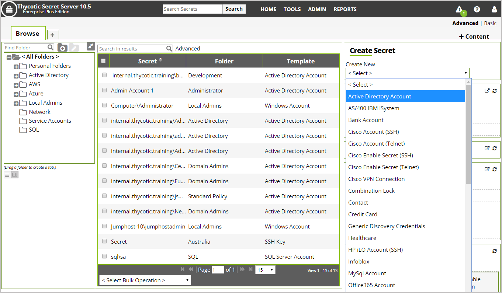

Enter the data for the Secret you want to save, and make sure to choose the
Folder that the Secret will be saved into. Hit Save, and your Secret has been
created.

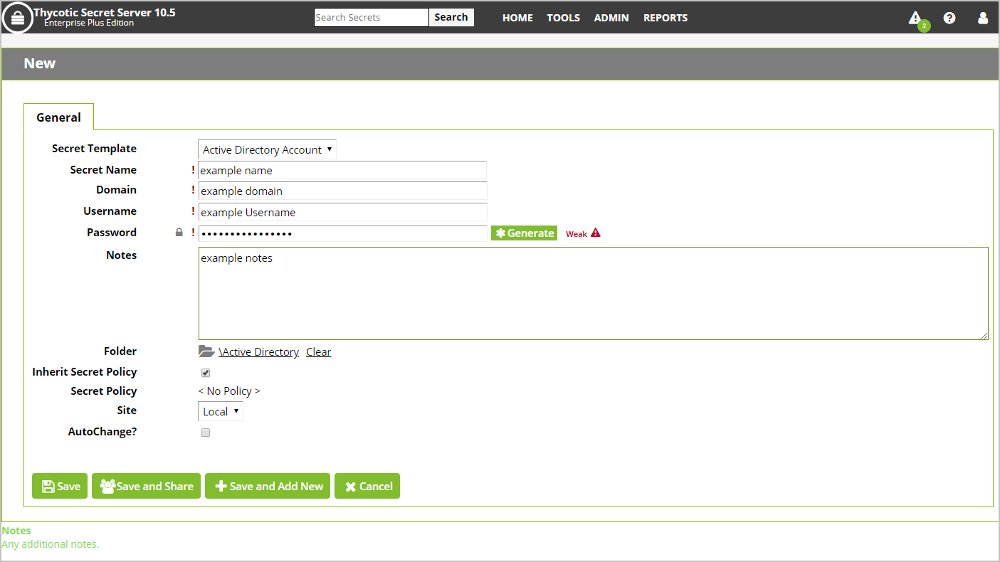

## Configuring Secret Templates
---------------------------------

Secret Server manages privileged account credentials through a highly
configurable system of secrets. **Secret Templates** are used to create secrets
and define object attributes for secrets. Templates can be configured according
to account requirements.

The following is a list of Secret Templates that are compliant with Common
Criteria standards available in the Government edition of Secret Server:

- **Active Directory Account**

- **Bank Account**

- **Combination Lock**

- **Contact**

- **Credit Card**

- **Password**

- **Pin**

- **Product License Key**

- **Security Alarm Code**

- **Social Security Number**

- **Unix Account (SSH Key Rotation)**

To follow Common Criteria standards, navigate to **Admin \| Secret Templates**
and click the **Active Templates** button. Ensure that only the templates listed
above are selected in the Active column. Then **Save**. Users only can create
Secrets using templates marked as Active.

To view object attribute data in a template from the dropdown list of Active
Templates, **select a template** from the dropdown list and then click **Edit**.

Each of the listed templates below only holds object attribute data that are
defined locally by Secret Server. The objects, secrets, and templates are as
follows:

Object:

Attribute

Objects in Secret Server are defined by attribute data. All object attribute
data is locally defined by Secret Server.

Secret:

Attributes Inherited from Template

Secret templates dictate the fields each secret contains, the launchers for each
secret, and the remote password changer used. They also provide a default
expiration, which can be changed on a per-secret basis.

Command Restrictions

Command restrictions are limited to SSH sessions and allow administrators to
create multiple-choice command menus that users can follow. If SSH command menus
are enabled, users cannot issue commands directly to the target system.

Field Data

Each field in a secret template is either “Text,” “Password,” or “Notes.”
Password fields can be hidden from users and are updated when a password change
has occurred on that secret’s account. Text fields are the standard field type
and may include information such as “Domain” or “Username.”

Folder

Folders in Secret Server store individual secrets. Permissions applied to
folders dictate which users can view the secrets inside that folder and which
users can see the folders.

Password Requirements Rule Override

Password requirements can optionally be enforced on a per-template basis. If the
password requirement is not enforced, users can manually type any password they
want and will be notified if they enter a weak password that does not meet the
password requirements. If the requirements are enforced, users cannot save the
new password until it meets the requirements.

Policy Identifier

Secret policies are a collection of security and password settings that are
applied to individual secrets or folders. Each setting of a secret policy can be
configured as either default or enforced. Default allows users to later change
the setting. Enforced locks the settings and cannot be modified on a per-secret
basis unless the secret is moved out of the folder that has the secret policy
attached. Secret policy settings include items such as “Remote Password Changing
Auto Change,” and “Requires Approval for Access.”

Subject Identifier

The secret template of each secret identifies the type of store password or
other data. This allows users to see the intended usage of each template.

Secret Name

The secret name is the label or title that describes the content of each secret.
When Secret Server creates secrets automatically, the default naming convention
is “host/account,” or “domain/account.”

Template:

Field Parameters

Field parameters include username, password, and type. Secrets include a
combination of field parameters that vary with user input. Secret type is
defined by the template for each secret, such as “Bank Account” or “Active
Directory Account.” The number of field parameters also are defined at the
secret template level.

Password Change Policy

Password rotation is enabled or disabled on a per-secret or per-template basis.
Password rotation frequency depends entirely on the expiration period for each
secret. The default expiration time is 30 days for all secret templates.

Password Strength Policy

A password policy is a set of instructions on how each new password is created.
Administrators must choose a minimum and maximum password length, which
character sets are used, and how many characters from each set are required. See
the “Managing User Passwords” section for details on password requirements.

Secret Expiration Policy

When a secret reaches its expiration date, it is flagged as “Expired.” If
automatic password rotation is enabled for that secret, expiration triggers a
remote password change. Expiration can be changed on each secret, but the
default expiration period is set at the secret template level.

Secret Name Pattern

When Secret Server names a secret via the discovery import process, it uses the
naming convention “hostname/username,” or “domain/username.” This is not
enforced, so users can name secrets whatever they want.

Template Description

Secret template descriptions allow administrators to describe the purpose of a
template when they create a new template, which is a best practice to avoid
confusion.

Template Name

The secret template name is what users see in the drop-down menu when they
create a new secret. It is also on the Secret Browse page so that users can see
which secret template is associated with each secret.

Template Status

Like secrets, users can disable secret templates to make them invisible to
users, unless they chose to view inactive templates. The status is either
“enabled” or “disabled.”

Secret Access Policy

If users have view (or greater) rights, they can see whether a secret exists and
can open the secret to view its data. If a user does not have view rights, the
secret is invisible.

Secret Modification Policy

Each secret carries individual access permissions that are typically inherited
from the secret’s folder. These permissions determine not only which users can
view the secret but also which users are can edit the secret’s data. A user can
have view, edit, or owner permission. With the view permission, a user can view
but not modify a secret. The edit permission allows the user to modify field
data. The owner permission allows users to grant or revoke access to other
users.

## Configuring Password Policy for Secret Templates
-----------------------------------------------------

When creating and rotating passwords for Secrets inside of Secret Server, it is
important to uphold strong requirements and to use Secret Server to manage
changing requirements effectively.

Secret Server allows administrators to, for example, set the minimum password
length to 6 characters, observe that a 7-character password and a 16-character
password are both accepted, then change the minimum length to 8, observe that a
7-character password is then rejected but that a 16-character password is
accepted.

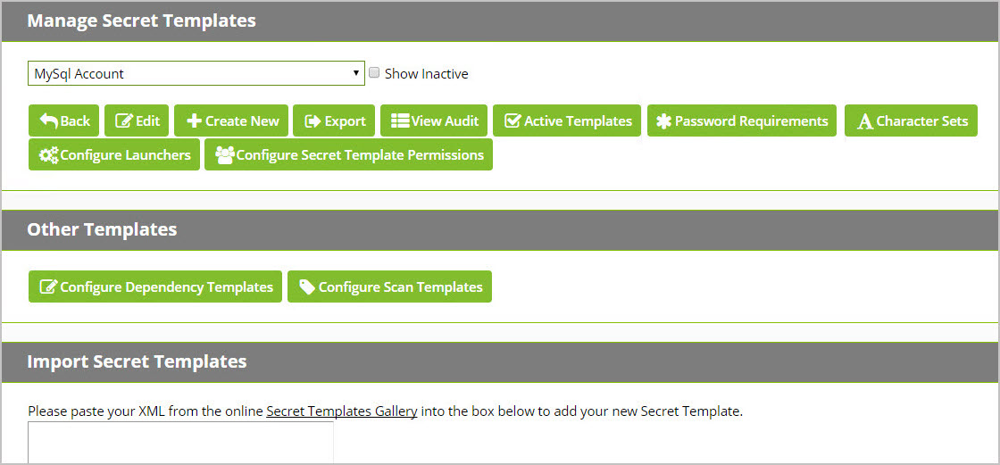

In Secret Server password requirements can be set and applied *at the Secret
Template level*. To adjust requirements, navigate to **Admin \| Secret
Templates** and select the **type of template** you want to adjust from the
dropdown menu. Then click **Password Requirements**.

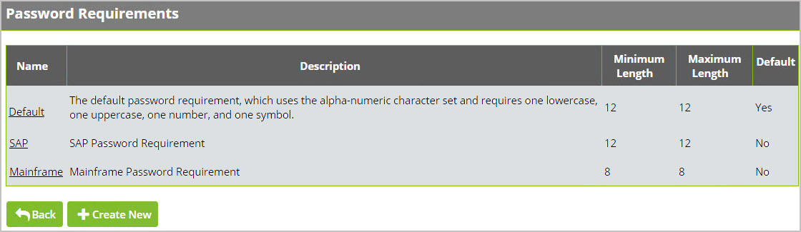

Select the **Default** password requirement from the list to edit **all** your
organization’s default password requirement settings on secret templates or
select **Create New** to create a new password requirement specific to this
template.

Adjust the **Password Length** requirements and **Character Set** requirements
for your organization on the **Password Requirement Edit** page. You may assign
your new requirement to any Secret Template.

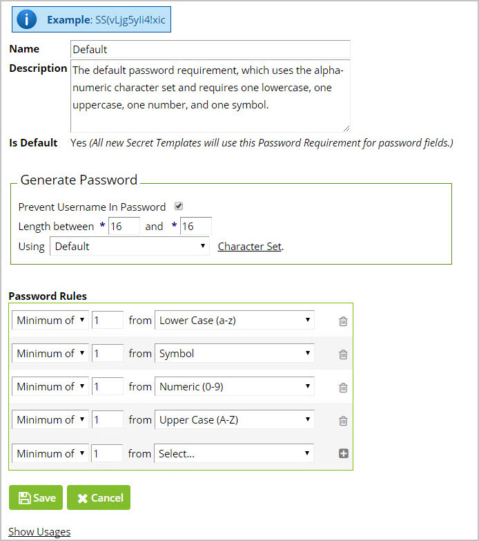

>**Note**: Password Requirements set for these templates will be enforced for both
human-generated and auto-generated secrets.*

10.4 Authentication Strength for Non-Password Credentials
---------------------------------------------------------

Secret Server uses RSA keys of 2048 bits or higher for secure authentication.
These SSH keys are non-password credentials that can be managed by Secret
Server. To ensure that these are maintained up to encryption standards, make
sure that your **Unix Account (SSH Key Rotation)** Template is configured with
an SSH Key Bit Size of 2048 or higher.

By default, the Government Edition of Secret Server will set this Template
setting to 2048 but to adjust the bit size navigate to **Admin \| Secret
Templates** and select **Unix Account (SSH Key Rotation)** from the dropdown
list. Then click the button to **Edit**.

From the Secret Template Designer page, click **Edit** to adjust settings. You
can increase the bit size to 4096 from the default setting of 2048 if you
choose, but do *not* lower this setting to 1024.

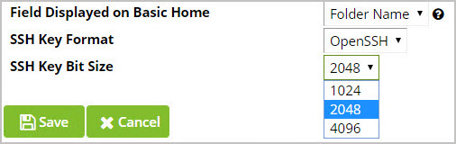

To create, store, and manage SSH keys in Secret Server, users must engage this
Unix Account (SSH Key Rotation) Template. That means no SSH key will be created
without a set standard of encryption enforced.

10.5 Configuring Remote Password Changing for SSH Key Rotation
--------------------------------------------------------------

### Security Overview for SSH Key Rotation and PuTTY Launcher

SSH Key Rotation allows you to manage your Unix account private keys and
passphrases as well as their passwords. With key rotation, whenever the password
is changed on the secret (manually, during a scheduled auto-change, or when
checking in a secret that changes the password on check-in), the public/private
key pair will be regenerated and the private key encrypted using a new
passphrase. The public key will then be updated on the Unix machine referenced
on the secret.

In order to use default SSH Key Rotation commands, the following minimum
requirements must be met on the machine being managed:

- SSH Key logins should be enabled on the target using keys in OpenSSH format.
    A secret can be created with keys in PuTTY format but they will be converted
    to OpenSSH when the key is rotated.

- Public keys should be stored in [\~userhome]/.ssh/authorized_keys (not authorized_keys2).

- Grep and Sed should be installed on the target.

- If doing a privileged SSH Key Rotation, where a privileged user sets the key for another user, the privileged user must have sudo permissions that do not prompt for a password and the permissions to edit the user’s authorized keys file with sudo.

If a system does not meet these requirements it may still be possible to do key
rotation by modifying the key rotation command sets.

### Creating a Unix Account (SSH Key Rotation) Secret

Under Secret Server’s Common Criteria compliance standards, you can setup Secret
Server to rotate SSH Keys for Unix Accounts.

To setup a Launcher, you will need:

- A **Unix Account (SSH Key Rotation)** Secret that is connected to a remote machine

To create a Unix Account (SSH Key Rotation) Secret:

From the **Home** Dashboard select the **Unix Account (SSH Key Rotation)**
Template from the **Create Secret** widget.

Enter a **Secret Name**, and the **Machine Name**, **Username**, and
**Password** for the Unix/Linux Account. Then select the SSH **Private Key** by
browsing to it on your machine. Enter the **Private Key Passphrase** for the SSH
Key and if there is a corresponding Public Key upload that as well.

Specify which Secret Server folder you want to store the Key in if it differs
from the default folder path. Likewise, determine what secret policies you want
to assign to this SSH key, if any.

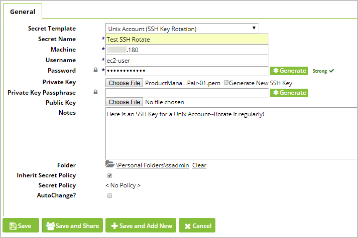

Click **Generate New SSH Key** to automatically rotate the private and public
SSH key pairing upon clicking **Save**. This action is a security measure to
ensure that no one can access your SSH key unless they are doing so through
Secret Server’s vault.

### Enabling the Launcher

By default, the Launcher is enabled.

To verify this, click on **Admin \| Configuration**.  Check the **Enable
Launcher** Setting to ensure that this is set to **Yes**.

### Using the Launcher

>**Note**: If there are certificate errors when connecting Secret Server (e.g.
host name mismatch error in the certificate) then the error message needs to be
resolved in order for the putty launcher to function.*

*In other words, SSL Certificates must be properly configured or the Launcher
will fail to connect, see the “Configuring X.509v3 Certificates” section for
directions to setup certificates.*

Click the SSH secret from your Home Screen and click **View Secret**.

Click on the **PuTTY Launcher** icon.  

The first time you do this you will be prompted by a “**Protocol Handler Failed
to Launch**” message – select the type of launcher you need and **Run** the .msi
file. Secret Server will download a very small process called a Protocol Handler
that helps facilitate the connection between your machine and the endpoint.  

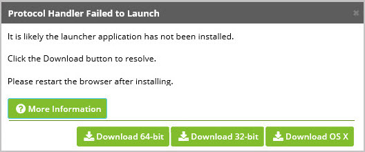

Once downloaded, close out the “Failed to Launch” window and *refresh your
browser page*.

Click on the launcher icon on the secret (and provide the machine name if
prompted). The appropriate credentials will be passed along to the launcher –
and will open the appropriate launcher PuTTY session.

### Enable Remote Password Changing

>**Note**: To maintain compliance with Common Criteria regulations, Remote Password
Changing is applicable for SSH Key Rotation ONLY.

Navigate to **Admin \| Remote Password Changing**. Click **Edit**, then check
**Enable Remote Password Changing**, **Save**.

### Rotate SSH Key Remotely

Navigate back to the SSH Key Rotation Secret’s **View** screen. Click the
**Change Password Remotely** button at the bottom of the screen.

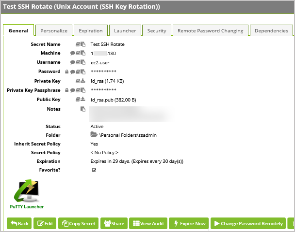

From the Change Password Remotely screen, **Generate** a new Password and
Passphrase for your new SSH Key and allow the toggle next to Generate New SSH
Key to remain checked. Click **Change**.

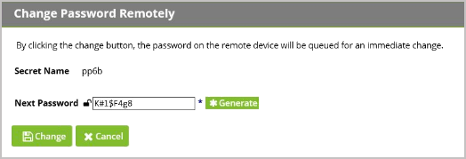

You will be directed to a **Password Scheduled for Change** screen, click
**Back** to return to your secret’s Remote Password Changing tab view, then
navigate to the **General** tab. Verify that a new password is listed. In the
screenshot below you can see the former passwords listed in the Notes section,
confirming that the rotation was effective.

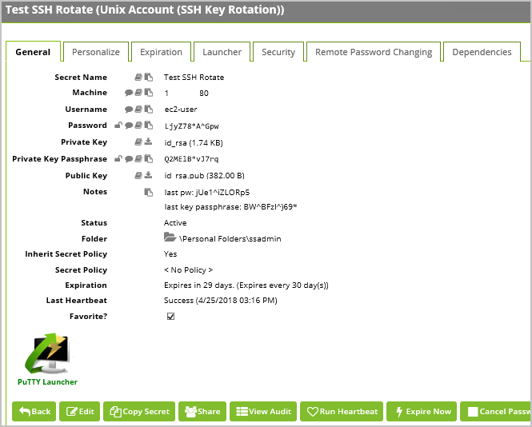

Click the **PuTTY Launcher** icon to confirm that Secret Server can still
connect to the unix/linux machine using the newly rotated SSH Key.

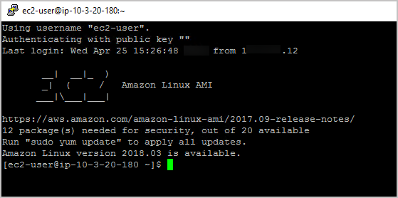

## Secret Expiration
----------------------

A core feature of Secret Server is Secret expiration. Any template can be set to
expire within a fixed time interval. For a Secret to expire, a field must be
selected as the target of the expiration. For example, a Secret template for
Active Directory accounts might require a change on the password field every 90
days. If the password remains unchanged past the length of time specified, that
Secret is considered expired and will appear in the **Expired Secrets** panel on
either the Dashboard’s Expired Secrets widget or the Home page.

Secret expiration provides additional security by reminding users when sensitive
data requires review. This can assist in meeting compliance requirements that
mandate certain passwords be changed on a regular basis. When expiration is
combined with Remote Password Changing, Secret Server can completely automate
the process of regularly changing entire sets of passwords to meet security
needs.

### Setting up Secret Expiration for the Secret template

To set up expiration on a Secret, you must first enable expiration on the
template from which the Secret is created.

To enable Secret expiration for a Secret template, navigate to **Administration
\| Secret Templates**. In the Manage Secret templates page, select the template
from the dropdown list and click the **Edit** button. In the Secret template
Designer page, click on the Change link. On this subsequent page, check the
**Expiration Enabled?** box. You can now enter the expiration interval (every x
number of days) as well as the field on the Secret you wish to expire and
require to be changed. The interval setting can be overridden for each
individual Secret.

Enabling expiration for a template will enable expiration for all the Secrets
that were created using this template.

### Setting up Secret Expiration for the Secret

Now that expiration has been enabled for the template, Secret expiration is
enabled for the Secrets that were created using that template as well as Secrets
created in the future. The Expiration tab will appear on the Secret View page
and requires the user to have Owner permission on the Secret. If you would
prefer to set a custom expiration at the Secret level, you can adjust the
interval of expiration for the Secret by clicking the **Expiration** tab in the
Secret View page. In the Expiration tab, you can set the Secret to expire using
the template settings (default), a custom interval, or a specific date in the
future.

### Forcing Expiration

To force expiration, navigate to the **Secret View** page. From there, click
**Expire Now**. This will force the Secret to expire immediately regardless of
the interval setting. The expiration date will read "Expiration Forced".

### Resetting an Expired Secret

To reset an expired Secret, you will need to change the field that has expired
and is required to change. For example, if the field set to expire is the
Password field and the current Password is "asdf", then a change to "jklh" will
reset the expiration interval and thus remove the expiration text on the Secret
View page.

If you do not know which field is set to expire, you will need to go to the
Secret template that the Secret was created from. Navigate to **Administration
\| Secret Template** and select the template. Click the **Edit** button and then
on the next page, click the "**Change**" link. In the "Change Required On"
textbox you will see the field that is set to expire.

### AutoChanging an Expired Secret 

Remote Password Changing (RPC) is enabled under the Administration, Remote
Password Changing page. Click **Edit** to enable Remote Password Changing,
Secret Heartbeat, and Secret Checkout. Once enabled, all Secret templates with
RPC configured will be available to use RPC.

The Remote Password Changing tab contains the settings for configuring RPC on an
individual Secret. Enabling AutoChange on a Secret will allow Secret Server to
Remotely Change the Password when it expires. The user must have Owner
permission on the Secret to enable AutoChange. When editing on the RPC tab, the
Next Password field can be set. If left blank an auto-generated password will be
used.

To auto-change passwords based on secret expiration leave the AutoChange
schedule set to "**None**."

If the password change fails, Secret Server will flag the Secret as Out of Sync
and continue to retry until it is successful. If the Secret cannot be corrected
or brought In Sync, manually disabling AutoChange will stop the Secret from
being retried.

### Setting the Password Change Retry Interval 

Secret Server checks for expired secrets once every minute. However, if a
previous password change attempt failed, Secret Server will not immediately try
to change that password again the next time expired secrets are checked. Each
secret template has a "Retry Interval" that it uses to determine how often to
attempt retries of failed password changes. This exists to prevent unavailable
machines or network connection issues from overwhelming the server or network
with potentially thousands of password change requests at once. The default
retry interval is one hour. To change the default, navigate to **Admin \| Secret
Templates**, select the template you wish to change from the dropdown menu, and
click **Edit**.

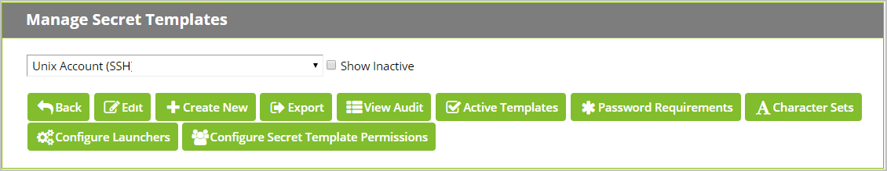

At the bottom of the **Secret Template Designer** page, click **Configure
Password Changing**

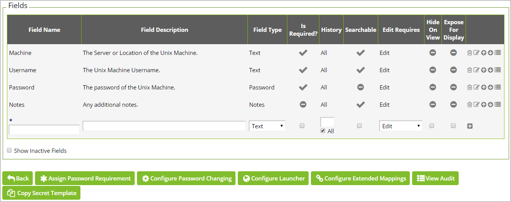

On the **Secret Template Edit Password Changing** page, click **Edit**. Adjust
the **Days**, **Hours**, and **Minutes** values of the **Retry Interval**. You
can also adjust the **Maximum Attempts** if you want Secret Server to stop
attempting to change the password after a specified number of failures. Click
**Save** when done.

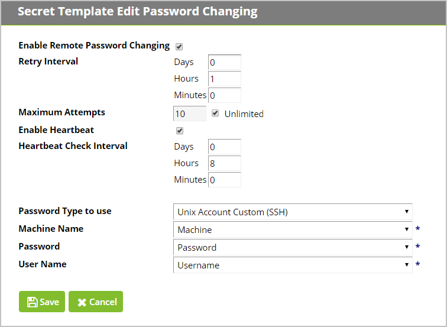

## Common Criteria Configuration
==================================

## Verify Settings in Government Edition
------------------------------------------

### Verify DPAPI Setting is Enabled

The Thycotic Government Edition Installer will automatically set encryption in
Secret Server to use DPAPI. To verify that DPAPI is in use, navigate to **Admin
\| Configuration \| Security** tab and ensure that DPAPI is enabled by scrolling
to the bottom of the page and checking the existence of the **Decrypt Key to not
Use DPAPI** button.

If DPAPI is not enabled in your Secret Server installation, this button will say
“**Encrypt Key to Use DPAPI**.” To maintain compliance with Common Criteria
standards do not decrypt the Secret Server key.

### Verify FIPS Mode is Enabled

Common Criteria evaluations rely on FIPS 140 validations to provide assurance
that cryptographic functionality is implemented properly. The Secret Server
Government Edition Installer checks for FIPS encryption security standards on
the Windows local server and enables FIPS mode by default in Secret Server. To
check this setting, go to **Admin \| Configuration \| Security** tab and ensure
that **the Enable FIPS Compliance** line is set to **Yes**.

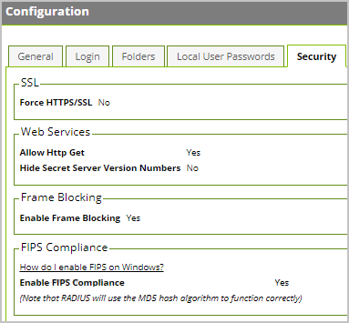

#### Manually Enabling FIPS on Windows Local Server

The **Secret Server Government Edition Installer** ensures that FIPS Compliance
is automatically enabled in Windows on your local server. To verify or do this
manually:

1. Go to **Windows Local Security Policy editor** (secpol.msc)

1. Navigate on your left pane to **Security Settings \| Local Policies \|
    Security Options**

1. Find and go to the property of **System Cryptography: Use FIPS Compliant
    algorithms for encryption, hashing, and signing...**

1. Choose **Enable** and click **OK**.

1. Restart your Server with **iisreset**

The Microsoft .NET implementations of AES and SHA are not FIPS certified so
Secret Server uses the Windows API versions for encryption functionality which
\*are\* FIPS certified. **More information on the FIPS certificate numbers for
the Windows operating systems, including the algorithm implementations that we
use can be found at:**
<http://technet.microsoft.com/en-us/library/cc750357.aspx>

### Manually Disabling TLS v1.0

To disable the TLS 1.0 protocol so that IIS does not try to negotiate using the
TLS 1.0 protocol, follow these steps:

1. Click **Start**, click **Run**, type regedt32 or type regedit, and then
    click **OK**.

1. In Registry Editor, locate the following registry key:  
    
    **HKey_Local_Machine\\System\\CurrentControlSet\\Control\\SecurityProviders
    \\SCHANNEL\\Protocols\\TLS 1.0\\Server**  

- \*If the subkeys “Server” or “Client” do not exist, create them under the
- TLS 1.0 key.

1. On the **Edit** menu for each subkey, click **Add Value**.

1. In the **Data Type** list for each subkey, click **DWORD**.

1. In the **Value Name** box for each subkey, type “**Enabled**,” and then
    click **OK**.  
    
    \*Note If this value is present, double-click the value to edit its current
    value.

1. Type **00000000** in Binary Editor to set the value of the new key equal to
    "0".

1. Click **OK**. Restart the Windows Server.

More information can be found at
<https://support.microsoft.com/en-us/help/187498/how-to-disable-pct-1-0-ssl-2-0-ssl-3-0-or-tls-1-0-in-internet-informat>

### Microsoft Cryptographic Engine

Secret Server relies on Windows Server 2016 Standard Edition to provide protocol
and cryptographic functionality. Windows Server 2016 Standard Edition implements
a FIPS certified (CMVP \#2937) Cryptographic Primitives Library.

More information on the FIPS 140 certificate numbers for the Windows operating
systems, including the algorithm implementations that we use can be found at:
<http://technet.microsoft.com/en-us/library/cc750357.aspx>

**Warning: The use of other cryptographic engines was not evaluated nor
supported in the Common Criteria configuration.**

## Configuring X.509v3 Certificates
-------------------------------------

In order to maintain compliance with Common Criteria standards, the following
installed certificates must follow the standard X.509v3 digital certificate
structure.

*\*Do not use self-signed certificates in production environments.*

### Installing Certificate in Trust Store

To best protect the users of your Secret Server website, use an SSL certificate
from a trusted root authority and install it on your **web server(s)**.

- It is possible to use a self-signed certificate in demo or sandbox
    environments as long as **all other machines** used to access Secret Server
    are also configured to trust the certificate. Otherwise, users will receive
    warnings about it being invalid and unsafe to navigate to your Secret Server
    URL.

- Local machines either need to:

    - Import your **public certificate** into the **Trusted People** certificate store if you used IIS to create it

- OR

- If you used OpenSSL and set up a **custom Root CA** to sign your web server certificate, the Root CA must be imported into the **Trusted Root Certification Authorities** store.

- If a **custom Intermediary CA** is created, this must also be imported into the **Intermediate Certification Authorities** store.

If Secret Server will be communicating with any remote server using TLS, any
Root CAs and Intermediate CAs in the trust chains of the certificates presented
by those remote servers must be added to the **Trusted Root Certification
Authorities** and **Intermediate Certification Authorities** stores
respectively. This includes syslog and LDAPS servers.

Follow the steps below to install a certificate in the Trusted Root CA store:

1. On your local machine open **mmc.exe**, select **File**, then **Add/Remove Snap-In…**

1. Next choose **Certificates** and then **Add**. Select **Computer Account**, then **Local Computer**. Click **Finish**.

1. Open **Certificates (Local Computer)**, then expand the **Trusted Root Certification Authorities** store/folder from the left pane and select **Certificates**, then in the right-side **Actions** pane select **More Actions**, **All Tasks**, and **Import…**

1. Click **Next** then select the certificate to import. This is usually a file with a file extension of .cer, .crt, .pem, or .pfx and click **Next**.

1. If prompted, enter the certificate’s password and click **Next**.

1. Leave the selected options at the **Certificate Store** step and click **Next**.
    

    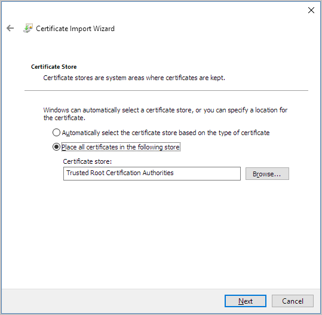

1. Click **Finish** to import the certificate

To import and Intermediate Certificate Authority follow the same steps for a
Root Certificate Authority but select **Intermediate Certification Authorities**
in step 3 instead of **Trusted Root Certification Authorities**. In step 6, the
selected certificate store should also say **Intermediate Certification
Authorities**.

### Configuring Web Certificate

To install a web certificate for use by IIS:

1. Open IIS Manager by clicking **Start**, clicking **Run**, typing in “**inetmgr**”, and clicking **OK**.

1. Click on the server node (one of the root nodes) in the left panel, and double click on **Server Certificates**.  
    

    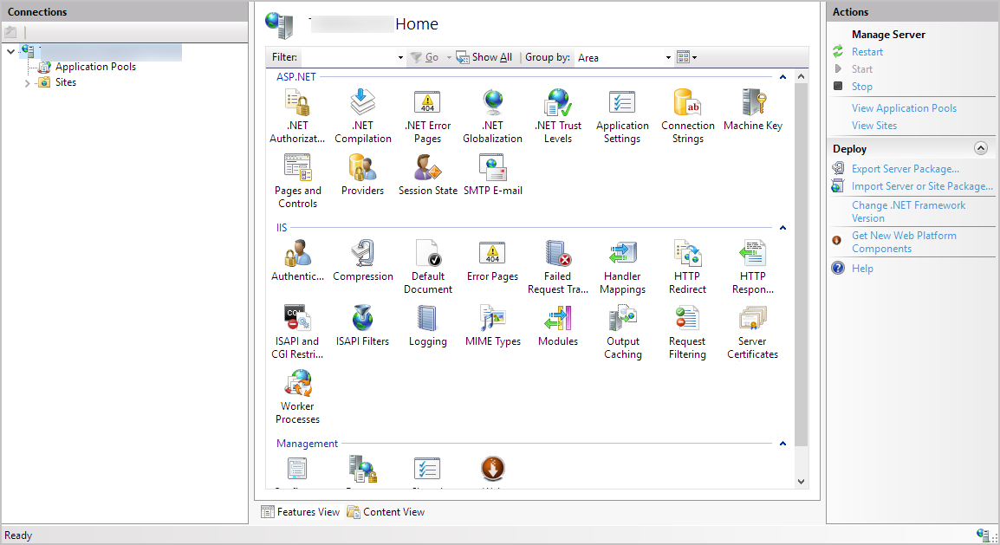

1. Click **Import…** in the right-hand **Actions** panel.

    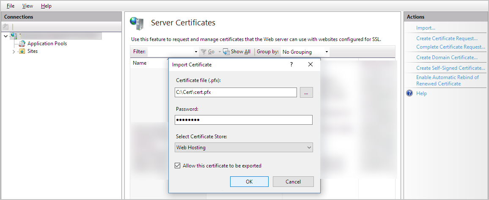

1. Select the certificate to use, enter the password, select “Web Hosting” in **Select Certificate Store**, and click **OK**.

Alternatively, to create a self-signed certificate, click **Create Self-Signed
Certificate** on the right panel and type in a Friendly Name. *\*Note, using
Self-Signed certificates is not compliant with Common Criteria standards. If
using a self-signed certificate you must also export and install it on every
user machine that connects to the Secret Server website.*

Now that your certificate is installed, IIS must be configured to use it.

- In IIS Manager, click on your website in the left panel, then click **Bindings** on the right panel.

- If https is not already listed, click **Add**, select **https**, select the correct certificate, and click **OK**.

- If https was already listed, select it, click **Edit**, and select the correct certificate.

### Configuring Client Certificates

Client Certificates can be used for **LDAPS** connections and for **Secure TCP**
Syslog connections if your LDAPS or Secure TCP Syslog server requires one to be
used.

You will need to install a Client Certificate on your **web server(s)** in the
Local Computer’s **Web Hosting** (used by newer versions of IIS) or **Personal**
Stores:

1. On your local machine open **mmc.exe**, select **File**, then **Add/Remove Snap-In…**

1. Next choose **Certificates** and then **Add**. Select **Computer Account**, then **Local Computer**. Click **Finish**.

1. Open **Certificates (Local Computer)**, then import your certificate by selecting the **Personal** or **Web Hosting** store/folder from the left pane, then **All Tasks**, and **Import…**

    

1. Follow the Import Wizard to complete the installation of the client certificate.
>**Note**: If you are using an older version of IIS, or IIS is not installed on your machine, the Web Hosting store will not exist. In that case, import into the Personal store.*

- To enable Secret Server to send the client certificate to remote servers, you must first get the certificate thumbprint. This thumbprint will be added to Secret Server and used to identify which certificate to send when a client certificate is requested.

- To get the certificate thumbprint:

1. Right-click on the certificate file in Windows Explorer or the certificate listed in MMC and select **Open**.

1. Select the **Details** tab.

1. Scroll down in the list of fields until you find **Thumbprint**. Select it. The value will be displayed in the box below the field list.

   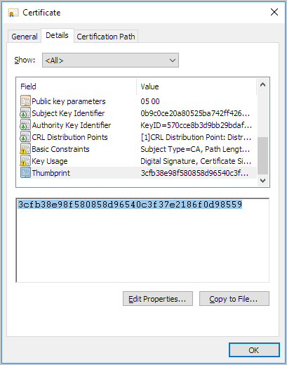

1. Select the text in this box and copy it by pressing **Ctrl+V**.

- Now that you have the thumbprint copied to the clipboard, you can add it to Secret Server:

1. In Secret Server, select **ADMIN \> Configuration**.

1. Select the **Security** tab and click **Edit**.

1. Find the **TLS Auditing** section.

    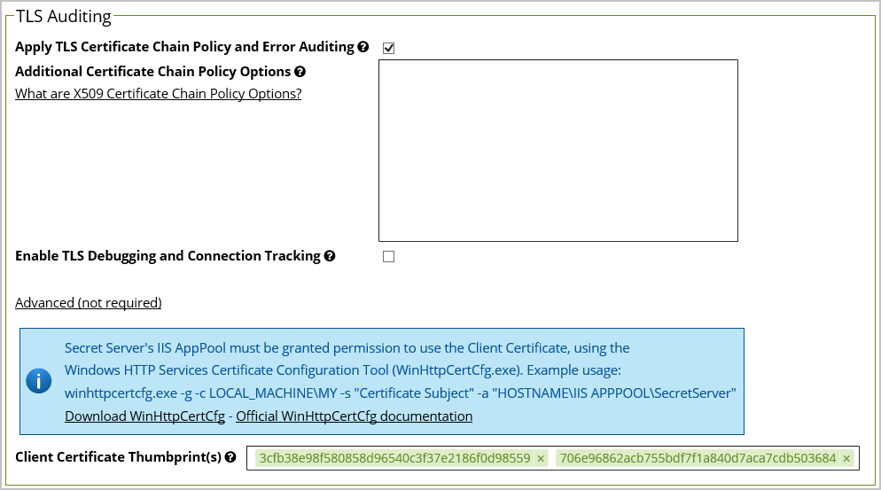

1. Check **Apply TLS Certificate Chain Policy and Error Auditing**.

1. Click **Advanced (not required)** to expand that section.

1. Paste the thumbprint in the **Client Certificate Thumbprint(s)** field. If you need to use more than one client certificate (for example, if you have
    multiple Secret Server nodes with different client certificates), you can paste multiple thumbprints in this field.

1. Click **Save** when done.

### Certificate Identifiers Overview

Certificates used for server authentication are verified by Secret Server using
the verification provided by Microsoft Windows' Schannel. A certificate must
contain a reference identifier that the client can use to verify that the server
is presenting a matching certificate. This identifier can be contained in either
the certificate **Subject** or **Subject Alternative Name (SAN)**. In order for
the Subject to be verified as valid for a given server, it must contain a CN
entry that contains the **Fully-Qualified Domain Name (FQDN)** of the server. If
a certificate needs to be valid for more than one reference identifier, the
certificate can contain a SAN that contains multiple entries. These entries can
include both DNS names and IP addresses. If a certificate contains a SAN, the CN
in the subject is ignored and only the entries in the SAN are used to validate
the certificate against the server.

## Configuring Transport Layer Security (TLS)
-----------------------------------------------

Common Criteria users must configure TLS in Secret Server. To enable TLS, follow
the steps in the below sections:

### TLS Configuration with AD

To configure TLS with Active Directory, follow the steps in the “Configuring TLS with Active Directory” section.

### TLS Configuration with Syslog

To configure TLS with Syslog, follow the steps in the “Configuring Auditing for TLS Connections” section.

### TLS Configuration with IIS

According to Common Criteria security standards, you must force Secret Server
through HTTPS/SSL for all website connections, ensure you are using an https URL
in your Secret Server browser, then navigate to **Admin \| Configuration \|
Security** tab, click **Edit** and then check the **Force HTTPS/SSL** checkbox,
followed by the **Enable HSTS**. We recommend adjusting the Maximum Age (in
seconds) to a high number, the example below allows for approximately six
months, but we recommend up to one year. **Save** changes.

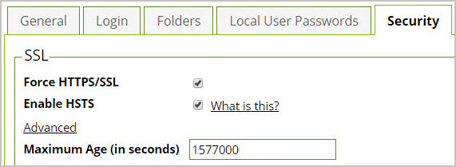

For more information on HSTS, see our article on Securing with HTTP Strict
Transport Security (HSTS) at:

<https://thycotic.force.com/support/s/article/Securing-with-HSTS> **INTERNAL ONLY**

## Local Auditing
===================

## Understanding Local Audit Records and Reports 
---------------------------------------------------

By design, Secret Server locally audits all actions taken within Secret Server.
Secret Server’s auditing capacity is not configurable. See **Auditable Events** for details on Secret Server items that are audited and
corresponding user permissions required for accessing audit records.

Various User Permissions are tailored for specific kinds of audits, listed
below. To adjust user permissions, go to **Admin \| Roles** and create a new
role or click an existing role to edit the permissions on it. You can assign
roles to individual users by going to **Admin \| Users** and assigning roles.

- **Add Secret Custom Audit**  
    Allows a user to make a custom audit entry when accessing a Secret using the web services API.

- **User Audit Expire Secrets**  
    Allows a user to view the “User Audit” report, which shows all secrets that have been accessed by a particular user in a specified date range. Also allows the user to force expiration on all these secrets, which would make Secret Server automatically change the password.

- **View Configuration Unlimited Admin**  
    Formerly “View Unlimited Admin Configuration,” allows a user to view the
    Unlimited Admin Mode configuration. Also allows a user to view the Unlimited
    Admin Mode audit log.

- **View Secret Audit**  
    Allows a user to view Secret Audit.

- **View User Audit Report**  
    Allows a user to view, but not edit, the User Audit Report.

## Accessing Local Reports 
-----------------------------

To view a list of out of the box reports, navigate to the **Reports** tab from
an Administrator account.

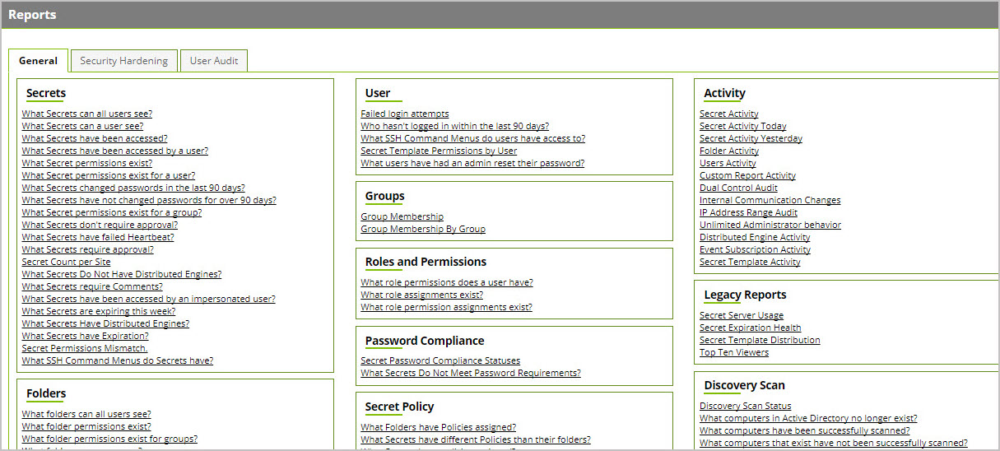

For customized reports and creation, see the options available to you at the
bottom right corner of the Reports page. The **View Audit** button on the bottom
left corner will show you a local audit for any reports that have been viewed.

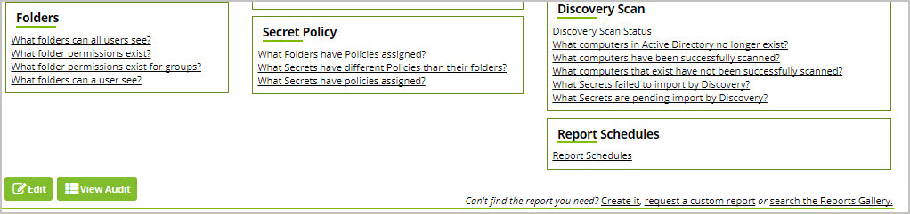

Administrator actions have audit trails inside Secret Server, these are
generally found as a **View Audit** button on any landing page under the
**Admin** tab. For example, at the bottom of **Admin \| Configuration** you can
view the audit for every edit that has occurred on the **Configuration** page:

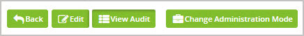

For User Audits, navigate to **Reports \| User Audit** tab, then select a user
and time period to view the audit of all actions taken by that user in Secret
Server.

## Configuring Local Windows Event Log Auditing
-------------------------------------------------

Outside of Secret Server, you can also send audit logs as EVT records to your
Windows Server’s Windows Event Log locally**.**

**Note that the Windows Event Log is tied to the syslog implementation, because
of this, disabling syslog will disable Windows Event Logs as well**. If
Syslog/CEF Logging is not yet enabled within Secret Server, go to **Admin \|
Configuration** and **Edit** the General tab to check **Enable Syslog/CEF
Logging** followed by **Write Syslogs As Windows Events**. *Syslog/CEF Logging
configuration also detailed in the section, “Configuring Auditing for TLS Connections”.

The following steps walk you through how to grant required permissions to the
Application Pool outside of Secret Server to successfully write audits to the
Windows Event Log:

### Granting Application Pool Access to Windows Event Log

When the database becomes inaccessible, Secret Server will try to log errors to
the Windows Event Log. By default, however, Network Service and standard service
accounts will not have permissions to the Event Log.  *Permissions must be
manually added to the Application Pool for specific Event Log registry keys*.

- *IMPORTANT NOTE: Changes made to the Windows registry happen immediately, no backup is created automatically. Do not edit the Windows registry unless you are confident about doing so. Using Registry Editor incorrectly can cause serious, system-wide problems that may require you to re-install Windows to correct them. Microsoft cannot guarantee that any problems resulting from the use of Registry Editor can be solved. Use this tool at your own risk.*

**Required Registry Permissions**

The following permissions are required for the Identity configured on the Secret
Server Application Pool in IIS (Network Service, IIS APPPOOL\\SecretServer,
etc.).

HKEY_LOCAL_MACHINE\\SYSTEM\\CurrentControlSet\\Services\\EventLog

Applies to "This key and subkeys".

- Read
    - Query Value

    - Enumerate Subkeys

    - Notify

    - Read Control

- Set Value

- Create Subkey

HKEY_LOCAL_MACHINE\\SYSTEM\\CurrentControlSet\\Services\\EventLog\\Security

Applies to "This key and subkeys".

- Read

    - Query Value

    - Enumerate Subkeys

    - Notify

    - Read Control

**How to Apply Windows Event Log Permissions**

1. Determine the account that is running Secret Server. This can be done by
logging in to Secret Server, **Admin \| Diagnostics**. Click the button to
**Show Background Processes**. Look for any of the "Thread Identity" labels.
These will contain the identity of Secret Server (often NT AUTHORITY\\NETWORK
SERVICE or IIS APPPOOL\\SecretServer).  

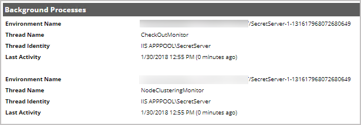

1. Open the **Registry Editor** on the machine running Secret Server (**Start \| run-regedit**, depending on OS)

1. On the left, navigate to **HKEY_LOCAL_MACHINE\\SYSTEM\\CurrentControlSet\\Services\\EventLog**  

1. Right click on the **EventLog** folder in your registry editor and select
**Permissions**, then click the **Advanced** button

1. On the Permissions tab, Click **Add**

1. Click **Select a principal**.

1. Enter the name of your app pool’s account (see step 1, for example: “IIS
APPPOOL\\SecretServer”) in the box listed under **Enter the object name to
select (examples).** Click **Check Names**, Once “SecretServer” (or the name of
your Secret Server app pool) is listed in the box and underlined, click **OK**

1. Under **Basic permissions:**, check **Read**.

1. Click **Show advanced permissions**, then check **Set Value** and **Create
Subkey** under **Advanced permissions:**.

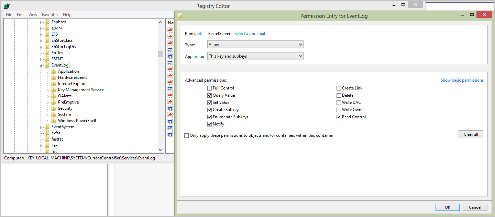

1. Click **OK** on the remaining dialogs and **Apply** the permissions.  You
should be back on the main Registry Editor window.

1. Navigate
to **HKEY_LOCAL_MACHINE\\SYSTEM\\CurrentControlSet\\Services\\EventLog\\Security**,
right-click and select **Permissions...**

1.  Click **Add...**, find the account running Secret Server (like in step 7),
then click **OK**.

1. Check **Read** in the **Allow** column, then click **OK** to apply the
permission.

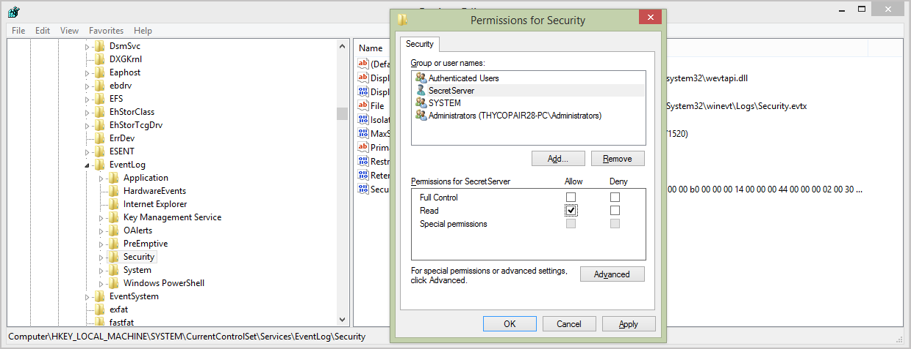

Inside of Secret Server, navigate to **Admin \| Configuration \| General** tab
to verify that the Application Setting **Write Syslogs as Windows Events** is
set to **Yes**.

Next, for instructions on accessing Windows Event Logs on the server for Secret
Server logs, see the section, “Accessing Windows Event Logs”.

12.4 Accessing Windows Event Logs
---------------------------------

After setting up Windows Event Logs to consume Secret Server logs you can access
logs for local auditing and troubleshooting purposes through the **Windows Event
Log Event Viewer** on Secret Server’s local server.

To find the Windows Event Log, open the Windows **Event Viewer** from the local
server and navigate to **Windows Logs \| Application**. Event Logs for Secret
Server will be listed as **[SecretServer]** under the **Source** column:

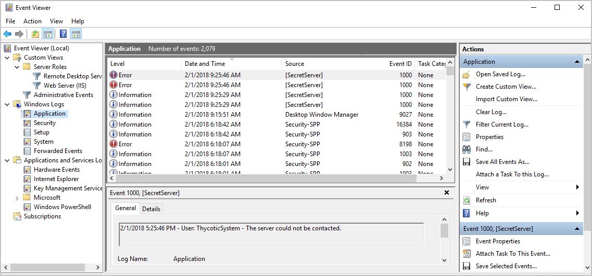

# External Auditing
======================

## Security - Connecting to External Audit Server
---------------------------------------------------

Using the **Secure TCP** Syslog/CEF Protocol will make Secret Server try to
establish a secure connection to your external audit server. Secret Server will
only use TLS v1.2 or v1.1 for security reasons.

If your audit server requires Client Certificates, see the “Configuring Client Certificates” section. If configured, Secret Server will pass the
certificate to the external audit server when it connects, so the audit server
can validate the Secret Server machine.

*\*If the connection between Secret Server and the external audit server is
disconnected or cannot be established, Secret Server will log an internal error
and automatically try to re-send any missed audit messages later, see the “Determining Status of a Remote Audit Server” section.

*\*For a connection to be successfully established using Secure TCP protocol,
Secret Server must trust the SSL certificates being used by the audit server. If
the audit server is using a self-signed certificate, the Certificate Authorities
used to create it need to be installed on the Secret Server machine. If Secret
Server has issues trusting the certificate, details will be logged internally.*

- More information for setting TLS options for a syslog-ng server can be found at 

- <https://www.balabit.com/documents/syslog-ng-ose-latest-guides/en/syslog-ng-ose-guide-admin/html/tlsoptions.html>

- More information on creating your own Certificate Authorities can be found at

- <https://jamielinux.com/docs/openssl-certificate-authority/>

## Configuring Syslog/CEF External Audit Server
-------------------------------------------------

### Compatible Audit Servers

- syslog-ng

- Any Audit server that accepts *TLS encrypted messages using the BSD Syslog Protocol*

### Configuration Steps

###### To setup your external audit server:

- Navigate to **Admin \| Configuration**, then click **Edit**.

- You will see a configuration area in the **General tab** under **Application Settings** to **Enable Syslog/CEF Logging**. Check this box to enable:

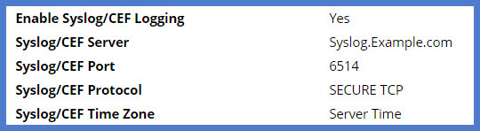

*\*Syslog/CEF may require an additional license key. To install licenses,
navigate to Admin \| Licenses and select Install New License. Once installed,
you will need to activate your license. Contact your Thycotic Sales
Representative if you have questions about your licensing.*

- After enabling Syslog/CEF Logging, **configure the IP address** for the **IIS Server** that is **hosting the Syslog/CEF web application**. Enter the Syslog/CEF IP address next to **Syslog/CEF Server.**

- Next, configure the **port number** where the logging information will be passed. Enter this for the **Syslog/CEF Port.** 6514 is the default port for Secure TCP Syslog.

*\*Secret Server requires outbound access to this server and port so communication can pass freely.*

- Set the **Syslog/CEF Protocol** to **Secure TCP**. This setting will accept either TLS v1.2 or v1.1 for added security, because other versions of SSL (that is, SSL v3 and TLS v 1.0) have known weaknesses.

- Lastly, **Syslog/CEF Time Zone** can be set to **UTC Time** or **Server Time** depending on preference.

### Caching Syslog Audits

Once secure Syslogging is enabled in Secret Server, if the connection breaks
between the external Syslog server and Secret Server, failed syslog messages
will be cached in the Secret Server database and re-sent at regular intervals
until the connection between the syslog server and Secret Server is
reestablished.

### Compatibility Notes Related to Using Client Certificates

1) If you are using a Client Certificate, Secret Server’s IIS AppPool must be
granted access to use the certificate using the Windows HTTP Services
Certificate Configuration Tool (WinHttpCertCfg.exe).  
Otherwise if Secret Server is configured to use a Client Certificate, and IIS
doesn’t have permission, you will see errors like this in the logs:  

*TLS Error Detected (Authentication Error connecting to IP:PORT) - The
credentials supplied to the package were not recognized.*  
Example usage:  
**cd C:\\Program Files (x86)\\Windows Resource Kits\\Tools**  
**winhttpcertcfg.exe -g -c LOCAL_MACHINE\\MY -s "CertificateSubject" -a
"HOSTNAME\\IIS APPPOOL\\SecretServer"**  
Download: <https://www.microsoft.com/en-us/download/details.aspx?id=19801>More
info:
<https://msdn.microsoft.com/en-us/library/windows/desktop/aa384088(v=vs.85).aspx>2)
If you are using a Client Certificate, and a Syslog-NG logging server, yad ou
may occasionally see this message in the main Syslog-NG log file:  
*SSL error while reading stream; tls_error='SSL
routines:ssl_get_prev_session:session id context uninitialized'*  
On the Secret Server side, this shows up like this:  
*TLS Error Detected (Authentication Error connecting to IP:PORT) -
Authentication failed because the remote party has closed the transport stream.*  
This is caused because Windows tries to cache secure connections when client
certificates are in use, but because Syslog-NG has not configured their OpenSSL
“session id context”, OpenSSL gives this error when it tries to resume a
previous session.  

Secret Server will automatically reconnect and resend any missed messages, so
these errors really should cause no impact. However if you would like, you can
disable Window’s secure connection caching, by adding the
[ClientCacheTime](https://docs.microsoft.com/en-us/windows-server/security/tls/tls-registry-settings)
setting set to 0 in the Registry, and then doing a reboot. This did not cause
any significant performance impact in our internal testing, but your mileage may
vary.

\*If Syslog-NG configures their OpenSSL session id context, this error message
correction will no longer be needed.

## Configuring Auditing for TLS Connections 
----------------------------------------------

To track problems with TLS connections including whenever the connection might
fail, enable the TLS Certificate Chain Policy and Error Auditing in Secret
Server by navigating to **Admin \| Configuration \| Security** tab, then scroll
down to the TLS Auditing section.

- Ensure that the **Apply TLS Certificate Chain Policy and Error Auditing** is
    set to **Yes.** If not set to yes, Client Certificates cannot be used.

- Ensure that the **Enable TLS Debugging and Connection Tracking** is set to **Yes**. When set to yes, Secret Server will send information logs to your audit server about when TLS connections are opened or closed. If debug logging is enabled in "web-log4net.config" detailed information about X509 certificate chain validation will also be logged. Note that this setting may create a lot of extra messages in your log files.

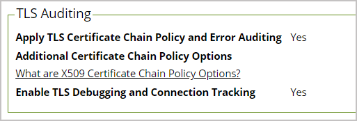

To Edit click the **Edit** button and **check** the setting you want to turn on
or uncheck the setting you want to turn off.

*\*If the TLS connection breaks, an error message will be logged in the local
audit trail and Secret Server will keep trying every 60 seconds to reestablish
the TLS connection to the syslog server*

*\*If Secure TCP is used for the Syslog/CEF Protocol, and there are one or more
Client Certificate Thumbprints entered, Secret Server will check the Local
Computer’s Web Hosting and Personal certificate store and use the first one it
finds (See the “Configuring Client Certificates” section).*

*\*To add Client Certificate Thumbprints, you can copy and paste a list in bulk
after clicking Edit, then Advanced (not required). Separate each SSL Certificate
SHA1 Thumbprint (40 characters each) with a semicolon (up to ten total are
allowed).*

## Determining Status of a Remote Audit Server
------------------------------------------------

To view the logs for any TLS-Connection related errors:

- Open **Microsoft SQL Server Management Studio**, navigate to your SecretServer database (**DBMachineName \> Databases \> SecretServer**) and run a **New Query**.

- Type **select \* from tbSecurityAuditLog** to view the events from your TLS Audit:

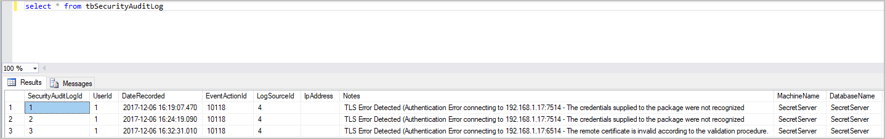

*\*For more detailed troubleshooting reporting, reference logs in File Explorer
on Secret Server’s web server (C:\\inetpub\\wwwroot\\SecretServer\\log)
including SS.log, SS-BSSR.log (Background Scheduler), SS-BSWR.log (Background
Worker) for any errors that might crop up.*

## Auditable Events 
==============================

This section describes audit events generated by the evaluated security
functionality.

Locally in Windows Event Logs (EVT), the audit records are stored and displayed
by the TOE in the following format:

- [Timestamp] [User] [Event] [Action] [Item Modified]

External audit records may be formatted differently. For example, Splunk audit
information will be stored and displayed by the TOE in the following format:

- [Timestamp] [Subject_ID] [Event_Type] [Outcome MSG]

| **Component**   | **Auditable Events**                                                                                                                                                 | **Audit Record**                                                                                                                                                                                                                                                                                                                                                                                                                                                                                                                                                                                       |
|-----------------|----------------------------------------------------------------------------------------------------------------------------------------------------------------------|--------------------------------------------------------------------------------------------------------------------------------------------------------------------------------------------------------------------------------------------------------------------------------------------------------------------------------------------------------------------------------------------------------------------------------------------------------------------------------------------------------------------------------------------------------------------------------------------------------------------------------------------------------------------------------------------------------------------------------------------------------------------------------------------------------------------------------------------------------------------------------------------------------------------------------------------------------------------------------------------------------------------------------------------------------------------------------------------------------------------------------------------------------------------------------------------------------------------------------------------------------------------------------------------------------------------------------------------------------------------------------------------------------------------------------------------------------------------------------------------------------------------------------------------------------------------------------------------------------------------------------------------------------------------------------------------------------------------------------------------------------------------------------------------------------------------------------------------------------------------------------------------------------------------------------------------------------------------------------------------------------------------------------------------------------------------------------------------------------------------------------------------------------------------------------------------------------------------------------------------------------------------------------------------------------------------------------------------------------------------------------------------------------------------------------------------------------------------------------------------------------------------------------------------------------------------------------------------------------------------------------------------------------------------------------------------------------------------------------------------------------------------------------------------------------------------------------------------------------------------------------------------------------------------------------------------------------------------------------------------------------------------------------------------------------------------------------------------------------------------------------------------------------------------------------------------------------------------------------------------------------------------------------------------------------------------------------------------------------------------------------------------------------------------------------------------------------------------------------------------------------------------------------------------------------------------------------------------------------------------------------------------------------------------------------------------------------------------------------------------------------------------------------------------------------------------------------------------------------------------------------------------------------------------------------------------------------------------------------------------------------------------------------------------------------------------------------------------------------------------------------------------------------------------------------------------------------------------------------------------------------------------------------------------------------------------------------------------------------------------------------------------------------------------|
| ESM_ICD.1       | Definition of object attributes                                                                                                                                      | May 22 2018 15:30:37 - User: SecretServer Administrator - [SecretServer] Event: [Secret] Action: [Create] By User: SSAdmin Item Name: Unix Account SSH Test Container Name: SecretServer Administrator  May 22 2018 20:20:57 - User: SecretServer Administrator - [SecretServer] Event: [Secret] Action: [Edit] By User: SSAdmin Item Name: Unix Account SSH Test Container Name: SecretServer Administrator Details: [testparent.thycotic.com](http://testparent.thycotic.com/)\\Children of Homer **LINK BROKEN** (Granted View)  May 22 2018 20:57:41 - User: SecretServer Administrator - [SecretServer] Event: [Secret] Action: [Edit] By User: SSAdmin Item Name: Unix Account SSH Test [BARRY] Container Name: SecretServer Administrator Details: [testparent.thycotic.com](http://testparent.thycotic.com/)\\Children of Homer **LINK BROKEN** (Revoked View)  May 23 2018 11:33:32 - User: admin - [SecretServer] Event: [Secret Template] Action: [Create] By User: admin Item Name: Test Template Details: Secret Template "Test Template" was created.                                                                                                                                                                                                                                                                                                                                   |
|                 | Association of attributes with objects                                                                                                                               | Jan 04 10:25:54 WIN-3SS887QA4R4 CEF:0\|Thycotic Software\|Secret Server\|10.4.000001\|10005\|SECRET - EDIT\|2\|msg=[SecretServer] Event: [Secret] Action: [Edit] By User: admin Item Name: My Active Directory Secret Name Details: Fields: (Username) suid=2 suser=admin cs4=admin cs4Label=suser Display Name src=10.12.30.4 rt=Jan 04 2018 10:25:36 fname=My Active Directory Secret Name fileType=Secret fileId=26  May 23 2018 11:34:35 - User: admin - [SecretServer] Event: [Secret Template] Action: [Edit] By User: admin Item Name: Test Template Details: Active: true to false;                                                                                                                                                                                                    |
| ESM_EAU.2       | All use of the authentication mechanism                                                                                                                              | May 22 2018 15:59:11 - User: [qaparent.thycotic.com](http://qaparent.thycotic.com/)\\Matt testuser 1 - **LINK BROKEN** [SecretServer] Event: [User] Action: [Login] By User: [qaparent.thycotic.com](http://qaparent.thycotic.com/) \\md_testuser1 **LINK BROKEN** Item Name: [qaparent.thycotic.com](http://qaparent.thycotic.com/)  \\md_testuser1 **LINK BROKEN**  May 22 2018 16:05:46 - User: ThycoticSystem - Login Failure - User balhblah does not exist  May 22 2018 16:08:25 - User: [qaparent.thycotic.com](http://qaparent.thycotic.com/)\\Matt **LINK BROKEN** testuser 3 -  [SecretServer] Event: [User] Action: [Login Failure] By User: [qaparent.thycotic.com](http://qaparent.thycotic.com/)\\md_testuser3 **LINK BROKEN** Item Name: [qaparent.thycotic.com](http://qaparent.thycotic.com/)\\md_testuser3 **LINK BROKEN** Details: AuthenticationFailed                                                                                                                                                                                                                                                                                                                                                                                                       |
| ESM_EID.2       | Creation or modification of identity and credential data                                                                                                             | Jan 04 10:37:27 WIN-3SS887QA4R4 CEF:0\|Thycotic Software\|Secret Server\|10.4.000001\|19\|USER - PASSWORDCHANGE\|2\|msg=[SecretServer] Event: [User] Action: [Password Change] By User: admin Item Name: admin suid=2 suser=admin cs4=admin cs4Label=suser Display Name duser=admin duid=2 fname=admin fileType=User fileId=2 src=10.12.30.4 rt=Jan 04 2018 10:37:24                                                                                                                                                                                                                                                                                                                                                                 |
| ESM_ICD.1       | Creation and modification of identity and credential data                                                                                                            | Jan 04 12:46:26 WIN-3SS887QA4R4 CEF:0\|Thycotic Software\|Secret Server\|10.4.000001\|1\|USER - CREATE\|2\|msg=[SecretServer] Event: [User] Action: [Create] By User: admin Item Name: New User suid=2 suser=admin cs4=admin cs4Label=suser Display Name duser=New User duid=6 fname=New User fileType=User fileId=6 src=10.12.30.4  May 24 2018 15:21:49 - User: Marrio Thycotic - [SecretServer] Event: [Domain] Action: [Edit] By User: admin Item Name: [testparent.thycotic.com](http://testparent.thycotic.com/) **LINK BROKEN** Details: Groups Added to Synchronization: secretserver  May 24 2018 15:28:06 - User: ThycoticSystem - [SecretServer] Event: [User] Action: [Added To Group] By User: ThycoticSystem Item Name: [testparent.thycotic.com](http://testparent.thycotic.com/)\\jsmithson **LINK BROKEN** Container Name: [testparent.thycotic.com](http://testparent.thycotic.com/)\\secretserver  **LINK BROKEN**                                                                                                                                                                                                                                                                                                                                    |
|                 | Enrollment or modification of subject                                                                                                                                | May 22 2018 13:43:22 - User: admin - [SecretServer] Event: [Role] Action: [Assign User Or Group] By User: admin Item Name: User Container Name: user3  May 22 2018 14:00:06 - User: admin - [SecretServer] Event: [Configuration] Action: [Edit] By User: admin Details: EnableMinimumPasswordAge: false to true; MinimumPasswordAgeInMinutes: 43200 to 3;  May 22 2018 14:09:55 - User: admin - [SecretServer] Event: [Configuration] Action: [Edit] By User: admin Details: MinimumPasswordAgeInMinutes: 3 to 2; PasswordHistoryDepth: 5 to 4;  May 22 2018 14:24:17 - User: admin - [SecretServer] Event: [Secret Template] Action: [Edit] By User: admin Item Name: Active Directory Account Details: ValidatePasswordRequirementsOnCreate: false to true; ValidatePasswordRequirementsOnEdit: false to true;  May 22 2018 14:23:30 - User: admin - [SecretServer] Event: [Password Requirement] Action: [Edit] By User: admin Item Name: Default Details: IsDefault: false to true;  May 22 2018 20:59:04 - User: admin - [SecretServer] Event: [Secret] Action: [Edit] By User: admin Item Name: testparent\\mufasa Container Name: admin Details: [qaparent.thycotic.com](http://qaparent.thycotic.com/)\\StephGroup **LINK BROKEN** (Granted View)  May 22 2018 21:03:08 - User: admin - [SecretServer] Event: [Secret] Action: [Edit] By User: admin Item Name: testparent\\mufasa Container Name: admin Details: [qaparent.thycotic.com](http://qaparent.thycotic.com/)\\StephGroup **LINK BROKEN** (Revoked View)  May 23 2018 13:20:54 - User: admin - [SecretServer] Event: [Configuration] Action: [Edit] By User: admin Details: ADUserSyncOption: ImportEnabled to MirrorAD; AllowSynchronizedAccountDisabling: false to true;  May 23 2018 14:51:37 - User: admin - [SecretServer] Event: [Domain] Action: [Edit] By User: admin Item Name: [testparent.thycotic.com](http://testparent.thycotic.com/) **LINK BROKEN**             Details: Groups Added to Synchronization: HelpDeskTier1  May 23 2018 14:52:16 - User: admin - [SecretServer] Event: [Domain] Action: [Synchronize] By User: admin Details: Active Directory Sync Initiated                                                                                                                  May 23 2018 14:52:20 - User: ThycoticSystem - [SecretServer] Event: [User] Action: [Added To Group] By User: ThycoticSystem Item Name: [testparent.thycotic.com](http://testparent.thycotic.com/)\\gman **LINK BROKEN** Container Name: [testparent.thycotic.com](http://testparent.thycotic.com/)\\HelpDeskTier1 **LINK BROKEN**   May 23 2018 14:26:16 - User: ThycoticSystem - [SecretServer] Event: [User] Action: [Edit] By User: ThycoticSystem Item Name: [testparent.thycotic.com](http://testparent.thycotic.com/)\\ **LINK BROKEN** Details: Enabled: true to false;                                                                                                                                                                                                                                                     May 23 2018 15:13:55 - User: ThycoticSystem - [SecretServer] Event: [User] Action: [Disable] By User: ThycoticSystem Item Name: [testparent.thycotic.com](http://testparent.thycotic.com/)\\gman **LINK BROKEN**  May 22 2018 12:53:53 - User: admin - [SecretServer] Event: [User] Action: [Edit] By User: admin Item Name: user1 Details: IsLockedOut: false to true;  22 2018 12:54:51 - User: user1 - [SecretServer] Event: [User] Action: [Login Failure] By User: user1 Item Name: user1 Details: UserIsLockedOut  May 22 2018 12:55:09 - User: admin - [SecretServer] Event: [User] Action: [Edit] By User: admin Item Name: user1 Details: IsLockedOut: true to false;  Apr 04 21:32:02 THY616-PC CEF:0\|Thycotic Software\|Secret Server\|10.4.000001\|15\|CONFIGURATION - EDIT\|2\|msg=[SecretServer] Event: [Configuration] Action: [Edit] By User: [admin](mailto:j@c.com) Details: MinLength: 1 to 8; RequireLowercase: false to true; RequireNumbers: false to true; suid=1 [suser=admin](mailto:suser=j@c.com) cs4=Display Name cs4Label=suser Display Name src=::1 rt=Apr 04 2018 21:31:44  Apr 04 21:33:32 THY616-PC CEF:0\|Thycotic Software\|Secret Server\|10.4.000001\|500\|System Log\|7\|msg=System.Exception: API_InvalidPassword at Thycotic.ihawu.Business.Rest.Logic.Users. UserLogic. UpdateAndSetPassword(IUser user, IUserUpdateArgs updatedUser) in C:\\\\development\\\\VSO\\\\Thycotic.Ihawu\\\\src\\\\Thycotic.ihawu.Business \\Rest\\\\Logic\\\\Users\\\\UserLogic.cs:line 269 at Thycotic.ihawu.Business.Rest.Services.Api.V1.User.UserService. \<UpdateUser\>d__15\`1.MoveNext() in C:\\\\development\\\\VSO\\\\Thycotic.Ihawu\\\\src\\\\Thycotic.ihawu.Business \\\\Rest\\\\Services\\\\Api\\\\V1\\\\User\\\\UserService.cs:line 227 src=::1 rt=Apr 04 2018 21:33:32                                                                                                                                                                                                                                                                                                  |
| ESM_ICT.1       | Transmission of identity and credential data (and object attributes, if applicable) to external processes or repositories                                            | May 23 2018 06:54:41 - User: user1 - [SecretServer] Event: [Secret] Action: [Launch] By User: user1 Item Name: user1\@centos7-001 Container Name: Administrators Details: PuTTY   May 23 2018 07:54:46 - User: user1 - [SecretServer] Event: [Secret] Action: [Edit] By User: user1 Item Name: user1\@centos7-001 Container Name: Administrators Details: Settings: (Change Password Remotely, Auto Change Next Password)   May 23 2018 07:55:09 - User: ThycoticSystem - [SecretServer] Event: [Secret] Action: [Password Change] By User: ThycoticSystem Item Name: user1\@centos7-001 Container Name: Administrators Details: Remote Password Change - Fields: (Password)  May 23 2018 19:33:55 - User: Marrio Thycotic - [SecretServer] Event: [Secret] Action: [Delete] By User: admin Item Name: Will Be Deleted Container Name: Marrio Thycotic                                                                                                                                                                                                                                                                                                                                                                     |
| FAU_GEN.1       | Start-up and shutdown of the audit functions; All auditable events for the not specified level of audit;                                                             | **N/A – Cannot turn off internal audit functions within Secret Server while Secret Server continues to run for Security reasons For enabling Syslog audit functions:**   Jan 08 08:11:58 WIN-3SS887QA4R4 CEF:0\|Thycotic Software\|Secret Server\|10.4.000001\|15\|CONFIGURATION - EDIT\|3\|msg=[SecretServer] Event: [Configuration] Action: [Edit] By User: admin Details: EnableCefLogging: false to true; suid=2 suser=admin cs4=admin cs4Label=suser Display Name src=10.12.30.4 rt=Jan 08 2018 08:11:43  May 23 2018 07:34:33 - User: ThycoticSystem - WIN-GNDNGLV41TD: Application initialized and started.   May 23 2018 07:34:40 - User: ThycoticSystem - Starting CEF/SysLog Auditing in the EventQueueMonitor thread...  May 23 2018 12:57:13 - User: admin - Secure TCP Syslog: could not get existing connection to 13.92.231.152:65140, and failed to create new connection: TLS Error Detected (Authentication Error connecting to 13.92.231.152:65140 - A connection attempt failed because the connected party did not properly respond after a period of time, or established connection failed because connected host has failed to respond 13.92.231.152:65140)                                                                                                                                                                                                                                                                                                                                |
| FAU_STG_EXT.1   | Establishment and disestablishment of communications with audit server                                                                                               | Apr 05 19:52:10 THY616-PC CEF:0\|Thycotic Software\|Secret Server\|10.4.000001\|15\|CONFIGURATION - EDIT\|2\|msg=[SecretServer] Event: [Configuration] Action: [Edit] By User: admin Details: EnableCefLogging: false to true; CefPort: 514 to 9999; CefServer: 127.0.0.1 to 192.168.0.100; suid=1 suser=admin cs4=Display Name cs4Label=suser Display Name src=::1 rt=Apr 05 2018 19:52:04  Apr 05 19:51:05 THY616-PC CEF:0\|Thycotic Software\|Secret Server\|10.4.000001\|15\|CONFIGURATION - EDIT\|2\|msg=[SecretServer] Event: [Configuration] Action: [Edit] By User: admin Details: EnableCefLogging: True to False; suid=1 suser=admin cs4=Display Name cs4Label=suser Display Name rt=Apr 05 2018 19:51:05 src=::1                                                                                                                                                                                                                                                                                                  |
| FCS_HTTPS_EXT.1 | Failure to establish a session, establishment/termination of a session                                                                                               | Jan 08 11:36:50 WIN-3SS887QA4R4 CEF:0\|Thycotic Software\|Secret Server\|10.4.000001\|16\|USER - LOGIN\|2\|msg=[SecretServer] Event: [User] Action: [Login] By User: admin Item Name: admin suid=2 suser=admin cs4=admin cs4Label=suser Display Name duser=admin duid=2 fname=admin fileType=User fileId=2 src=10.12.30.4 rt=Jan 08 2018 11:36:39                                                                                                                                                                                          |
| FCS_TLS_EXT.1   | Failure to establish a session, establishment/termination of a session                                                                                               | Apr 05 19:53:25 THY642 CEF:0\|Thycotic Software\|Secret Server\|10.0.104.000001\|100\|TLS Audit\|2\|msg=Domain [testparent.thycotic.com] **LINK BROKEN** : TLS Connect: Created new secure connection to Active Directory Server testparent.thycotic.com:636 rt=Apr 05 2018 19:53:18  Apr 05 19:53:25 THY642 CEF:0\|Thycotic Software\|Secret Server\|10.0.104.000001\|100\|TLS Audit\|2\|msg=Domain [testparent.thycotic.com]: **LINK BROKEN** TLS Disconnect: Destroying secure connection to Active Directory Server testparent.thycotic.com:636 **LINK BROKEN** rt=Apr 05 2018 19:53:18  Apr 04 16:58:16 THY642 CEF:0\|Thycotic Software\|Secret Server\|10.0.104.000001\|100\|TLS Error Detected\|8\|msg=TLS Error Detected - ActiveDirectory: TLS Error Detected (qaparent): The revocation function was unable to check revocation because the revocation server was offline. src=::1 rt=Apr 04 2018 16:58:16                                                                                                                                                                                                                                                                                                                                                                                                                                                  |
| FIA_AFL.1       | The reaching of an unsuccessful authentication attempt threshold, the actions taken when the threshold is reached, and any actions taken to restore the normal state | May 23 2018 20:22:43 - User: User1 - [SecretServer] Event: [User] Action: [Login Failure] By User: user1 Item Name: user1 Details: UserIsLockedOut  May 23 2018 20:51:41 - User: ThycoticSystem - [SecretServer] Event: [User] Action: [Edit] By User: ThycoticSystem Item Name: user1 Details: LoginFailures: 4 to 5; IsLockedOut: false to true;                                                                                                                                                                                                                                                                                                                                               |
| FIA_USB.1       | User-Subject Binding User-Role Binding                                                                                                                               | May 24 2018 15:21:49 - User: Marrio Thycotic - [SecretServer] Event: [Domain] Action: [Edit] By User: admin Item Name: [testparent.thycotic.com](http://testparent.thycotic.com/) **LINK BROKEN** Details: Groups Added to Synchronization: secretserver  May 24 2018 15:28:06 - User: ThycoticSystem - [SecretServer] Event: [User] Action: [Added To Group] By User: ThycoticSystem Item Name: [testparent.thycotic.com](http://testparent.thycotic.com/)\\jsmithson **LINK BROKEN** Container Name: [testparent.thycotic.com](http://testparent.thycotic.com/)\\secretserver **LINK BROKEN**  May 23 2018 20:56:08 - User: admin - [SecretServer] Event: [Role Permission] Action: [Added To Role] By User: admin Item Name: Administer Active Directory Container Name: Gov_Administrator  May 23 2018 20:59:15 - User: admin - [SecretServer] Event: [Role] Action: [Assign User Or Group] By User: admin Item Name: Gov_Administrator Container Name: gov_admin                                                                                                                                                                                                                                                                                                    |
| FMT_MTD.1       | Management of TSF data                                                                                                                                               | May 23 2018 19:35:36 - User: admin - [SecretServer] Event: [Secret] Action: [Edit] By User: admin Item Name: User1 Secret Container Name: admin Details: user1 (Granted Edit)  May 23 2018 19:40:15 - User: admin - [SecretServer] Event: [Role] Action: [Assign User Or Group] By User: admin Item Name: Administrator Container Name: admin1                                                                                                                                                                                                                                                                                                                                                                                        |
| FMT_MOF.1       | All modifications of TSF function behavior                                                                                                                           | Apr 05 20:15:11 THY616-PC CEF:0\|Thycotic Software\|Secret Server\|10.4.000001\|100\|BACKUPCONFIGURATION - EDIT\|2\|msg=[SecretServer] Event: [Backup Configuration] Action: [Edit] By User: admin Details: BackupHistoryLength: 5 to 7; BackupStartTime: 1 to 300; BackupDate: 1/1/2005 12:00:00 AM to 12/31/2004 12:00:00 AM; suid=1 suser=admin cs4=Display Name cs4Label=suser Display Name src=::1 rt=Apr 05 2018 20:15:06  Apr 05 20:17:11 THY616-PC CEF:0\|Thycotic Software\|Secret Server\|10.4.000001\|10014\|UNLIMITEDADMIN - ENABLE\|2\|msg=[SecretServer] Event: [Unlimited Administrator] Action: [Enable] By User: admin Details: Testing suid=1 suser=admin cs4=Display Name cs4Label=suser Display Name src=::1 rt=Apr 05 2018 20:17:06  Apr 05 20:17:21 THY616-PC CEF:0\|Thycotic Software\|Secret Server\|10.4.000001\|15\|CONFIGURATION - EDIT\|2\|msg=[SecretServer] Event: [Configuration] Action: [Edit] By User: admin Details: UnlimitedAdministrator: true to false; suid=1 suser=admin cs4=Display Name cs4Label=suser Display Name src=::1 rt=Apr 05 2018 20:17:18  Apr 05 20:17:21 THY616-PC CEF:0\|Thycotic Software\|Secret Server\|10.4.000001\|10015\|UNLIMITEDADMIN - DISABLE\|2\|msg=[SecretServer] Event: [Unlimited Administrator] Action: [Disable] By User: admin Details: End testing suid=1 suser=admin cs4=Display Name cs4Label=suser Display Name src=::1 rt=Apr 05 2018 20:17:18                                                                                                                                                                                                                                                                                                                                                                          |
| FMT_SMF.1       | Use of the management functions *Note: Management functions are defined in the table below.*                                                                         | Jan 08 11:59:50 WIN-3SS887QA4R4 CEF:0\|Thycotic Software\|Secret Server\|10.4.000001\|15\|CONFIGURATION - EDIT\|3\|msg=[SecretServer] Event: [Configuration] Action: [Edit] By User: admin Details: AllowTwoFactorRememberMe: false to true; TwoFactorRememberMeDurationDays: 0 to 1; suid=2 suser=admin cs4=admin cs4Label=suser Display Name src=10.12.30.4 rt=Jan 08 2018 11:59:37                                                                                                                                                                                                                                                                                                                                                |
| FMT_SMR.1       | Modification to the members of the management roles                                                                                                                  | Apr 05 20:18:41 THY616-PC CEF:0\|Thycotic Software\|Secret Server\|10.4.000001\|10\|ROLE - ASSIGNUSERORGROUP\|2\|msg=[SecretServer] Event: [Role] Action: [Assign User Or Group] By User: admin Item Name: Administrator Container Name: User One suid=1 suser=admin cs4=Display Name cs4Label=suser Display Name fname=Administrator fileType=Role fileId=1 cs2Label=Group or User cs2=User One src=::1 rt=Apr 05 2018 20:18:37  Apr 05 20:18:51 THY616-PC CEF:0\|Thycotic Software\|Secret Server\|10.4.000001\|11\|ROLE - UNASSIGNUSERORGROUP\|2\|msg=[SecretServer] Event: [Role] Action: [Unassign User Or Group] By User: admin Item Name: Administrator Container Name: User One suid=1 suser=admin cs4=Display Name cs4Label=suser Display Name fname=Administrator fileType=Role fileId=1 cs2Label=Group or User cs2=User One src=::1 rt=Apr 05 2018 20:18:45                                                                                                                                                                                                                                                                                                                                                 |
| FTA_SSL.3       | The termination of a remote session by the session locking mechanism.                                                                                                | May 23 2018 11:36:56 - User: admin - [SecretServer] Event: [Configuration] Action: [Edit] By User: admin Details: AllowLogoutTimeout: false to true; TimeoutInMinutes: 5 to 1;  May 23 2018 11:38:56 - User: ThycoticSystem - [SecretServer] Event: [User] Action: [Logout] By User: ThycoticSystem Item Name: admin                                                                                                                                                                                                                                                                                                                     |
| FTA_SSL.4       | The termination of an interactive session.                                                                                                                           | May 23 2018 21:46:49 - User: admin - [SecretServer] Event: [User] Action: [Login] By User: admin Item Name: admin  May 23 2018 21:48:14 - User: admin - [SecretServer] Event: [User] Action: [Logout] By User: admin Item Name: admin                                                                                                                                                                                                                                                                                                       |
| FTA_TAB.1       | TOE Access Banner                                                                                                                                                    | May 23 2018 14:39:24 - User: SecretServer Administrator - [SecretServer] Event: [Configuration] Action: [Edit] By User: SSAdmin Details: EnableLoginPolicy: false to true; ForceLoginPolicy: false to true;                                                                                                                                                                                                                                                                                                                                |
| FTA_TSE.1       | TOE session establishment                                                                                                                                            | May 24 2018 14:50:47 - User: operator - [SecretServer] Event: [User] Action: [Login Failure] By User: operator Item Name: operator Details: InvalidIpAddress                                                                                                                                                                                                                                                                                  |
| FTP_ITC.1       | All use of trusted channel functions                                                                                                                                 | Apr 05 19:53:25 THY642 CEF:0\|Thycotic Software\|Secret Server\|10.1.104.000003\|100\|TLS Audit\|2\|msg=Domain [testparent.thycotic.com] **LINK BROKEN** : TLS Connect: Created new secure connection to Active Directory Server testparent.thycotic.com:636 **LINK BROKEN** rt=Apr 05 2018 19:53:18  Apr 05 19:53:25 THY642 CEF:0\|Thycotic Software\|Secret Server\|10.1.104.000003\|100\|TLS Audit\|2\|msg=Domain [testparent.thycotic.com] **LINK BROKEN** : TLS Disconnect: Destroying secure connection to Active Directory Server testparent.thycotic.com:636 rt=Apr 05 2018 19:53:18                                                                                                                                                                                                                                                                                         |
| FTP_TRP.1       | All attempted uses of the trusted path functions                                                                                                                     | Apr 04 16:58:16 THY642 CEF:0\|Thycotic Software\|Secret Server\|10.1.104.000003\|100\|TLS Error Detected\|8\|msg=TLS Error Detected - ActiveDirectory: TLS Error Detected (qaparent): The revocation function was unable to check revocation because the revocation server was offline. src=::1 rt=Apr 04 2018 16:58:16                                                                                                                                                                                                                    

Table 7: Auditable Events

## Management Functions
=================================

This section describes management activities and corresponding roles of the
evaluated security functionality

**Roles and Management Functions**

| **Role**       | **Management Functions**                       |
|----------------|------------------------------------------------|
| Read-only User | Search and list Secrets                        |
| User           | Use Secret/Launch session                      |
| User           | Request access to Secret                       |
| Administrator  | Create, view, expire, edit, and assign Secrets |
| Administrator  | Perform bulk operations on Secrets             |
| Administrator  | Create and manage groups                       |
| Administrator  | Create and manage roles, assign roles to users |
| Administrator  | Create and manage containers (folders)         |
| Administrator  | Create and manage Secret policy                |
| Administrator  | Configure TOE SF (see Table 16)                |
| Administrator  | Create, manage, and unlock local accounts      |
| Administrator  | Configure IIS, SQL, syslog                     |
| Administrator  | Update TOE                                     |

By default each User Role is attached to various Permission Sets. To view the
specific permissions that each role is attached to, navigate to **Admin \|
Roles** and click into the user roles listed to see the list of permissions.

Organizations can tailor these user roles to maintain whatever permissions
settings are required for your specific user environment.

The following table specifies the specific user roles required to allow each
management activity listed.

| **Requirement** | **Management Activities**                                                                                                                | **Role**      |
|-----------------|------------------------------------------------------------------------------------------------------------------------------------------|---------------|
| ESM_EAU.2       | Management of authentication data for both interactive users and authorized IT entities (if managed by the TSF)                          | Administrator |
| ESM_EID.2       | Management of authentication data for both interactive users and authorized IT entities (if managed by the TSF)                          | Administrator |
| ESM_ICD.1       | Definition of identity and credential data that can be associated with users (activate, suspend, revoke credential, etc.)                | Administrator |
|                 | Management of credential status                                                                                                          | Administrator |
|                 | Enrollment of users into repository                                                                                                      | Administrator |
| ESM_ICT.1       | Configuration of circumstances in which transmission of identity and credential data (and object attributes, if applicable) is performed | Administrator |
| FAU_STG_EXT.1   | Configuration of external audit storage location                                                                                         | Administrator |
| FIA_AFL.1       | Management of the threshold for unsuccessful authentication attempts                                                                     | Administrator |
|                 | Management of actions to be taken in the event of an authentication failure                                                              | Administrator |
| FIA_USB.1       | Definition of default subject security attributes, modification of subject security attributes                                           | Administrator |
| FMT_MOF.1       | Management of sets of users that can interact with security functions                                                                    | Administrator |
| FMT_SMR.1       | Management of the users that belong to a particular role                                                                                 | Administrator |
| FTA_SSL.3       | Configuration of the inactivity period for session termination                                                                           | Administrator |
| FTA_TAB.1       | Maintenance of the banner                                                                                                                | Administrator |
| FTP_ITC.1       | Configuration of actions that require trusted channel (if applicable)                                                                    | Administrator |
| FTP_TRP.1       | Configuration of actions that require trusted path (if applicable)                                                                       | Administrator |
