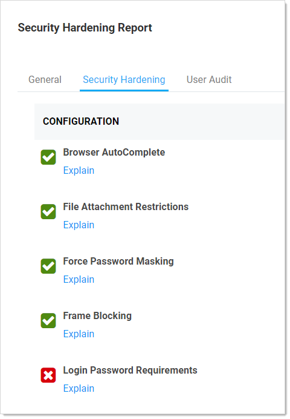
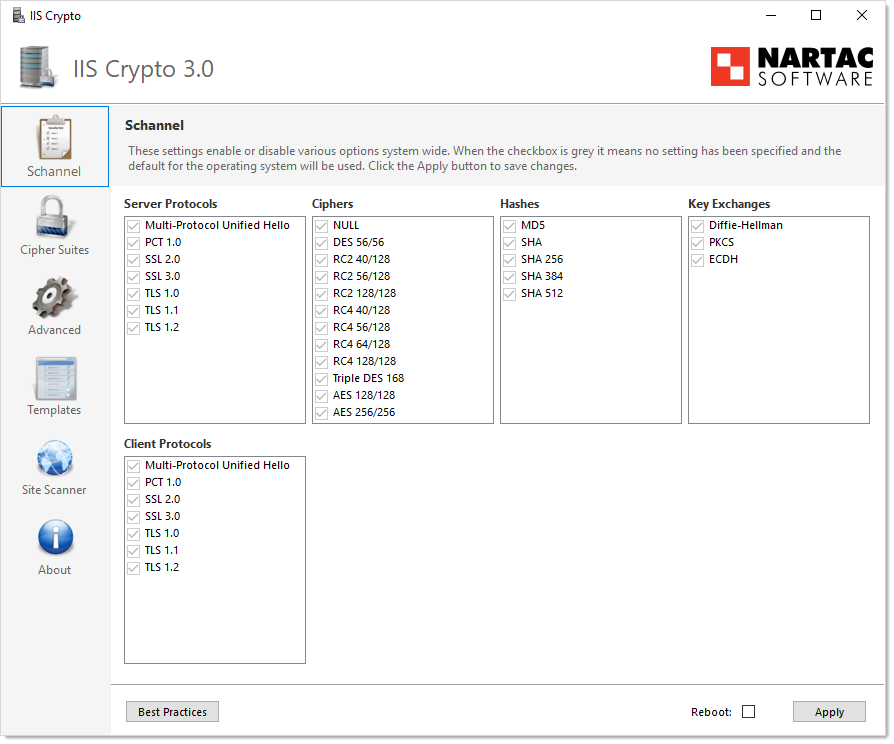
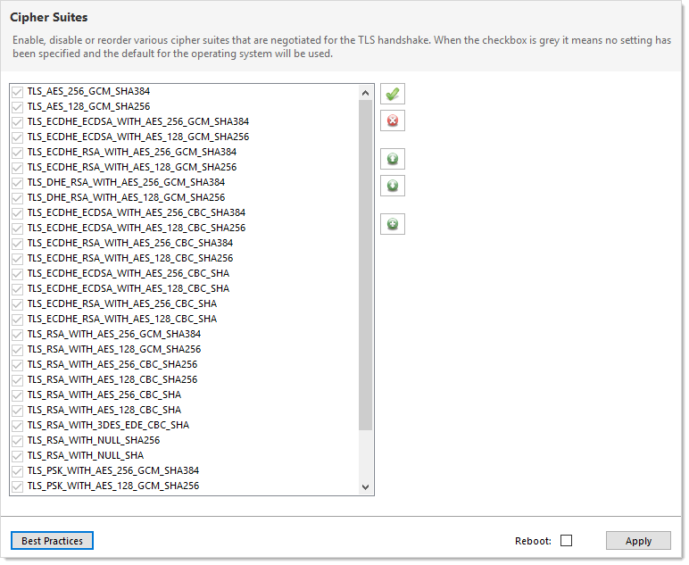
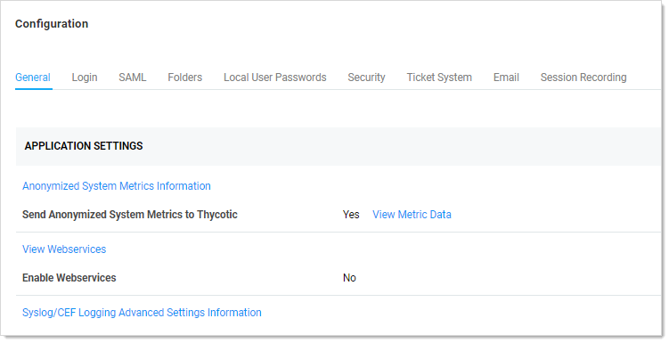
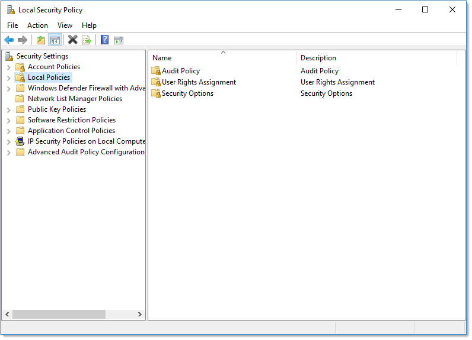
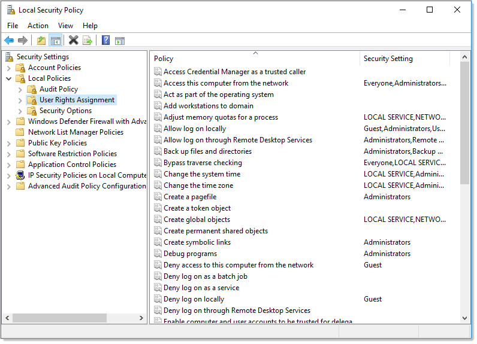
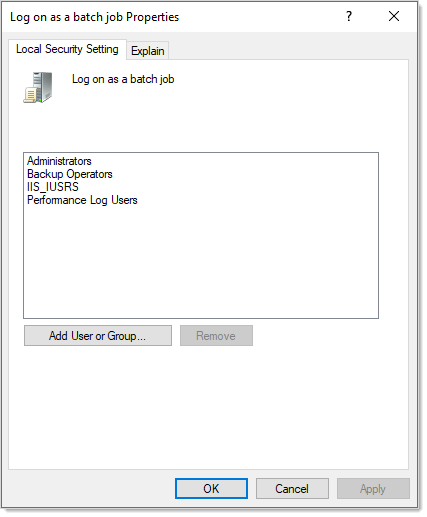

[title]: # (Enabling Common Criteria Security Hardening)
[tags]: # (Common Criteria,Security Hardening)
[priority]: # (1000)

# Enabling Common Criteria Security Hardening

> **Note:** This document and the information contained in it are confidential and proprietary to Thycotic and provided in strict confidence for the sole internal use of Thycotic and authorized agents and may not be disclosed to any third party or used for any other purpose without express prior written permission of Thycotic.
>
> **Note:** The PDF version of this online document is automatically generated and thus may have minor formatting anomalies.
>
> **Note:** This document is not updated with every Secret Server release—some minor releases do not affect the guide's contents and thus do not warrant a document update.

## Introduction

> **Important:** This document is closely associated with the Security Hardening Report in Secret Server \(Click **Reports \> Security Hardening**\) and with the [Security Hardening Guide](../security-hardening-guide/index.md), which provides information on security hardening beyond Common Criteria. We recommend having those available while reading this document.

### Overview

Secret Server (SS) made several security enhancements to achieve Common Criteria (CC) certification. These features are available in all versions of SS 10.4 and later. Due to their stringency and need for additional user configuration, not all these features are enabled by default by our standard installer.

This guide provides the information an administrator needs to configure SS 10.4 and above in compliance with the Common Criteria evaluated configuration. Follow this guide in its entirety to ensure each parameter setting matches those evaluated and certified as secure by Common Criteria standards.

### Audience

This document is for administrators who are responsible for installing, configuring, and operating enterprise infrastructure for their organization. To use this guide, you must have knowledge of your organization’s network infrastructure and applicable policies. In addition, you must have administrative access to configure your operational environment.

### What Is Common Criteria?

The Common Criteria for Information Technology Security Evaluation (ISO/IEC 15408), known as "Common Criteria," is an international standard for security certification of computer systems, networks, and application software. The certification ensures that claims about the security attributes of the evaluated product were independently verified in the evaluated configuration in the same specific environment. The certification assumes a specific evaluated configuration and does not validate any security claims when the product is used outside of that configuration.

## Procedures

### Security Hardening Checklist

After installing SS, navigate to the **Reports \> Security Hardening** tab, and follow the checklist to ensure your environment is as secure as possible:

> **Note:**  See the [Security Hardening Guide](../../security-hardening/security-hardening-guide/index.md) for details.

### Configuring TLS

To achieve Common Criteria certification on Secret Server, you must enable Transport Security Layer (TLS).

#### Manually Disabling TLS Version 1.0

TLS 1.0 is no longer considered secure, so it is important to disable this version of the protocol on SS. To do this, follow the instructions in the "Manually Disabling TLS v1.0" section of the [Common Criteria Hardening Guide](https://updates.thycotic.net/secretserver/documents/gov/SS_CommonCriteria_HardeningGuide_v10.pdf).

#### TLS Diffie-Hellman Hardening Overview

For information on configuring your servers with stronger Ephemeral Diffie-Hellman hardening, see the "TLS Diffie-Hellman Hardening Overview" in the [Common Criteria Hardening Guide](https://updates.thycotic.net/secretserver/documents/gov/SS_CommonCriteria_HardeningGuide_v10.pdf).

#### Restricting Server Cipher Suites for TLS

##### Allowed Suites

Common Criteria certification requires restricting the cipher suites configured on your server to only:

- TLS_DHE_RSA_WITH_AES_128_CBC_SHA
- TLS_DHE_RSA_WITH_AES_256_CBC_SHA
- TLS_RSA_WITH_AES_128_CBC_SHA
- TLS_RSA_WITH_AES_128_CBC_SHA256
- TLS_RSA_WITH_AES_256_CBC_SHA
- TLS_RSA_WITH_AES_256_CBC_SHA256

Restricting them can cause communication issues with other servers if they are not able to communicate using any of the above ciphers. In that case, you need to modify those servers to include these cipher suites to securely communicate according to Common Criteria guidelines.

##### Changing Cipher Suites with the IIS Crypto Tool

One way to change the cipher suites on a computer is to use the free IIS Crypto tool:

1. Download the GUI version of the tool at:
   <https://www.nartac.com/Products/IISCrypto/Download>
1. Run the tool:
   
1. Click **Cipher Suites** button on the left. The Cipher Suites window appears:
   
1. Click the  **Uncheck All** button to uncheck all cipher suites.
1. Find and click to select the suites in the list above.
1. Click the **Apply** button.

#### Configuring TLS with IIS

Common Criteria certification requires using HTTPS/SSL for all connections to the Secret Server Web page. To do this, follow the instructions in the "TLS Configuration with IIS" section of the [Common Criteria Hardening Guide](https://updates.thycotic.net/secretserver/documents/gov/SS_CommonCriteria_HardeningGuide_v10.pdf).

#### Enabling TLS Auditing

To have Secret Server audit TLS connections and connection failures, follow the instructions in the "Configuring Auditing for TLS Connections" section of the [Common Criteria Hardening Guide](https://updates.thycotic.net/secretserver/documents/gov/SS_CommonCriteria_HardeningGuide_v10.pdf).

#### Configuring TLS with Active Directory

To ensure that TLS is configured with Active Directory Follow the instructions in the "Configuring TLS with Active Directory" section of the [Common Criteria Hardening Guide](https://updates.thycotic.net/secretserver/documents/gov/SS_CommonCriteria_HardeningGuide_v10.pdf).

> **Note:** If you have any existing domains configured in Secret Server, you must edit them and enable LDAPS on each one.

#### Configuring TLS with Syslog

To configure TLS with Syslog, follow the steps in the "Configuring Syslog/CEF External Audit Server" section of the [Common Criteria Hardening Guide](https://updates.thycotic.net/secretserver/documents/gov/SS_CommonCriteria_HardeningGuide_v10.pdf).

### Additional Common Criteria Configurations

#### Configuring X.509v3 Certificates

See the "Configuring X.509v3 Certificates" section of the [Common Criteria Hardening Guide](https://updates.thycotic.net/secretserver/documents/gov/SS_CommonCriteria_HardeningGuide_v10.pdf) for instructions on installing and configuring certificates on the SS Web servers.

#### Enabling DPAPI

The Windows Data Protection API (DPAPI) is a pair of functions that allow access to operating-system-level data protection services to protect the master encryption key file, encryption.config.  

To enable DPAPI, follow the instructions in the "Verify DPAPI Setting Is Enabled" section of the [Common Criteria Hardening Guide](https://updates.thycotic.net/secretserver/documents/gov/SS_CommonCriteria_HardeningGuide_v10.pdf).

#### Enabling FIPS Mode

To configure your server and Secret Server to use the Federal Information Processing Standard (FIPS), follow the instructions in the "Verify FIPS Mode Is Enabled" section of the [Common Criteria Hardening Guide](https://updates.thycotic.net/secretserver/documents/gov/SS_CommonCriteria_HardeningGuide_v10.pdf).

> **Note:** Also see: [Enabling FIPS Compliance](../../authentication/enabling-fips-compliance/index.md)

#### Ensuring Zero Information Disclosure

To comply with Common Criteria requirements, you must configure Secret Server to not display any unnecessary information. This applies to unhandled errors as well as the application version number.

### Configuring Custom Error Messages

To hide detailed error messages and display a custom message when an unhandled error occurs:

1. Open `https://<your_secret_server_url>/ConfigurationAdvanced.aspx` in your browser.
1. Scroll to the bottom of the page and click the **Edit** button.
1. Type the message you want displayed to users in the **Zero Information Disclosure Message** text box.
1. Click the **Save** button.

### Hiding the Application Version Number

To hide the application version number in the application header and footer:

1. Go to **Admin \> Configuration \> Security**.
1. Click the **Edit** button. The Configuration page appears:

    
1. Click the **Security** tab.
1. In the **Web Services** section of the page, click to select the **Hide Secret Server Version Numbers** check box.
1. Click the **Save** button.

> **Note**: For diagnostic purposes, the application version number is still displayed on the Diagnostics page. Make sure that permissions to this page is limited to employees that may need to access this page when contacting Thycotic technical support.

### Configuring the Login Banner

For Common Criteria compliance, when a user first logs in, the login banner must reveal the user policy agreement  and force that user to agree to the policy before logging into Secret Server. To configure the Login Banner according to Common Criteria guidelines, follow the instructions in the "Configuring the Login Banner" section of the [Common Criteria Hardening Guide](https://updates.thycotic.net/secretserver/documents/gov/SS_CommonCriteria_HardeningGuide_v10.pdf).

### Configuring Account Lockout

To access SS, users must login with local or domain credentials. To comply with Common Criteria, Secret Server must use "account lockouts" to prevent repeated unsuccessful login attempts. Configurable by an Secret Server admin, an account becomes inaccessible after a defined number of unsuccessful authentication attempts until an admin unlocks the user’s account.

To configure settings for account lockouts:

1. Navigate to **Admin \> Configuration.**
1. Click the **Login** tab.
1. Click the **Edit** button.
1. Adjust the number in the **Maximum Login Failures** text box. The default is five attempts.

To Unlock a user’s account:

1. Navigate to **Admin \> Users \> Select the User**.
1. Click the **Edit** button.
1. Click to deselect the **Locked Out** check box.
1. Click the **Save** button.

### Disabling “Remember Me” Logins

A browser's "remember me" login function stores the user's login name and password so the user does not need to enter it again on that browser, which is both convenient and insecure. To disable “Allow Remember Me” during logins, follow the instructions in the "How to Disable Allow Remember Me during Logins" section of the [Common Criteria Hardening Guide](https://updates.thycotic.net/secretserver/documents/gov/SS_CommonCriteria_HardeningGuide_v10.pdf).

### Configuring SQL Server

To meet Common Criteria requirements, Microsoft SQL Server must be installed on the local machine—the same as the Secret Server Web server. During the install process for MS SQL, ensure that you use Windows authentication mode.

If you have an installed instance of Secret Server that does not meet this requirement, you can migrate the remote database to the server hosting Secret Server. If MS SQL Server is not installed and configured on the Secret Server, you must install it. The server must be configured with enough RAM, storage space, and processors to support running MS SQL Server and the Web site simultaneously. After copying the database, you can go to **Admin \> Database** to point Secret Server to the new database location.

> **Note:** Because the database must be installed locally with the Secret Server Web application for Common Criteria compliance, Secret Server is not fully compliant when running multiple nodes.

### Running the IIS Application Pool with a Service Account

To use Windows authentication to access the SQL database, you should create a service account. To run the Secret Server IIS Application Pool with a service account:

1. Open a command prompt window, change the directory to your .NET framework installation directory (usually `C:\Windows\Microsoft.NET\Framework…`) using the `cd` command.
1. Type `.\aspnet_regiis -ga <user_name>` and press **\<Enter\>**. The username is from the MS SQL Server user account.
1. Give your service account "modify" access to `C:\Windows\TEMP`.
1. Open the Local Security Policy App from your start menu.
1. Grant batch logon permissions to your service account:
    1. Open the Local Security Policy Console (search for and open `secpol.msc`):

      

    1. Expand the **Local Policies** folder (not shown).

    1. Click to select the **User Rights Assignment** folder.
       

    1. Right-click **Log on as a batch job** in the right panel and select **Properties**.
       

    1. Click the **Add User or Group** button.

    1. Add your service account.

    1. Click the **OK** button.

> **Note:** If you use group policy to enforce "Log on as a batch job" and have group-managed service accounts, that will overwrite any local permissions to "Log on as a batch job" on all computers that have the policy applied. Using the local security policy is a safer option if you are not sure about your usage across your domain.

5. Grant "Impersonate a client after authentication" permission to the service account under **User Rights Assignment** the same way "Log on as a batch job" was assigned above.
6. If you now get a "Service Unavailable" error after applying "Log on as a batch job" permissions:
    1. Update your group policy settings (**Start \> Run \> Cmd** and type `gpupdate /force`) and restart the Windows Process Activation service.

> **Note:** For more information, see [Running the IIS Application Pool As a Service Account](../../secret-server-setup/installation/running-ss-iis-app-pool-service-account/index.md).

### Assigning Common Criteria Roles and Permissions

See the "Common Criterial Roles and Permissions" section of the Common Criteria Hardening Guide.

### Managing User Passwords

See the "Managing User Passwords" section of the [Common Criteria Hardening Guide](https://updates.thycotic.net/secretserver/documents/gov/SS_CommonCriteria_HardeningGuide_v10.pdf).

### Configuring Secret Templates

To enable only the secret templates that are certified Common Criteria compliant and to set Common Criteria-compliant password policies on those templates, see the "Configuring Secret Templates" and "Configuring Password Policy for Secret Templates" sections of the [Common Criteria Hardening Guide](https://updates.thycotic.net/secretserver/documents/gov/SS_CommonCriteria_HardeningGuide_v10.pdf).

### Setting Authentication Strength for Non-Password Credentials

See the "Authentication Strength for Non-Password Credentials" section of the [Common Criteria Hardening Guide](https://updates.thycotic.net/secretserver/documents/gov/SS_CommonCriteria_HardeningGuide_v10.pdf).

### Configuring Remote Password Changing for SSH Key Rotation

See the "Configuring Remote Password Changing for SSH Key Rotation" section of the [Common Criteria Hardening Guide](https://updates.thycotic.net/secretserver/documents/gov/SS_CommonCriteria_HardeningGuide_v10.pdf).

### Configuring External Auditing

#### Connecting to an External Audit Server

To connect to an external syslog/CEF audit server, see the "Security—Connecting to an External Audit Server" and "Configuring Syslog/CEF External Audit Server" sections of the [Common Criteria Hardening Guide](https://updates.thycotic.net/secretserver/documents/gov/SS_CommonCriteria_HardeningGuide_v10.pdf).

#### Configuring Local Windows Event Log Auditing

See the "Configuring Local Windows Event Log Auditing" section of the [Common Criteria Hardening Guide](https://updates.thycotic.net/secretserver/documents/gov/SS_CommonCriteria_HardeningGuide_v10.pdf).
