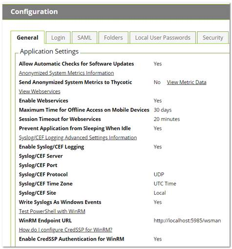
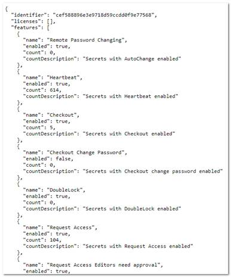
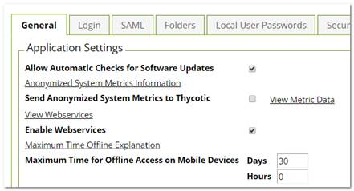

[title]: # (Secret Server Telemetry)
[tags]: # (Best Practice, Security Hardening, telemetry)
[priority]: # (1000)

# Secret Server Telemetry

## Overview

There are 3 reasons for Thycotic products to call home—when:

- Checking for available updates

- Activating licenses

- Reporting anonymized usage metrics

Each of these communications is explained below and can be disabled or avoided.

## Checking for and Downloading Updates

Frequency: Once per day

The software checks for available updates and sends the following information to Thycotic’s update server:

- .NET Framework version

- IP address of the installed instance

- Microsoft SQL Server version

- IP address of the installed instance

- Product version

Checking for updates and sending this information will only occur if both of the following are true:

- The server has outbound network access, which you can block at a firewall.

- The "Allow Automatic Checks for Software Updates" check box is enabled at Admin > Configuration (see below).

No sensitive data is sent during the check. Its only purpose is to alert administrators if a software update is available.  The queried website is also used to download new software versions during the upgrade process. If you wish to whitelist the specific servers involved, they are:

- `d36zgw9sidnotm.cloudfront.net:443`

- `updates.thycotic.net:443`

- `d36zgw9sidnotm.cloudfront.net:443`

- `tmsnuget.thycotic.com/nuget/`

## License Activation

Frequency: when a new license is activated.

The software also sends contact and license-key information, provided by the administrator, to Thycotic during online license activation. The same information is sent via another computer for offline activation.

## Reporting Anonymized Usage Metrics

> **Note:** This section only applies to Secret Server and Secret Server Cloud versions 10.6 and above.

Thycotic collects anonymized usage data to help guide future research and development plans so that product improvements can provide the greatest benefit to customers.

Frequency: Once per day

Secret Server returns anonymized metrics across several categories:

- A unique identifier number that allows Thycotic to correlate metrics from the same server over time but does not contain any information that identifies the customer.

- License information, including edition information and the number of licensed users but not license keys or other identifying data.

- A unique identifier number that allows Thycotic to correlate metrics from the same server over time but does not contain any information that identifies the customer.

- Product environment, including host operating system and SQL server version, not including any identifying data.

 Reporting of anonymized metrics only occurs if:

- The server has outbound network access (you can block your server at a firewall if desired)

- The "Send Anonymized System Metrics to Thycotic" setting under Admin > Configuration is enabled (see below).

You can allow for the metrics reporting on your firewall by whitelisting: `https://telemetry.thycotic.net:443`.

## Setting and Viewing Secret Server Telemetry

To set or view telemetry:
$1
$2

$1
$2

$1
$2

$1
$2
5. Click the **Save** button.