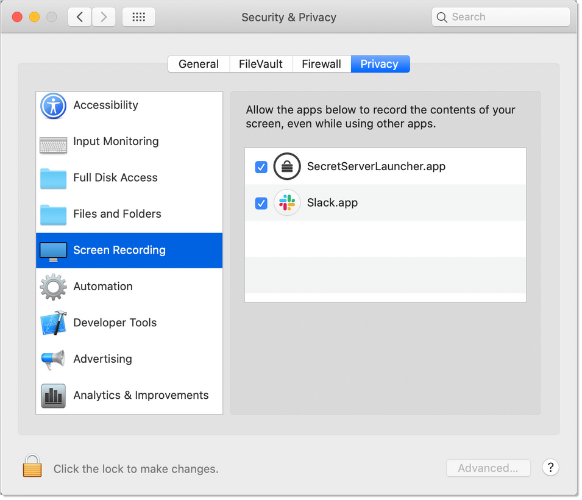

[title]: # (Caveats and Recommendations)
[tags]: # (Session Recording)
[priority]: # (1000)

# Caveats and Recommendations

## General

System requirements apply to both physical and virtual machines.

- Thycotic does not support these Web servers:

- Any Client OS

- Domain Controllers

- SharePoint Servers

- Small Business Server (SBS)

- Windows Server Essentials

- For best performance, we recommend using dedicated (clean) servers for hosting Thycotic products.

- If .NET and IIS features are not already installed on the Web server, the Thycotic Installer adds and configure them automatically.

## Database

- Database disk storage depends directly on how many recorded videos are stored to disk. For active users, we recommend you **use a 1 TB shared or local drive for archival or storage space**. For light users, we recommend beginning with 300 GB. Monitor your disk space usage closely, and tailor it for best results.

- **Carefully consider how quickly your allotted storage might be exhausted**. Once again, it is highly variable, but you might expect around 15 hours of recording per GB of storage. Using the example of encoding capacity used in the Session Recording section, if you wanted to record one year of usage by your 60 8-hour users, you would need around 11 TBs of storage (given vacations and holidays). Our recommended 1 TB would last nearly a month in that scenario. A session retention policy using the automatic deletion feature is likely your best option.

- If MS SQL Server is not already installed on your database server, the Thycotic Installer can setup SQL Express on the Web server; however, **SQL Express is only for trials and sandbox environments**. Though Thycotic supports SQL Express, your users will likely experience performance issues due to memory and product limitations. If experiencing performance issues while using SQL Express, we highly recommended upgrading to MS SQL Server prior to contacting Thycotic Support.

> **Note:** Please see Microsoft documentation on SQL Express at: <https://docs.microsoft.com/en-us/sql/sql-server/editions-and-components-of-sql-server-2017>

## Network Bandwidth and Video

- For SS 10.6 ASR requires around 300 Kbps. Older versions of Session Recording require 1-3 Mbps.

> **Note:** Our Mac launcher uses the older bit rate.

- Session recording bandwidth requirements vary widely based on monitor resolution and image complexity--higher resolutions and more complex images (simpler screen images compress better) use more bandwidth. For example, with a 1024×768 screen resolution, the required network bandwidth is typically between 0.1 Mbps and 1 Mbps.

- If your connection cannot support the needed bandwidth, the session data is still transmitted, but it takes longer to process each session.

- If a user tries to cancel the transmission, this activity appears in the audit record for the Session Recording Secret.

- All sessions are recorded at 1080p.

> **Note:** Before SS 10.6, session recordings 1080p or higher were not supported due to a limitation in Microsoft IIS. The session video would be recorded but may have been corrupted.

- Sessions are recorded using the H.264 MPEG-4 codec.

## Session Recording

- Server hosting session recording requires fixed RAM and disk space. We strongly recommend that you **do not apply dynamic settings**.

- **Do not record more sessions than you can encode**. If more concurrent sessions are recorded than the system can process, the sessions wait in a queue and are processed when enough server resources become available, which could be in a very long time or perhaps never if your storage is overwhelmed.

- The frame rate we can encode varies dramatically based on many factors, so **testing what encoding rate your session recording configuration can sustain is a must**. From there, you can get an idea of what is possible. For example, let us say you found that we can process 20 FPS on average on your Xeon processors. Given that rate, we could encode around 1 minute of a session recording in 3 seconds, or 1 hour in 3 minutes, or 1 day in 72 minutes--giving you perhaps 480 session hours per day. You could then parse that figure based on your typical usage to arrive at a maximum potential usage, for example, 60 people doing 8-hours of session recording.

- Typically, you can record **up to one hundred sessions at a time per web node**, load balanced, which should handle large use cases.

- CPU usage during video processing varies depending on concurrent users and recording length. We recommend that you **closely monitor CPU percentages on your web server** during video processing, as well on your client machines during recording, to increase CPU count for machines, if needed.

- We recommend that you **set up RabbitMQ as the backbone service bus** in session recording environments. To setup RabbitMQ. See: [Secret Server: How to install RabbitMQ](https://thycotic.force.com/support/s/article/How-to-install-RabbitMq) (KBA).

## macOS Catalina Security

macOS Catalina enforces security policy around screen recording. To use the session recording feature of the Thycotic launcher on MacOS Catalina, you must first:

1. Go to **System Preferences \> Security & Privacy \> Screen Recording** on your Mac.

1. Allow recording for the SecretServerLauncher.app:

   
