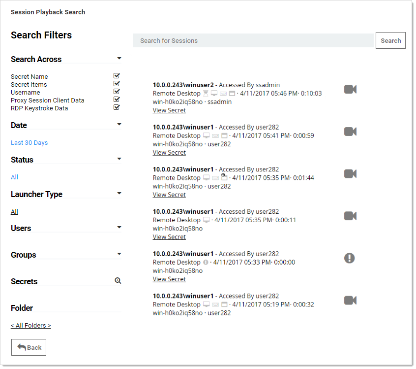
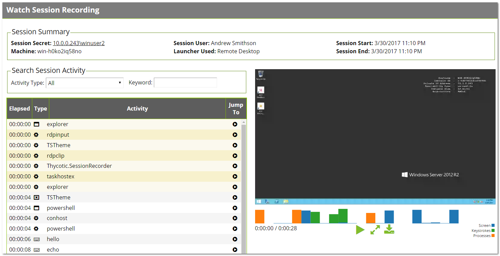

[title]: # (Session Recording)
[tags]: # (Session Recording)
[priority]: # (1000)

# Session Recording

> **Note:** Please click the table of contents on the left to see any sub-pages to this one.

## Basic Session Recording

Basic Session Recording is a licensed feature in SS. It relies on the protocol handler configured on client machines through SS's launcher. Using the launcher, SS captures second-by-second screenshots on the client machine during a user's recorded session. These images of the user's screen are compiled into a video that can be downloaded and played back for auditing and security purposes. Activity recorded in the session is based on screen changes only.

Session monitoring allows administrators with the Session Monitoring permission to view all active launched sessions within SS. If session recording is enabled on the secret, an administrator can watch the user's session in real time.

Admins can search through active and ended sessions. To review and search through sessions go to **Admin \> Session Monitoring**.

Searching across sessions can search the following data. To select what data is searched across check the options on the search filters on the left-hand side.

Some search filters require additional components to be installed or configured:

- **Proxy Session Client Data**: Search within keystroke data of proxied SSH sessions. Requires that the SSH proxy is enabled and SSH sessions are using it.
- **RDP Keystroke Data**: Requires the RDP Session Monitoring Agent be installed on the target.
- **RDP Application Name**: Requires the additional RDP Session Monitoring Agent be installed on the target.

To view a recording, click the camera icon on the session. The Watch Session Recording page appears:

If there is logged session activity, such as keystroke or application data from the RDP agent or SSH proxy then you can search through session activity and jump to points within the video playback. The playback also displays an activity map to show points of high activity, such as screen changes, keystrokes, and processes started and stopped.

Selecting an activity in the grid also shows additional details below such as the full folder path where the application started and the user that performed the operation.

> **Note:** SSH Keystroke data is shown in one-minute segments. In a short session of less than minute, the "jump to" only goes to the beginning of the video.

For active sessions, there are two actions that can be taken:

- **Watch Live:** When session recording is turned on for the secret and admin can view and replay the user's activity.
- **Terminate:** Sends a message to the end user or terminates their session. The end user sees an alert dialog pop up on their machine with the message. Session recording does not need to be enabled for this to work. For ended sessions admins can watch the recorded video and view the SSH log if session recording was turned on for the secret.

## Advanced Session Recording

Advanced Session Recording (ASR) is a licensed feature of SS that adds capabilities to those offered by basic session recording. You install the Advanced Session Recording Agent (ASRA), which uses the Remote Desktop Protocol, on any client machine where you want more information from the sessions recorded.

> **Note:** ASR is not available to those using our Mac launcher.
>
> **Note:** Older ASRAs (earlier than 7.7) only work if a distributed engine configuration is enabled with RabbitMQ or MemoryMQ installed.

ASR enhances the launcher sessions, which typically only include screenshots, keystrokes, and process activity. ASR features include:

- Screen Capture: The SS launcher records second-by-second screen images compiled into a playback video of the user's session. This is essentially the same as basic session recording.

- Logged Processes: The ASRA logs all processes started and stopped during a user's session.

- Recorded Key Strokes: The ASRA records all user keystrokes during the session, which can be disabled.

In addition to those, ASR includes these enhanced video playback features:

- Searchable Video: You can search video activity to find locations where specific activities, such as specific keystrokes or ran processes.
- Enhanced Playback: Sessions recorded using ASR display additional data on playback, such as the current active window, the used processes, and keystrokes in the session.
- On-demand video processing
- Recording all sessions
- Inactivity timeout
- Maximum session-length protection

> **Note:** The Windows protocol handler encodes your session in WEBM format in real time and sends the recording to SS. There is now an "Enable On-Demand Video Processing" option in SS which leaves the recordings in WEBM format, which Chrome and Firefox can playback without any further processing, saving server processing time. If an on-demand recording is viewed with Internet Explorer or Edge (which do not support WEBM playback), you can click a "Request Video Processing" button and the video will be converted to H.264/MP4, which they can then play. If "Enable On-Demand Video Processing" is not checked, then all sessions recorded by the Windows protocol handler will be automatically converted to H.264/MP4.

>**Note:** The Mac protocol handler does not yet support this feature, so any recordings created with it are converted to the chosen legacy video codec format. We recommend H.264/MP4.
>You can set the advanced session recording agent to "Record All Sessions." If someone logs into a server directly without launching from SS, or even logs in at the console, the full session is recorded, including metadata.
>
>**Note:** See [Secret Server Advanced Session-Recording Agent Installation](https://thycotic.force.com/support/s/article/SS-INST-EXT-Adv-Session-Rec-Agent) (KBA) for details.

## Session Recording Tab

The Session Recording tab contains the following configuration options:

- **Enable Deleting:** After the "Days Until Deleting" value, SS deletes the videos from disk.

- **Enable Moving to Disk:** After the "Days Until Moved to Disk" value, SS can move videos from the database to an archive path on disk.

- **Enable Session Recording:** Enable session recording for launched sessions.

- **Save Videos To:** By default, videos are stored in the database, SS can also store them directly to a network share. This network share must be accessible from all Web servers that SS is installed on.

- **Video Code:** Specify the codec to use to create the videos from the launcher screenshots. This codec must be installed on the Web server (or servers if clustering is enabled) that SS is installed on.

> **Note:** The Microsoft Video 1 codec is for testing only and does not support in browser playback. Sessions encoded with Microsoft Video 1 can still be downloaded for review.

For details on the settings in the Login and "Local User Passwords" tab, see [Configuring Users](../users/Configuring-Users/index.md).
