[title]: # (Secret Server Slack Integration)
[tags]: # (Slack,Integration)
[priority]: # (1000)

# Secret Server Slack Integration

Secret Server now integrates with Slack, allowing for notifications and workflow handling. This includes approval requests, recently used secret notifications, and launching secrets.

## Prerequisites

To use Slack integration, you must:

- Have the custom URL configuration options set, can be an internal or external domain.
- Have an external domain name with DNS and routing to your Secret Server instance, which can be anything. We use this in the Slack configuration pages below.
- Be an owner of your company's Slack installation to continue. This is very important.

## Setup and Configuration

### Slack Configuration

Setup the Slack app within the Slack API Interface:

1. Log on your [Slack workspace](https://api.slack.com/app). Your Slack Apps page appears.

2. Click the **Create New App** button. The Create a Slack App popup appears:

   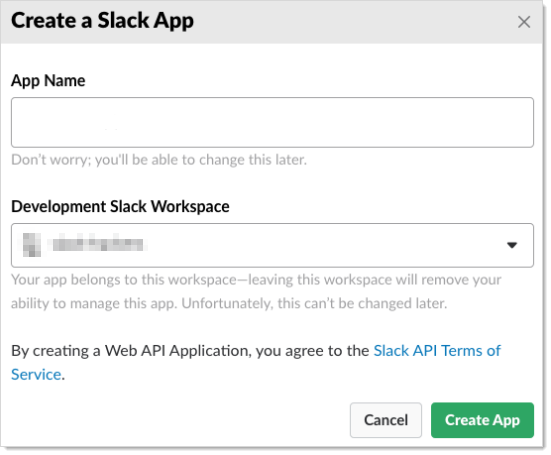

2. Type `Secret Server Bot` in the **App Name** text box.

2. Click the **Development Slack Workspace** dropdown list to select your workspace.

2. Click the **Create App** button. A Basic Information page appears (not shown).

6. Scroll down to the **App Credentials** section:

   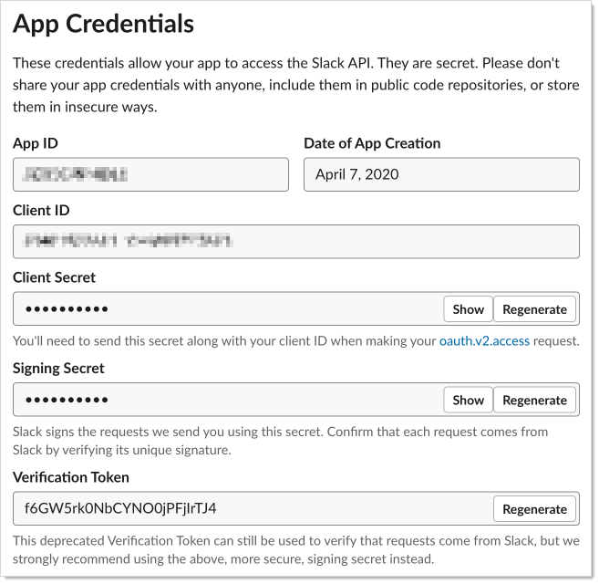

7. Record the **App ID** and **Signing Secret**.

   > **Note:** You can use the deprecated verification token instead (in the Bot Token text box in SS), but we strongly recommend against it.

8. Add them to the SS configuration:

   1. Log on your SS instance.

   1. Go to **Admin \> Show All**. An alphabetized menu appears.

   1. Click the **Slack Integration** link. The Slack Integration page appears:

      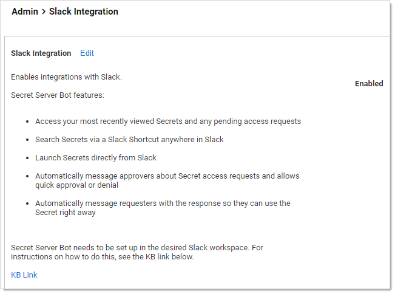

   1. Click the **Edit** link.

   1. A check box and buttons appear.

   1. Click to select the **Enabled** check box. Additional controls appear:

      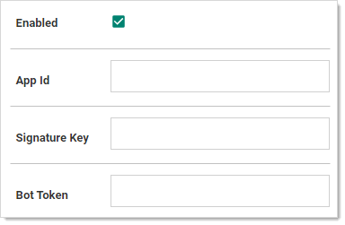

   1. Type your App ID in the **App ID** text box.

   1. Type your Signing Secret in the **Signature Key** text box.

      > **Note:** Leave the Bot Token text box empty unless you chose to the deprecated verification token.

9. Scroll down to the **Display Information** section.

10. Type the app name and a short description.

11. Right click and save the following image:

    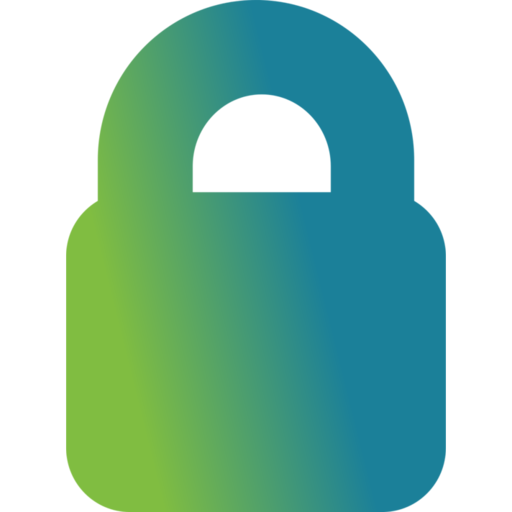

12. Set the icon for the app to the saved image. The completed section looks like this:

    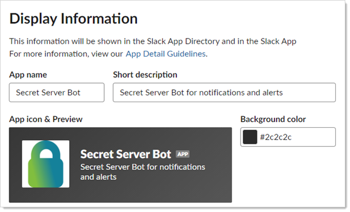

13. Click **OAuth & Permissions** in the left menu.

14. Scroll down to the **Scopes** section.

15. Click the **Add an OAuth Scope** button to add the following scopes to the Bot Token Scopes:

    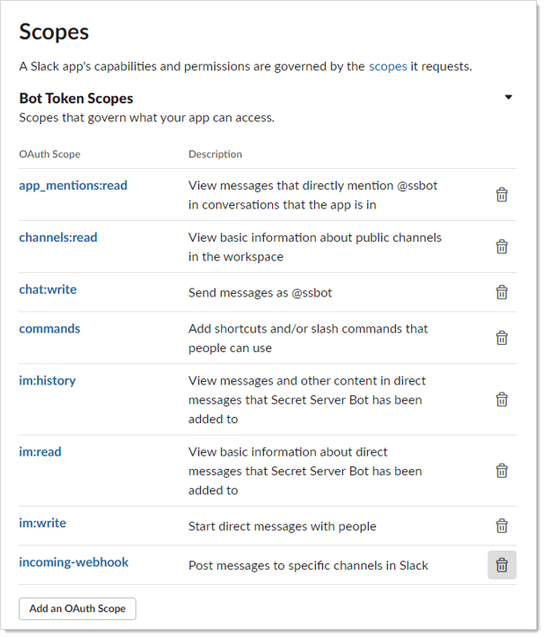

16. Click **Bot User** in the left menu.

17. Enable the **Always Show My Bot as Online** toggle.

18. Enable the **Home Tab** toggle.

19. Go to the **Incoming Webhooks** section to enable the **Incoming Webhooks** toggle.

20. Go to the **Interactivity & Shortcuts** section to enable the **Interactivity** toggle.

21. Type a link to your instance of Secret Server in the **Request URL** text box: `https://<secret server instance>/api/v1/slack/interaction`.

22. In the **Shortcuts** section, click the **Create New Shortcut** button to add a global shortcut named "Secret search."

23. Type `secretsearch` for the **Callback ID**.

    > **Note:** Skip this step to prevent secret searches within Slack.

24. Go to the **Event Subscriptions** section

25. Enable the **Enable Events** toggle.

26. Type a link to your instance of Secret Server in the **Request URL** text box: `https://<secret server instance>/api/v1/slack/event`.

    > **Note:** When adding this URL, Slack confirms connectivity by sending a challenge message to your server. If any firewall or network connectivity issues are present, you cannot proceed past this point until those issues are resolved.

27. Go to the **Subscribe to events on behalf of users** section.

28. Click the **Add Workspace Event** button to add the **app_home_opened** event.

29. Click **Install App** in the left menu.

30. Install the app into one of your workspace channels. #general is fine as the Secret Server Bot does not send messages to any channels— Slack just needs this association.

31. Copy the **Bot User OAuth Access Token** into the Secret Server configuration.

## User Setup

This section is performed once by the user.

1. In Slack, click **Apps**.

1. Add the Secret Server Bot application. This page appears:

   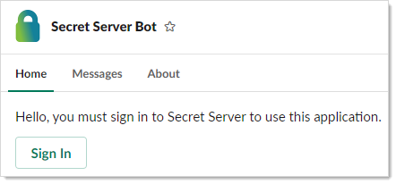

1. Click the **Sign In** button to log on. This launches a Web browser window to your Secret Server instance for you to log on. After you login or if you are already logged on, The All Secrets page appears.

1. (Optional) Close the browser window.

1. The the Home tab will look like this. It may or may not have the sections: My Pending Requests, Approval Requests, or Recent secrets.

   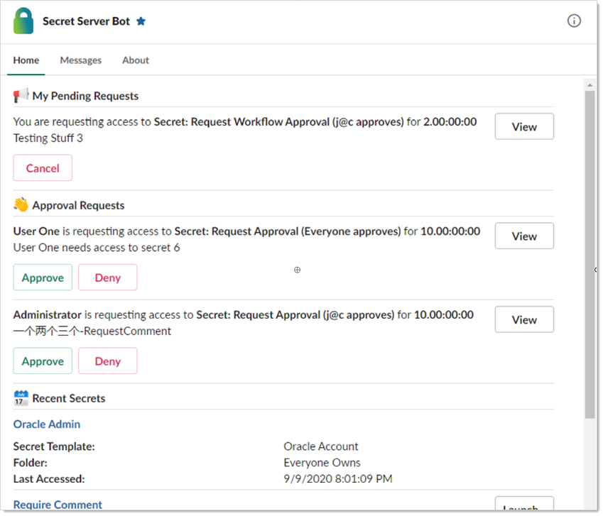

   At the bottom of the Home tab has the option to log off Secret Server.

## User Operations

### Request Operations on the Home Tab

This section discusses typical usage for a user regarding access requests while on the Home tab.

From the Home tab you can view access requests, cancel your own requests, or approve or deny access requests for secrets. For example, this might appear:

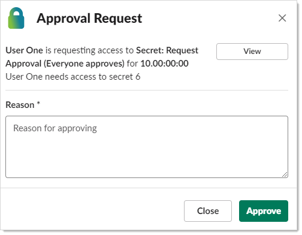

You can click on the name of a recent secret to go to it, or you can launch the secret directly from Slack. Launching from Slack supports multiple launchers, and user prompts.

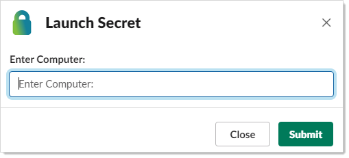

### Searching for Secrets

From any conversation you can click the lightning bolt shortcut button (assuming it is enabled) and select **Search Secrets**.

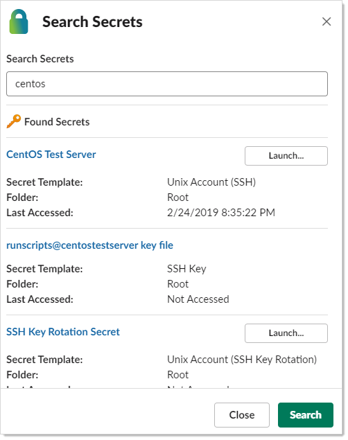

> **Note:** This only returns the top three results.

### Processing Approval Messages

If a new access request is made by a user in Secret Server and you are an approver, you are sent a message by Secret Server Bot, which you can immediately approve or deny.

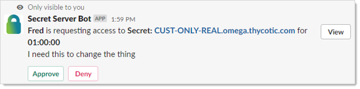

These messages are ephemeral, so they will not stay around and clutter up your conversations. If you miss one, that request stays available on the Home Tab.
Approvers also receive messages if the requesting user cancels the request:

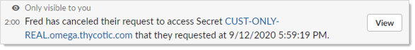

The requesting user receives messages telling them if the request was approved or denied. If approved, the message also includes basic secret details and the option to launch the secret (if applicable).

Approve:

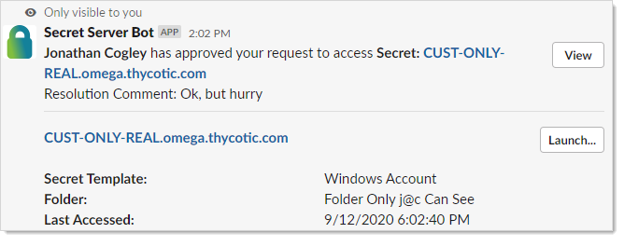

Deny:

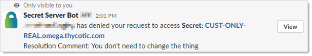

If an approval was already approve before you could approve it, clicking approve or deny immediately changes the message to explain its current state:

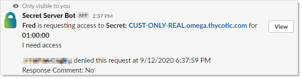