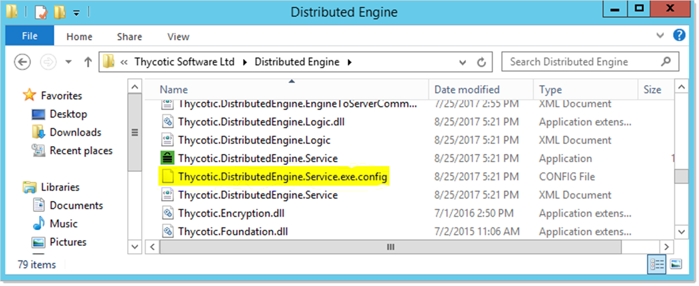
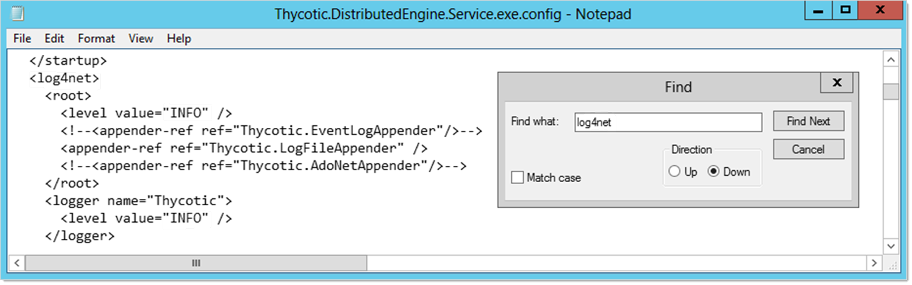

[title]: # (Enabling Debug Mode for Distributed Engine Logs)
[tags]: # (Distributed Engines,troubleshooting,debug mode)
[priority]: # (1000)

# Enabling Debug Mode for Distributed Engine Logs

> **Note:** See [Troubleshooting SSH Issues](../ssh-issues/index.md) for more on this topic.

## Overview

You can expand distributed engine for SS logging to include errors for troubleshooting an issue using the following procedure.

## Procedure 

1. Locate the `Thycotic.DistributedEngine.Service.exe.config` file. at `C:\Program Files\Thycotic Software Ltd\Distributed Engine` directory on the machine where distributed engine is installed:

   

1. Open the file in a text editor, such as Windows Notepad.

1. Press **\<CTRL\> + F**. The Find dialog box appears.

1. Type `log4net` in the **Find What** text box.

1. Click the **Find Next** button to locate the `<log4net>` tag:

   

1. Note the two tags containing the `value="INFO"` attribute.

1. Change the `INFO` value to `DEBUG` in both tags, retaining the quotation marks.

1. Save the file.

1. Restart the distributed engine. Debug mode is now enabled.

1. Reproduce or investigate the issue using the logs. You can also include them with your Thycotic support case if needed.

> **Note:** On occasion, you may be instructed by support to enable the VERBOSE mode to capture additional details for troubleshooting. This can be done by replacing "INFO" or "DEBUG" with "VERBOSE" instead.

> **Important:** Enabling verbose mode creates very detailed log information, which creates a large number of log files. These files can accumulate and quickly consume available resources on the machine. Therefore, it should only be turned on during the troubleshooting process and immediately turned off afterward in order to prevent performance issues.

 