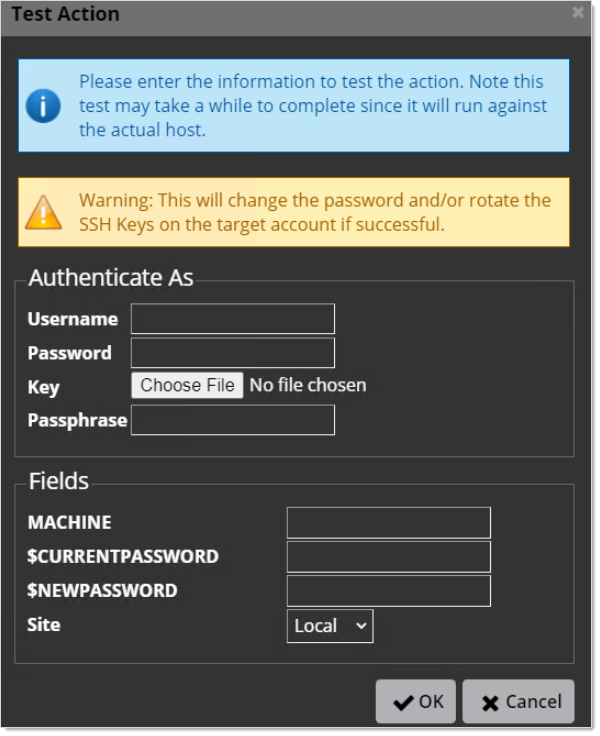

[title]: # (Troubleshooting Heartbeat and RPC Connection Errors for Linux Secrets)
[tags]: # (troubleshooting, workaround, rpc, heartbeat, linux)
[priority]: # (1000)

# Troubleshooting Heartbeat and RPC Connection Errors for Linux Secrets

 When creating custom SSH secret templates in Secret Server (SS), you may run into this error:

`Connection Failed - Connection lost (error code is 10058)` 

Please follow these steps to address that. You start with heartbeat and then address Remote Password Changing (RPC). 

> **Note:** See [Troubleshooting SSH Issues](../ssh-issues/index.md) for other SSH issues.

## Step 1: Troubleshooting Heartbeat

To determine if the heartbeat issue is outside of SS: 

1. Go to the errant secret in SS. 

1. Check that secret’s site. If the secret is using the "local” site, you should test the application servers. If this secret is using a different site, such as a distributed engine (DE), then test on that machine.

2. [Download PuTTY](https://www.chiark.greenend.org.uk/~sgtatham/putty/latest.html) on the application or any of the DE servers. 

2. Return to the secret on SS.

2. Click the **Remote Password Changing** tab of the secret (not shown). 

2. Check the **Associated Secret** section to see if the secret is run by an associated secret:

   

   This tells you the associated privileged account. If the secret is not running an associated secret, you log on directly as root.  

1. Log on that account to sudo to root.

1. Return to the local server or the DE.

2. Open PuTTY.

3. Type the IP of the subject Linux machine.

4. Log on:

   - If there is a privileged account secret, log on with it. 

   - If there is no privileged account secret, log on directly as root.

5. Sudo to root.

6. If you cannot log on, you could have a permissions, networking, or firewall issue that your team will need to address.

## Step 2: Troubleshoot RPC 

To determine if the RPC issue is outside of SS: 

1. Go to the errant secret in SS. 

1. Check that secret’s site. If the secret is using the "local” site, you should test the application servers. If this secret is using a different site, such as a distributed engine (DE), then test on that machine.

1. Open PowerShell to test the connection from the application or DE to the subject machine.

1. Test the SSH TCP port:

   `Test-NetConnection -ComputerName -Port 22`

1. Test the Telnet TCP port:

   `Test-NetConnection -ComputerName -Port 23`

1. If you did not already, [Download PuTTY](https://www.chiark.greenend.org.uk/~sgtatham/putty/latest.html) on the application or any of the DE servers. 

1. Return to the secret.

1. Click the **Remote Password Changing** tab  (not shown).

1. Go to the **Associated Secrets** section to determine the account responsible for running the custom password changer:

   

1. Determine the password type for the template:

   1. Go to **Admin > Secret Templates**. 

   1. Click to select the desired template in the dropdown list.

   1. Click the **Edit** button. The Secret Template Designer page appears (not shown).

   1. Click the **Configure Password Changing** button at the bottom of the page. The Secret Template Edit Password Changing page appears:

      

   1. Note the password types used, the applicable secret field, and the equivalent script variable. You will need to test your script using known-good values for these.

1. Determine the applicable custom RPC commands:

    1. Go to **Admin > Remote Password Changing**. The Remote Password Changing Configuration page appears (not shown).

    1. Click the **Configure Password Changers** button. The Password Changes Configuration page appears:

       

    1. Click the name link for the same password changer. The password changer page for that changer appears:

       

    1. On the left side, you see heartbeat commands under **Verify Password Changed Commands**. On the right side, you see RPC commands under **Password Change Commands**. These commands are needed shortly.

       > **Note:** This command set is an example. Yours may differ.

1. Return the SS or DE server.

1. Launch PuTTY.

1. Type the IP address of the subject Linux machine.

1. Log on as root, or if you have an associate secret on the SSH secret, use it to log on.

1. Use the RPC commands noted earlier in PuTTY to determine if they work outside of SS. If they do not work, fix them or contact your team to address the connectivity issue.

1. Once the issue is fixed or the commands amended (they work in PuTTY), return to SS.

1. Go to **Admin > Remote Password Changing**. The Remote Password Changing Configuration page appears (not shown).

1. Click the **Configure Password Changers** button. The Password Changes Configuration page appears:

    

1. Click the name link for the same password changer. The password changer page for that changer appears:

    

1. Test the PuTTY commands on the SS or DE server, replacing any variables with known-good values. If the commands do not work, revise them and try again.

1. If the original PuTTY commands did not work (you revised them):
   
    1. Click the **Edit Commands** button at the bottom of the page. The commands for that password changer appear:
    
        
    
    1. Scroll down to the **Password Change Commands** section:
    
        
    
    1. Click the blue edit icon to the right of any commands you want to change. The command becomes editable.
    
    1. Edit the command to make it match your known-good revision.
    
    1. Click the blue save icon next to the amended command.
    
    1. Click the **Back** button to return to the changer page:
    
        
    
1. Click the **Password Change Commands Test Action** button to confirm they work in SS. The Test Action Popup appears:

     

1. Type the known-good values for the text boxes.

1. Click the **OK** button. Upon success, you know that the password changer works.

1. Go to 
