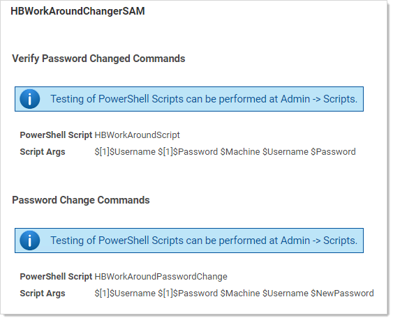

[title]: # (Windows Local-Account Access-Denied Error Workaround PowerShell Scripts)
[tags]: # (troubleshooting, workaround, Access-Denied Error)
[priority]: # (1000)

# Windows Local-Account Access-Denied Error Workaround PowerShell Scripts

## Overview 

Beginning with Windows 10 version 1607 (Creator’s Update) and Windows Server 2016, the default GPO security descriptor denies users [remote access to Security Account Manager (SAM)](https://docs.microsoft.com/en-us/windows/device-security/security-policy-settings/network-access-restrict-clients-allowed-to-make-remote-sam-calls) with non-domain credentials, and therefore prevents remote heartbeat and password changes made by otherwise-authenticated local user accounts. Affected Windows local account secrets return “Access Denied” on a heartbeat or remote password change.

This article provides a script and instructions to address these "access denied" errors. The script modifies the default local group policy remote SAM access security descriptor to allow all local users on a specified machine remote SAM access after authentication. This script requires elevated PowerShell permissions.

> **Note:** Adding an account to the local computer's Administrators group does not solve the problem.

On most systems, the Administrators group on the local machine is part of the “Network Access: Restrict clients allowed to make remote calls to SAM” security policy setting. Through testing, we determined that Windows currently treats this group as only the built-in administrator account for this configuration. Therefore, if you add another user to the Administrators group on the machine, that user will be unable to heartbeat since it is not the built-in administrator account. In addition, the built-in object, “Local account and a member of Administrators” does not allow a local account that is a member of Administrators to heartbeat for any account other than the built-in administrator account.

## Additional Requirements

For heartbeat to work correctly, make sure that the local or authenticated users are:

- *Not* in the "Deny access to this computer from the network" security policy
- *In* the "Access this computer from the network" security policy

## Remediation Options

**Option 1:** Creating a custom group and adding users to it (this is what the script does for users on the endpoint) then adding that group to the security setting to allow the user to heartbeat successfully. New local users need to be added to the custom group if they are created in the future.

**Option 2:** Adding a user individually to the security setting to allow the user to heartbeat successfully.

**Option 3:** Modifying the Default GPO: Adding “allow authenticated or local users” to the security setting. This allows all local users or all users who are authenticated to the machine to bypass this setting. This does requires the PowerShell Script below. The drawback is that this allows all users to remotely access SAM, so long as they are authenticated.

**Option 4:** Create a heartbeat workaround for GPO “Network Access: Restrict Clients Allowed to Make Remote Calls to SAM.” This is addressed in the last section. This is for situations where the GPO needs to be completely bypassed.

## Option 3: Modifying the Default GPO

### PowerShell Script Description

This script adds a local non-privileged user group to the machine (a custom group name can be specified with the `-GroupName` parameter), adds all local users to the group, and then adds this group to the "Network Access: Restrict clients allowed to make remote calls to SAM" local group policy. This allows all local users within the group remote access to SAM after authentication, which is required for SS heartbeat and password changing.

### Download

Extract the .ps1 script found here:
https://updates.thycotic.net/secretserver/support/PowerShell_Win10-HB-RPC-Fix/Win10-HbFix.zip
Run in an elevated PowerShell ISE session.

### Script Argument Help

#### Command Prompt Help

For full help text, run:

 `> Get-Help C:\Script\Win10-HbFix.ps1 -Examples` 

#### Parameters

##### -ComputerNames (string[])

Specifies the computers on which the script runs (comma separated). If unspecified, the default is the local computer. 

##### -Username (string)

Specifies a username of an account that has administrative permissions on the computer to add a local user group and modify the local group policy. You will be prompted for a password. Examples: `Administrator` or `TestDomain\AdminUser`.

##### -GroupName (string)

Specifies a name for the SAM access local user group. If unspecified, the default group name is "Secret Server Remote SAM Access"

##### -ForceGPUpdate

Specifies whether a group policy update should be forced for immediate effect following the script. (Otherwise Group Policy changes may take up to 120 minutes to take effect by default).

#### Examples

`> C:\Script\Win10-HbFix.ps1` 
This example gives remote SAM access to all local users on the current machine. The current PowerShell credentials would be used for authentication. 

`> C:\Script\Win10-HbFix.ps1 -LogDir "D:\Win10-HbFix\log"` 
This example changes the default output log path to `D:\Win10-HbFix\log` (default is `[user temp directory]\log`). 

 `> C:\Script\Win10-HbFix.ps1 -ComputerNames "WINSERVER","TestDomain\SOMEMACHINE" -Username "TestDomain\Administrator" ` 
This example gives remote SAM access to all local users on the WINSERVER and TestDomain\SOMEMACHINE remote computers. The domain user "TestDomain\Administrator" credentials will be used. You would be prompted for a password.

 `> C:\Script\Win10-HbFix.ps1 -ComputerNames "D:\Win10MachineList.txt" -Username "TestDomain\Administrator"` 

This example gives remote SAM access to all local users on the remote computers listed in D:\Win10MachineList.txt (one machine per line). The domain user "TestDomain\Administrator" credentials will be used. You would be prompted for a password.

`> C:\Script\Win10-HbFix.ps1 -ComputerNames "WINSERVER" -GroupName "Secret Server Group"` 

This example gives remote SAM access to all local users on the WINSERVER remote computer. The local group created will be named "Secret Server Group". Current PowerShell credentials would be used for authentication.

 `> C:\Script\Win10-HbFix.ps1 -ComputerNames "WINSERVER" -ForceGPUpdate -Verbose` 
This example gives remote SAM access to all local users on the WINSERVER remote computer, with verbose output. The current PowerShell credentials will be used for authentication. Group policy update will be forced on WINSERVER for immediate effect. 

### Related Articles and Resources

 [Network access: Restrict clients allowed to make remote calls to SAM](https://docs.microsoft.com/en-us/windows/security/threat-protection/security-policy-settings/network-access-restrict-clients-allowed-to-make-remote-sam-calls)

## Option 4: Creating a Heartbeat GPO Workaround

1. Make sure that **Admin \> Scripts** is functional. Once you have it working, download, unzip, and run this script [HBWorkAroundScripts.zip](https://updates.thycotic.net/secretserver/documents/HBWorkAroundScripts.zip).

2. Go to **Admin \> Scripts**. 

3. Add the HBWorkAroundScript and the HBWorkAroundPasswordChange scripts.

4. Test the first script. Add the appropriate `args[]` as needed. Add arguments 0-4 with no quotes or commas. Spaces are the argument separator and are required. 

5. You should get a return of “True,” such as this:

   

6. Navigate to **Admin \> Remote Password Changing.**

7. Click the **Configure Password Changers** button. The Password Changers Configuration page appears.

8. Click the **New** button at the bottom.

9. Click the **Base Password Changer** dropdown list to select **PowerShell Script** as your password changer. 

10. Type a name in the **Name** text box.

11. Click the **Save** button. The password change command page appears:

    

12. Click the **PowerShell Script** dropdown list in the **Password Change Commands** section to select the script you ran earlier.

13. Add the appropriate tokens in the **Script Args** text box. 

> **Note:** See [Dependency Tokens](../../api-scripting/dependency-tokens/index.md) for a complete list.

12. Click the **Save** button. Your configuration should look like this: 
    
    
    
11. Go to **Admin \> Secret Templates**.

11. Select **Windows Account**.

11. Click the **Edit** button.

13. Click the **Copy Secret Template** button.

13. Click the **Configure Password Changing** button.

13. Click the **Edit** button.

13. Click the **Password Type to Use** dropdown list to select the password change you created earlier.

13. Create your windows secret using the custom template. 

13. Once it is created, add your privileged and associated secret to the RPC tab as seen below. In that example we use the same one for the privileged and associated secret. 
    
    
    
19. Run a heartbeat to confirm it works as desired.