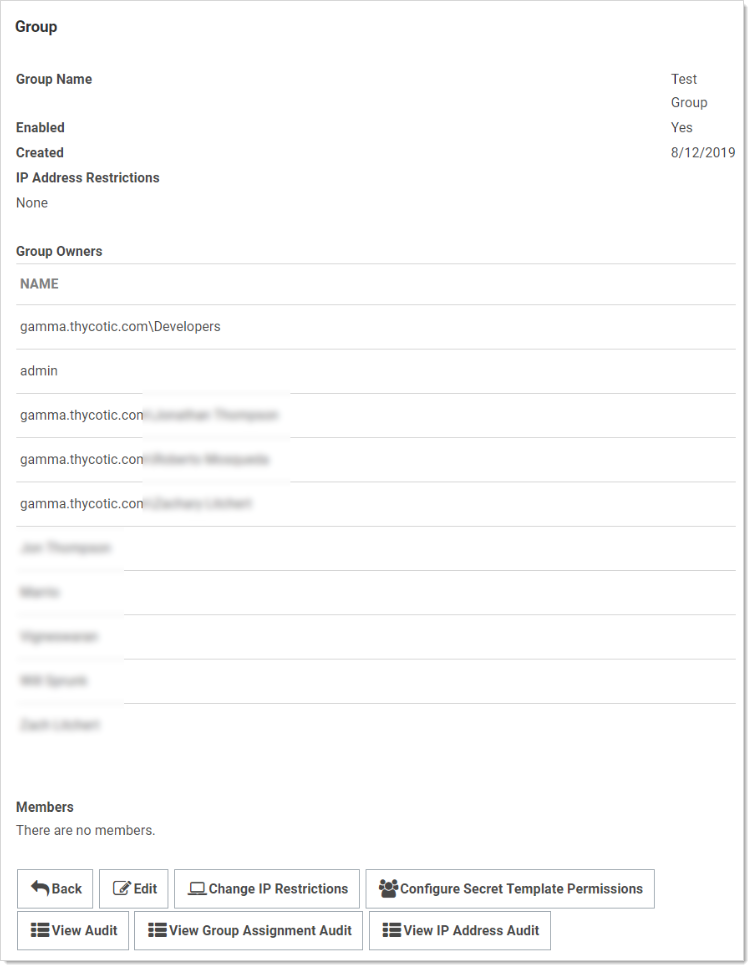
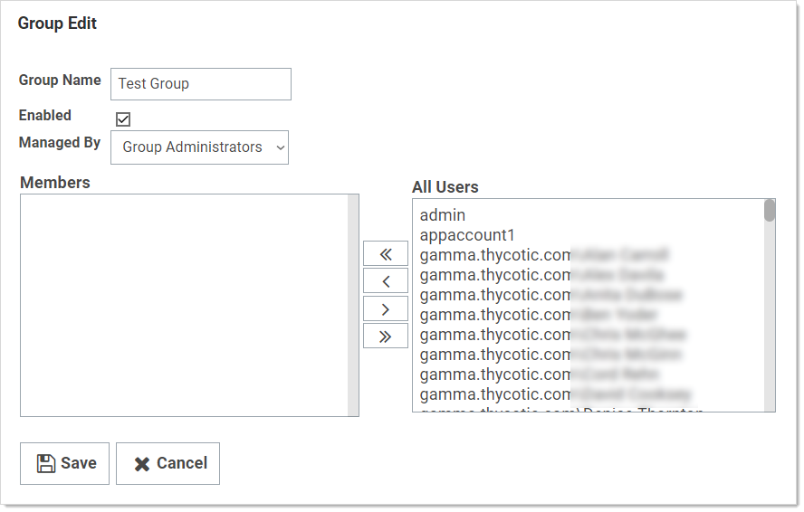
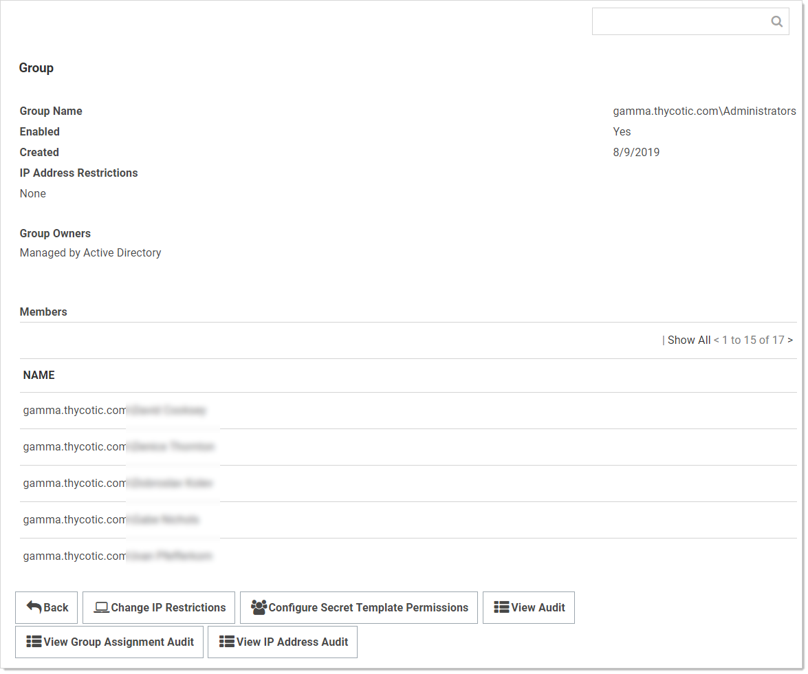

[title]: # (Assigning Group Owners)
[tags]: # (Group Owner)
[priority]: # (1000)

# Assigning Group Owners

Group Administrators can also set another group or user as the group owners for a SS local group. Group owners can manage membership just for that group. To assign the group owner:

1. Navigate to the **Groups** page:

   

1. Click the desired group in the list. The Group's page appears:

   

1. Click the **Edit** button. The Group Edit page appears:

   

1. Click the **Managed B**y dropdown list to select the owner.

1. Click the **Save** button.

> **Note:** Very commonly, the group owner is managed by Active Directory, not SS:

