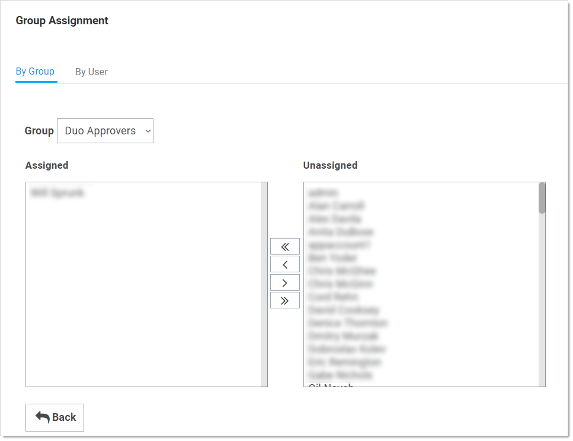
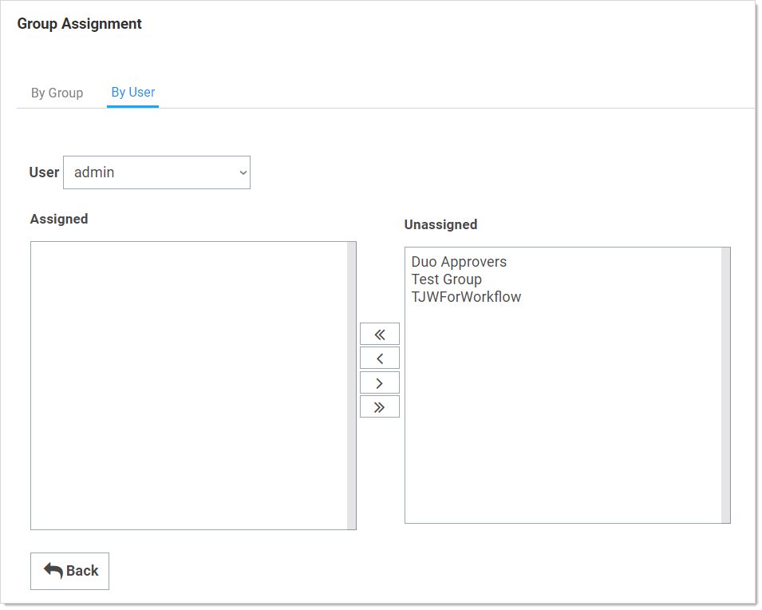

[title]: # (Assigning Users to Groups)
[tags]: # (Groups)
[priority]: # (10)

# Assigning Users to Groups

On the Group Assignment page, users can be added and removed from the group. 

1. Navigate to the **Groups** page:

   

1. Click the **View Group Assignment** button. The Group Assignment page appears:

   

1. Use the arrow buttons to move users into and out of the current group.  When you have finished with your changes, click the **Save Changes** button and your new group members are added.

   Alternatively, you can click the By User tab and manage the groups for a single user:

   

> **Note:** If the group was created using Active Directory synchronization, this group is not be editable. See [Active Directory Synchronization](#Active-Directory-Synchronization).
