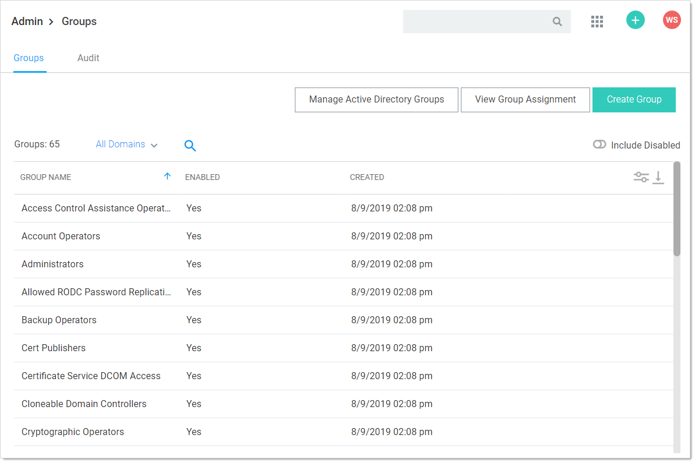

[title]: # (Creating User Groups)
[tags]: # (Groups)
[priority]: # (30)

# Creating User Groups

You can create and edit groups from the Groups page. You can get to the Groups page by navigating to **Admin \> Groups**

By either selecting an already existing group from the list, or clicking **Create Group**, you can modify or add the group.

> **Note:** To add groups and the users inside them from your Active Directory setup, you can use Active Directory synchronization (see [Active Directory Synchronization](#Active-Directory-Synchronization)).
