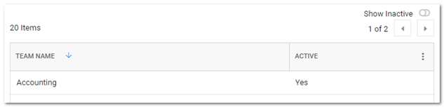
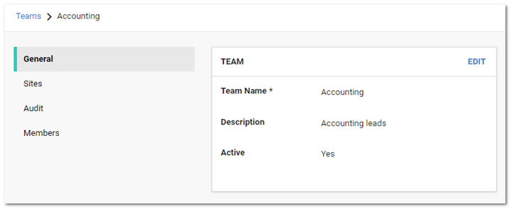
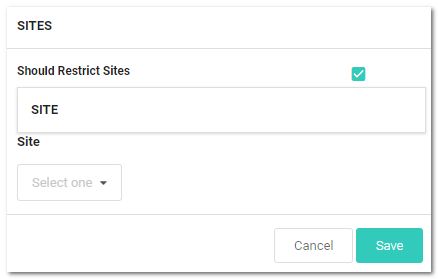
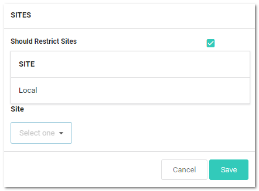
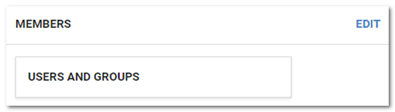
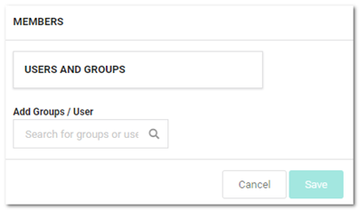
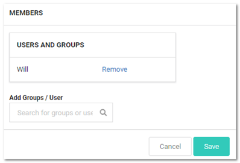
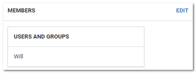

[title]: # (Creating Teams)
[tags]: # (Teams)
[priority]: # (1000)

# Creating Teams

1. Navigate to **Admin \> See All**. The Administration page appears:

   

1. Type and then click **Teams** in the list. The Teams page appears:

   

1. Click the **Create Team** button. The Create Team popup page appears:

   

1. Type the name for the new team in the **Team Name** text box.

1. (Optional) Type a description in the **Team Description** text box.

1. Click the **Create Team** button. The new team appears on the Teams page:

   

1. Click the table row for the newly created team. That team's page appears:

   

1. Click the **Sites** button on the left. The Sites page appears:

   

1. Click the **Edit** button. The page becomes editable:

   

1. Click to select the **Should Restrict Sites** check box. A Site dropdown list appears:

    

1. Click the **Site** list to select a site to restrict the team to. The selected site appears in the Site table:

    

1. Click the **Save** button.

1. Click the **Members** button on the left. The Members page appears:

    

1. Click the **Edit** button. The page becomes editable:

    

1. Type the name of the desired user or group to add in the **Add Groups / User** search box. When you begin typing, a list of available groups and users appear below. Select one. The user or group appears in the Users and Groups table:

    

1. Click the **Save** button. The member appears on the Members page:

    
