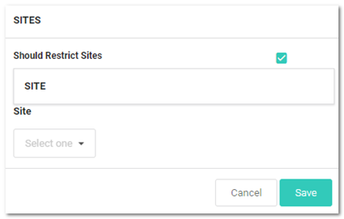
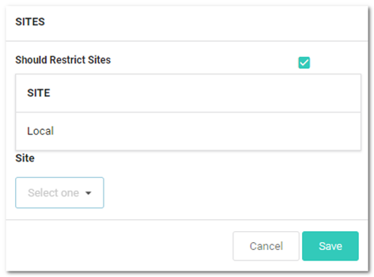
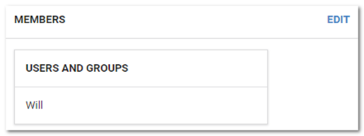
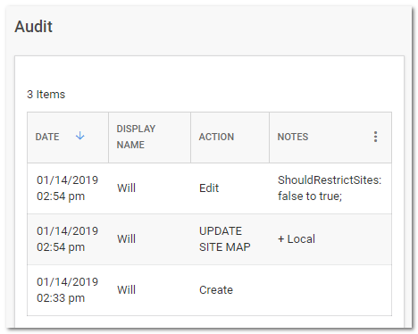

[title]: # (Editing Teams)
[tags]: # (Teams)
[priority]: # (1000)

# Editing Teams

1. In SS, click the **Admin** menu item. The Administration page appears.

1. Type and then click **Teams** in the list. The Teams page appears:

   

1. Click the table row for the desired team. That team's page appears:

   

1. On the **General** page, click the **Edit** button to change:

   - The team name
   - The team's description
   - The team's status

1. To restrict the visible sites:

   1. Click the **Sites** button on the left. The Sites page appears

     

   1. Click the **Edit** button. The page becomes editable:

     

   1. Click to select or deselect the **Should Restrict Sites** check box. If you enabled it, a Site dropdown list appears:

     

   1. Click the **Site** list to select a site to restrict the team to. The selected site appears in the Site table:

     

   1. Click the **Save** button.

1. To edit the team's member users or groups:

   1. Click the **Members** button on the left. The Members page appears:

      

   1. Click the **Edit** button. The page becomes editable:

      

   1. Type the name of the desired user or group to add in the **Add Groups / User** search box. When you begin typing, a list of available groups and users appear below. Select one. The user or group appears in the Users and Groups table:

      

   1. Click the **Save** button. The member appears on the Members page:

      

1. View events for the team using its audit trail:

     1. Click the **Audit** button on the left. The Audit page appears:

        

     1. Audit events occur when:

        - The team is created
        - General tab: name, description, or active status is changed
        - Sites tab: restrictions are added, removed, or changed
        - Members: users or groups are added or removed
