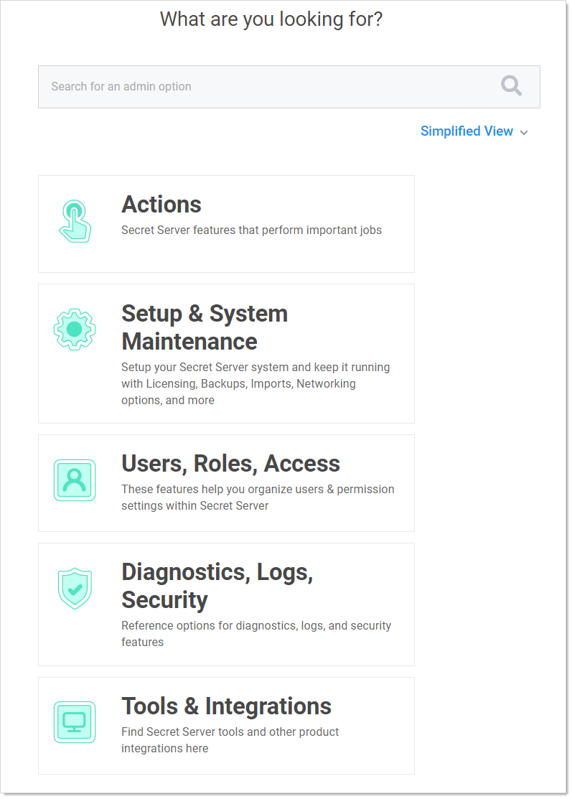

[title]: # (Viewing a User's Teams)
[tags]: # (Teams)
[priority]: # (1000)

# Viewing a User's Teams
$1
$2
   
$1
$2
   

   You can see if the user belongs to a team, and if so, what teams the user belongs to. If the Restricted by Team line says _No_, it means the user has been granted the Unrestricted by Teams permission, which means the user can view all users, groups, and sites.
